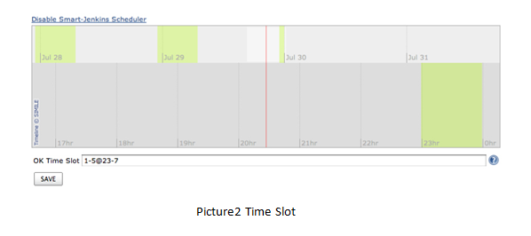
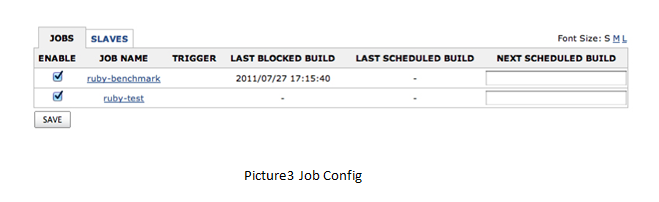
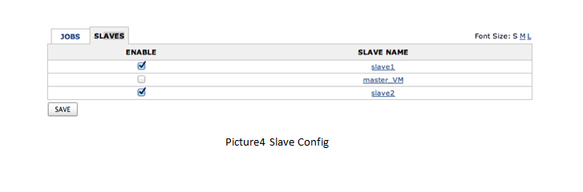

This plugin reduces the electricity consumption by shutting down idle
slaves and re-schedules jobs to avoid the rush hours of electricity.

Abstract

This plugin schedules jobs to avoid rush hours, shuts down idle
computers, and boots them remotely when necessary. In this plugin, OK
time (when jobs will be built by Jenkins) and NG time (when jobs will be
blocked by this plugin) are being defined. If it is in NG time, idle
slaves which are controlled by this plugin will shut down. At the same
time, jobs which are controlled by this plugin will be blocked and
re-scheduled. However, jobs which are configured to be built with
another slave (which is always online) will be built at once. If it is
in OK time, all slaves controlled by this plugin will boot. Meanwhile,
jobs which are blocked will be built in this time.

About this plugin

This plugin allows:

1.  Setting “OK” time1 and “NG” time2.
2.  Selecting slaves which will be controlled by this plugin
3.  Selecting jobs which will be controlled by this plugin
4.  Shutting down slaves when necessary even it is in OK time
5.  Waking up slaves when necessary even it is in NG time

User guide

To use this plugin, users need to do some setting in their slave
machines.

-   If the OS of a slave machine is Linux, users need to set the
    permission of “shutdown” command to make it can be used by every
    user of this machine.
-   Users need to make slave machines launch when system starts up.
-   Users need to make master machine’s number of built greater than 1.
-   Users need to install “wake-on-lan” on master.

Note: there are four jobs (shutdown-linux, shutdown-win, wol-linux,
wol-win) will be created by this plugin.

When you install this plugin, your side menu will have table like
picture1. You can boot your slave machines by clicking the button “On”
or shut down your slave machines by clicking the button “Off”. And when
the slave machine is online, it will show the IP and MAC address in this
table.

To activate this plugin, just check the smart Jenkins link and check
enable Smart-Jenkins Scheduler. You then get the following fields:

OK Time Slot is where you define your own OK time. You just need to
input the time you want to do your jobs. For example, from 23o’clock to
7o’clock next day, it is not rush time of electricity, so you want to do
your jobs in the time. Also, if you only need do your tests on weekdays,
you can input the day you want to do your jobs.

In this case, you can set your OK time like “1-5@23-7“(the number before
@ means the day you want to do your jobs and the number after @ means
the time you want to do your jobs in a day).

The green part in picture2 means OK time and the gray part means NG
time. The read line in picture2 means current time.

If you check the enable selection in job config page (picture3), jobs
which are checked will be controlled by this plugin. It means the
checked jobs will be blocked in NG time unless its config¹ says it can
be built with the slave which is always online.

If you check the enable selection in slave config page (picture4),
slaves which are checked will be controlled by this plugin. It means
that the checked slave will shut down when it is NG time and will boot
when it is OK time. And the un-checked slave will always online.

For example, you make job config in picture3 and slave config in
picture4. And you set “ruby-test” job’s matrix label\_exp as “slave1
\|\| master\_VM”. When it is NG time, slave1 is power off and master\_VM
is online. So the ruby-test job will be built with master\_VM machine. 
