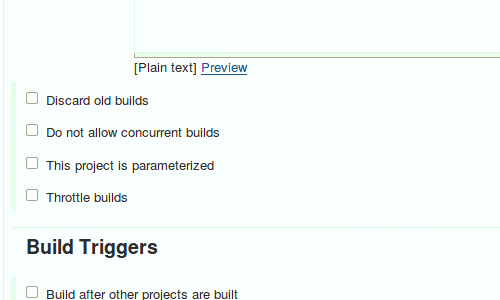
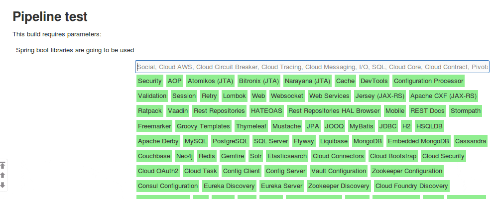

# Plugin spring-initializr-plugin

  
Add build parameter to be able to select spring dependencies (Spring
Initalzr, http://start.spring.io)

# Get started

1.  Make you build Parametrized
2.  Add Spring boot libraries parameter  
    {width="500"
    height="300"}
3.  Build it with parameters  
    
4.  Now create Pipeline Job that generates spring boot application. Use
    springBoot pipeline step  
    .gif){width="1000"
    height="400"}

# springBoot pipeline step

``` syntaxhighlighter-pre
springBoot <name>: <value>, <name>: <value>, ...  
```

[TABLE]
