  

# Summary

## Description

This plugin publishes the test results of a Jenkins build in Squash TM
when a build completes. It works on top of other publisher plugins
dedicated to the test technology that used in the build (junit, nunit,
mstest etc), before pushing the results.

## Usage

The plugin leverages the workflow implemented in the [Squash TM / Squash
TA integration
scenario](https://sites.google.com/a/henix.fr/wiki-squash-ta/tm---ta-guide/user-guide).
In a few words, it allows Squash TM to list the tests of a job, trigger
a build and gather the test results, with some restrictions (listed in
section Comparison with Squash TA). The job can be of any nature
(free-style or else) and use any test technology (if a Jenkins plugin is
also configured for it).

Also, due to the nature of that workflow please note that in this
version the publisher will process the results **only if the build was
triggered by Squash TM**. This limitation will be addressed in future
developments.

## Dependencies

This plugin works for Jenkins version 1.651.3 or higher and requires
JUnit plugin v1.19+ (not tested with earlier versions).

  

# Jenkins configuration

## Global settings

As an administrator, go to the system configuration (first item in the
administrator view). Scroll down to the TM Publisher section. From
there, you can add one or several TM servers by clicking on
the **\[Add\]** button and filling the following informations :

-   server name : a label that identify a given instance of Squash TM
-   server URL : the base URL of the TM server
-   login : the login of the account on Squash TM that Jenkins will use
    to push the results. NB : that user must belong to the 'Test
    Automation Server' user group.
-   password : the password of that user.

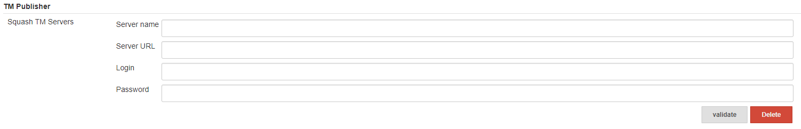{width="1109"}These
will allow the plugin to identify instances of Squash TM that request
for result update, and to authenticate on them.

The **\[Validate\]** button (next to **\[Delete\]**) will test that the
server is reachable and up. For now the credentials aren't validated
yet. Potential errors in your configuration will issue a warning. Once
you are done save the configuration as usual. You can save the
configuration even if warnings were reported, e.g. when the endpoint is
down at the moment yet the URL is correct nonetheless.

## Job Settings

As a job manager, go to the configuration page of your job.

Jobs of all nature are supported. As a job manager, go to the
configuration page of your job. In order to work the plugin requires two
simple items. First, on the general job properties, tick the box
'*Enable integration with Squash TM*'.

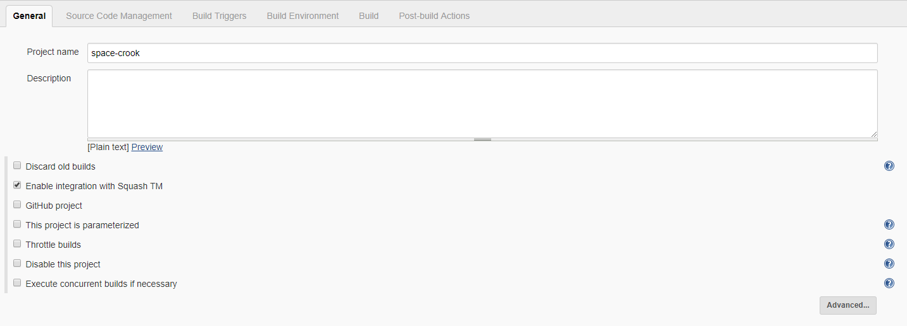{height="400"}

  

Then add a new post-build step : 'Publish your tests results on Squash
TM'.

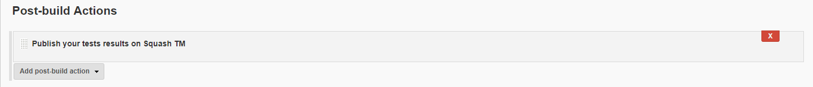{width="1109"}

  

That's all you need to configure TM-publisher per-se. However you will
also need to configure additional test result publishers such as [JUnit
plugin](https://wiki.jenkins-ci.org/display/JENKINS/JUnit+Plugin),
[NUnit
plugin](https://wiki.jenkins-ci.org/display/JENKINS/NUnit+Plugin),
[JSUnit
plugin](https://wiki.jenkins-ci.org/display/JENKINS/JSUnit+plugin) etc.
Remember that TM-publisher simply pushes tests results, it does not
generate them.

Note that 'Maven project' job style implicitly handle jUnit test results
: if you run a Maven job and your tests are run by a jUnit runner you
don't need to configure extra test results publishers.

  

In some cases, further configuration is needed to access the reports.

The following example is a Junit test with Gradle :

-   As a job manager, go to the configuration page of your job then to
    the ‘*Post-build Actions*’ tab
-   Add a new post-build action: ‘*Publish Junit test result report*’
-   Fill in the ‘*Test report XMLs field*’ with the path of your test
    reports
-   Make sure the ‘*Publish Junit test result report*’ action is above
    ‘*Publish your tests results on Squash TM*’.

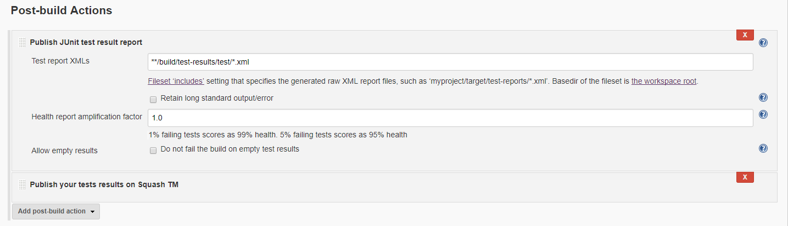{width="1109"}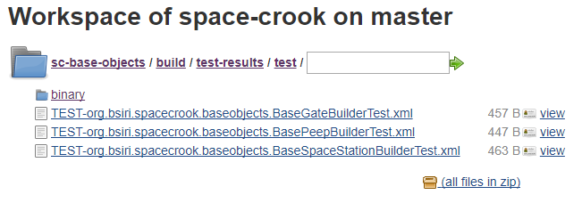{height="150"}

  

# Squash TM configuration

## Configure Squash TM properties

-   Open the **squash.tm.cfg.properties** file located in the conf
    folder of Squash TM installation folder (ex : C:\\Squash-TM\\conf)
-   Look for **tm.test.automation.server.callbackurl** and uncomment it
-   Add the Squash TM url (ex: <http://192.168.2.138:8080/squash>. This
    URL will be used by Squash4Jenkins to notify Squash TM of the
    execution progress
-   Restart Squash TM

## Add a Jenkins instance to Squash TM

### Create a Test Automation Server User

You only need to create one automated server user, even if you want to
add several automated servers.

-   In Squash TM, as an administrator, click on *Administration* (in the
    upper corner) then click on *Users.*
-   Click on **\[Add\]**. A popup displays
-   In the *Group* field, select *Test Automation Server*.
-   Fill in the *Login* and *Password* fields with the login and
    password you have configured in Jenkins (in system configuration).
-   Click on **\[Add\].**

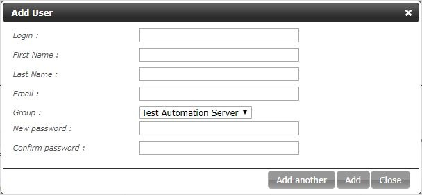{width="470"}

### Create a Test Automation Server

-   In Squash TM, click on *Administration* (in the upper corner) then
    click on *Automation servers*.
-   Click on **\[Add\]**. A popup displays.
-   Fill in the URL field with the Jenkins url (ex :
    <http://localhost:9080/jenkins).>
-   Fill in the *Login* and *Password* fields with the login and
    password of the Jenkins user dedicated to automation.
-   Click on **\[Add\].**

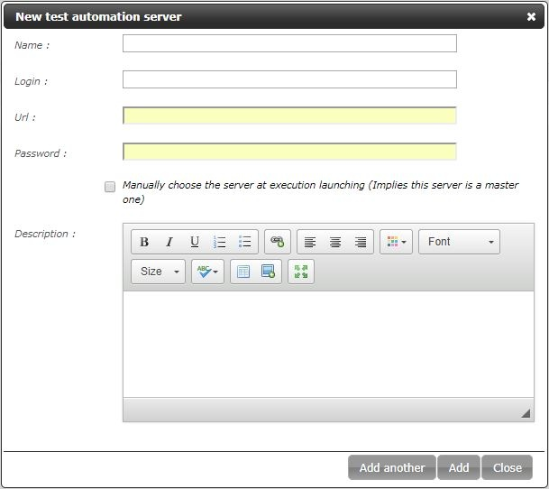{width="470"}

  

Login must be unique for each URL 

## Configure a Squash project for automation

-   Click on *Administration* (in the upper corner) then click on
    *Projects*.
-   Select an existing project, scroll down to *Test automation
    management*.
-   Click on *No server*. A drop down menu displays with the test
    automation displays.
-   Select the server you have previously added and click on
    **\[Confirm\]**.
-   In the Test automation management you should see a new section
    called Jobs.

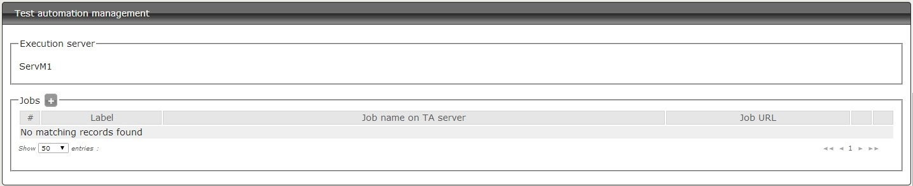{height="250"}

-   Click on **\[+\]**. A popup *Add a job* displays with all the jobs
    you have in Jenkins

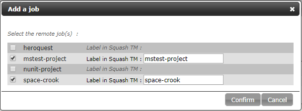{width="550"}

-   Select the job(s) you want to add. You can change their label in
    Squash TM.

Job's name can't be blank and must be unique

-   Click on **\[Confirm\]**

  

You can edit your job (pencil button) if you want to further configure
it.

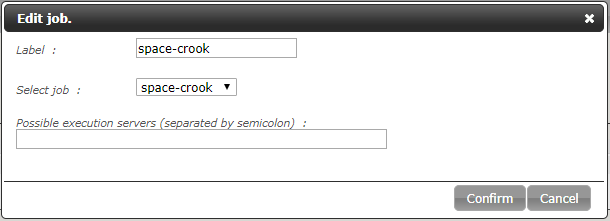{width="550"}

  

The Squash TM project is now automation-ready. Please consult the user
guide to trigger Jenkins builds from Squash TM and get the results.

  

# User guide

## Create an automated test

-   In the *Test Cases Workspace*, select a project that is
    automation-ready
-   Click on **\[+\]** to create a new test case
-   Fill in the '*Name*' field and click on **\[Add\]**
-   On the *Auto. script* field, click on '**Click to edit...**'

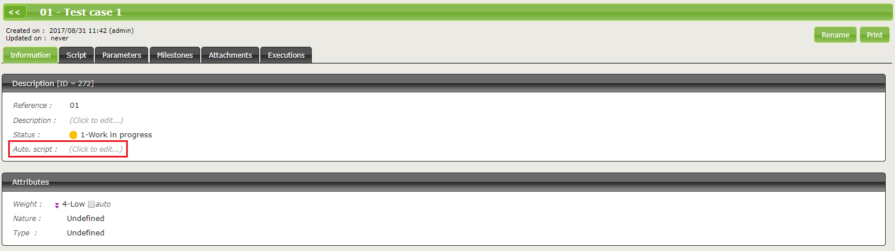{width="1220"}

-   Associate the automation script to the test case. You can type the
    name of the script (/TM\_JOB\_NAME/Path\_to\_the\_script) or use the
    **\[Pick...\]** button

The TM\_JOB\_NAME will be checked, but the path\_to\_the\_script won't.
To be safe use the Pick...button.

-   Click on **\[Confirm\]**

  

## Run an automated test

-   In the *Campaign Workspace*, select a project and click on **\[+\]**
-   Create a new campaign and an iteration
-   Select the iteration and in the '*Execution Plan*' tab, click on
    **\[+ Add\]**
-   Drag and drop the automated test from the Test Case Library to the
    Execution Plan and click on **\[Back\]**
-   To run the test, use one of the button on the screen below:

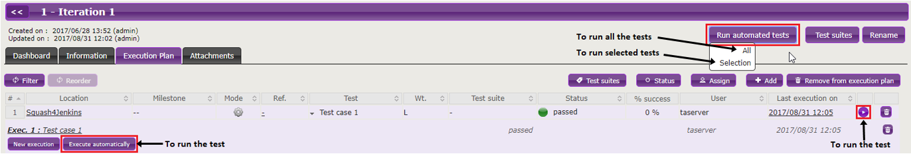{width="1220"}

-   A popup *Overview of automated test executions* displays. Once the
    execution is over, the status and the progress bar are updated.
    Click on **\[Close\]**.

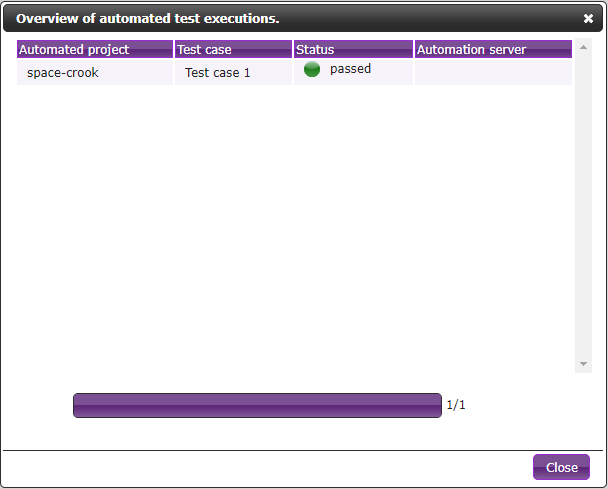{width="550"}

-   On the execution plan, click on the test case name to show all
    executions of the test.
-   Click on an Execution to access execution details where are
    displayed:  
    -   the status (Squash TM status)
    -   the automated test status
    -   a link to the report (result URL)
    -   a link to the job (job URL)

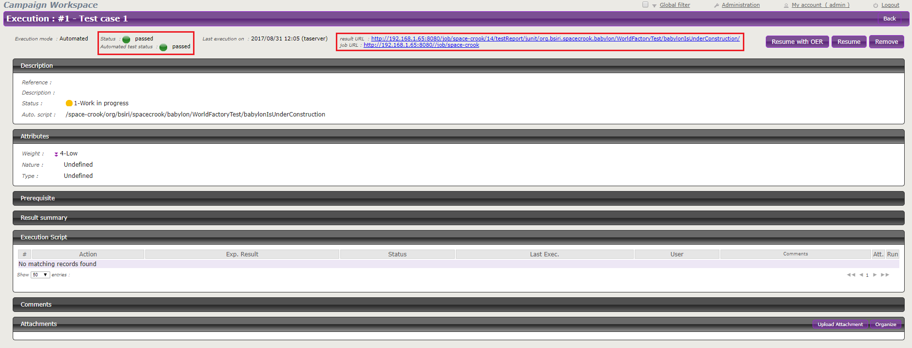{width="1220"}

  

# Comparison with Squash TA

The main user stories implemented by a regular Squash TM-TA stack are
fullfiled by the TM-publisher, but not all. Because the TM-publisher
plugin makes no assumption about the actual build tools and test runners
involved in the Jenkins build, many advanced features from Squash TA are
not available here due to integration problems.

The following features are supported :

-   TM user can bind a test case to a remote test hosted on Jenkins
-   TM user can start automated test suites
-   Test statuses are updated automatically on build completion

The following features are **NOT** supported :

-   Passing datasets to the automated tests
-   Running only a subset of the test suite : the job will run entirely
    and all tests will be run
-   Dispatch the tests on available slave nodes
-   Running tests in a specified order
-   Real-time status updates : all results will be pushed at the end of
    the build

  
