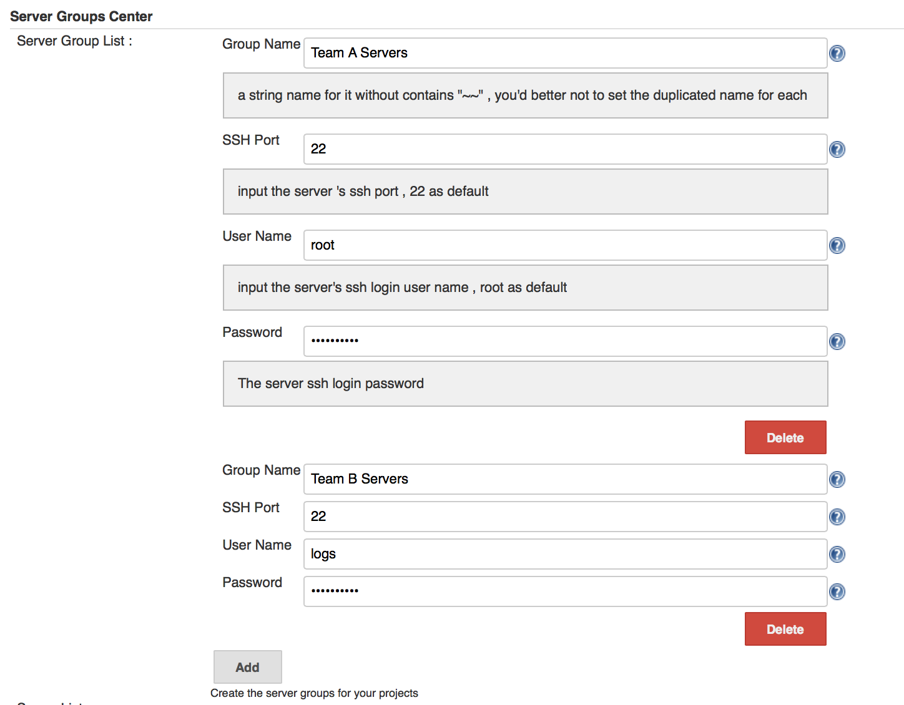
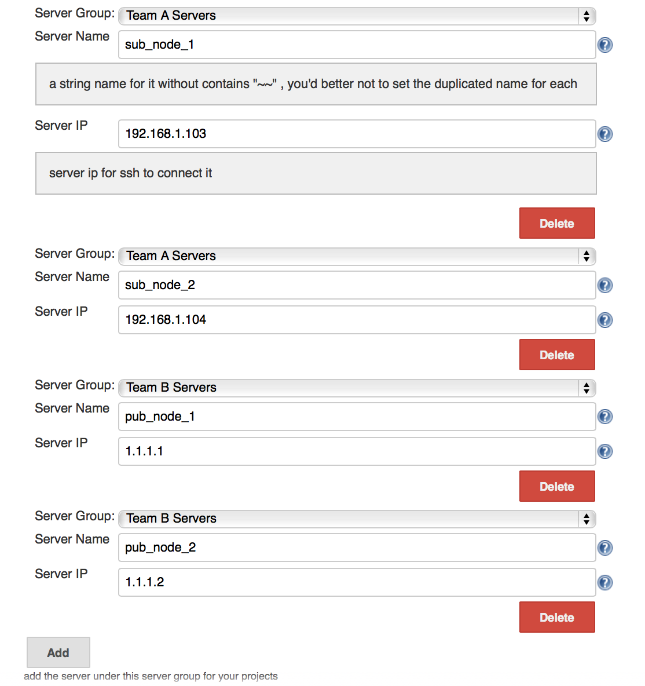
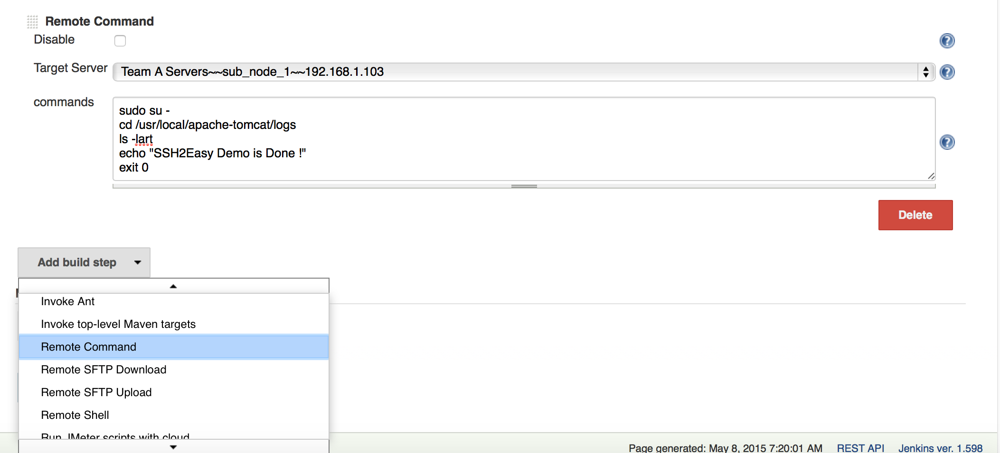
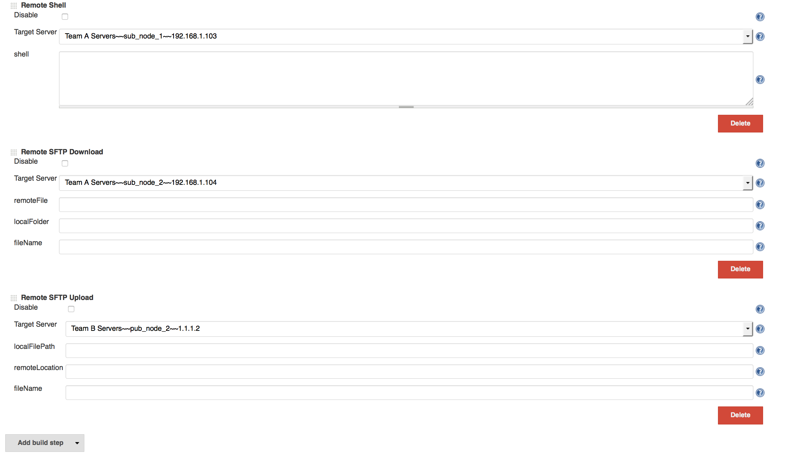

This plugin allows you to ssh2 remote server to execute linux commands ,
shell , sftp upload, downlaod etc

#### Quick Introduce

I ever worked at cloud system CI related tasks , Till now , There are
several SSH and ACL plugins , But they didn't fulfill our team's
requirements towards its management design and function , Base on that ,
I  redesign and rebuild this new plugin during my daily work , As time
went by , This plugin always provide good solution and resolve SSH and
ACL requirements almost compared with others , Its main advantages
includes :

1, In a cloud based large scale company , Its development environment
and testing environment is so complicated , its application deploy mode
is multi-styles base on different product , Some of others SSH plugin
can't work on such as Nohup start related features , when its SSH2 input
stream and output stream is keep alive , their build process will hung
on etc , This Plugin - SSH2Easy can resolve this problem .

2, When there are so many servers need to management by Jenkins , We
will need to input so many redundancy SSH info , such as SSH port , SSH
username , password with the other SSH plugins , Actually , the most of
VM and Servers have the same information for these items , Just only its
host IP is different , So If you use this plugin - SSH2Easy , it is more
convenient to manage them by SeverGroup mode .

3, This plugin also provide "Disable" feature for its build steps ,
During daily work , this feature is also very convenient .

4\. This plugin also provide to support Multi-Projects and Multi-Teams
share the same Jenkins System but with JobName level and ViewTab level
ACL strategy 

Overall , This plugin want to provide very simple and easy ways for its
useful features of SSH2  and ACL related features , So I want to share
it on public Jenkins Plugin Center here , Hope helpful to some of us
towards on SSH2 and ACL related requirements  .

#### 1. SSH2 accounts group management

{width="851"
height="664"}
{width="852"
height="903"}

#### 2. SSH2 remote shell  and command

{width="853"
height="393"}

#### 3. SFTP remote upload and download

{width="855"
height="497"}

#### 4. Project and View pattern based ACL strategy
