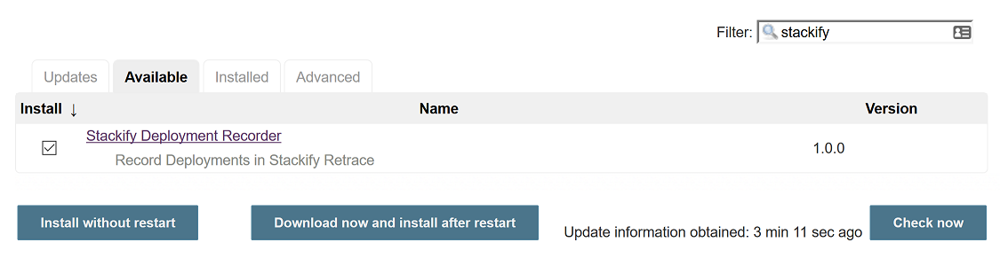
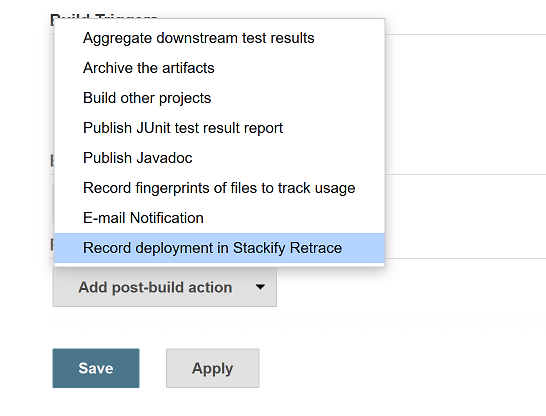
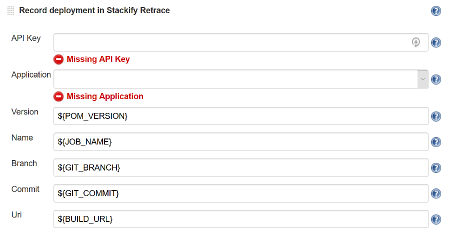
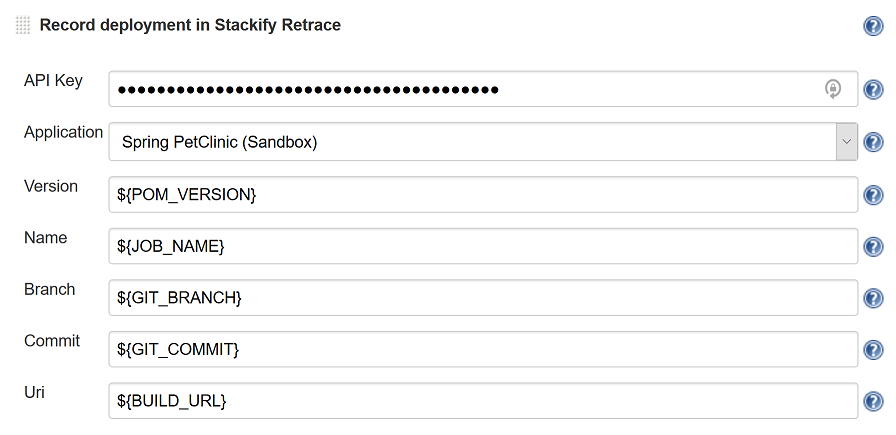
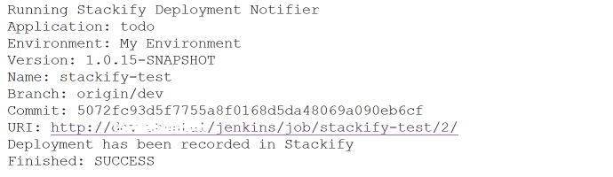
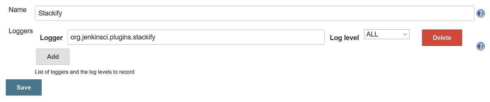
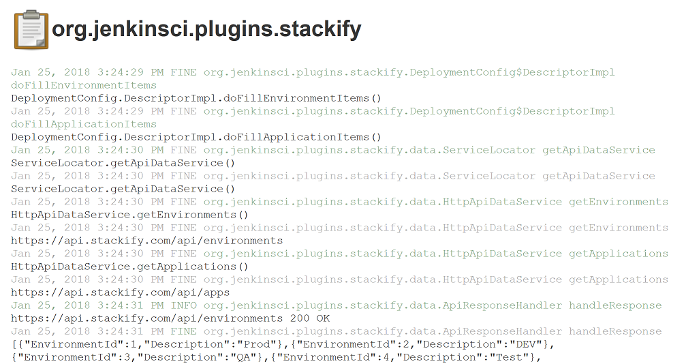

 

Jenkins Plugin to Record Deployments in Stackify Retrace  
  
Deployment Tracking Overview:  
<https://support.stackify.com/deployment-tracking-overview/>  
  
Sign Up for a Trial:  
<http://www.stackify.com/sign-up/>

## Installation

Manage Jenkins / Manage Plugins / Available

Search for 'Stackify' and install the 'Stackify Deployment Recorder'
plugin.

{height="150"}

## Usage

Jenkins Job / Configure

Add the 'Record deployment in Stackify Retrace' Post Build Action

{height="250"}

Fill in your Stackify API key first. You will then get a drop down list
of applications to pick from.

{height="250"}

The configuration defaults should be fine for a Git + Maven Java
project.

{height="250"}

Save your job configuration changes.

## Troubleshooting

#### Job Log

Jenkins Job / Console Output

{height="150"}

#### System Log

Manage Jenkins / System Log / Add new log recorder

Name: Stackify

Logger: org.jenkinsci.plugins.stackify

{height="150"}

Then you can view log messages from the Stackify plugin.

{height="250"}

 

  
  
  
  
