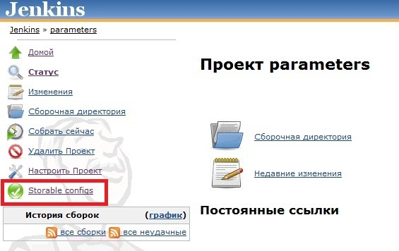
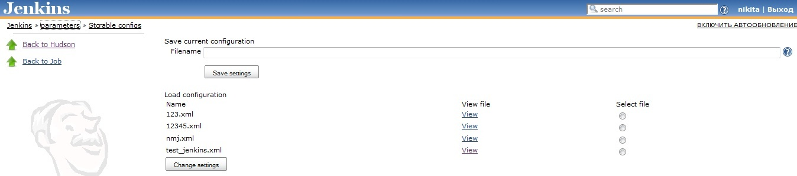

The current version of this plugin may not be safe to use. Please review
the following warnings before use:

-   [Arbitrary file read
    vulnerability](https://www.jenkins.io/security/advisory/2020-09-16/#SECURITY-1968%20(1))
-   [Arbitrary file write
    vulnerability](https://www.jenkins.io/security/advisory/2020-09-16/#SECURITY-1968%20(2))

This plugin allows you to save and load set of job parameters.

Hudson 1.366 or later.

This plugin was created for Hudson 1.366. It might not work with earlier
versions of Hudson.

# User guide

This plugin saves and loads job parameters (Boolean value, String
parameter,
[ScriptSelectionTaskDefinition](http://wiki.jenkins-ci.org/display/JENKINS/Selection+Tasks+Plugin)
and etc.).

1\. Select job. In menu there is button "Storable configs". Press this
button.

2\. You should see the following page with empty configuration list.

3\. For saving current job parameters you need to enter the filename and
to press "Save settings" button. Plugin will save all job parameters in
HUDSON\_HOME\\jobs\\job\_name\\storable-configs\\filename.xml . This
file will appear in "Load configuration" section. You may view all
available configuration files.

4\. For loading parameters you need to choose one file from the list and
to press "Change settings" button.

## Changelog 

##### Version 1.0 (February 28, 2011) 

-   Initial release.
