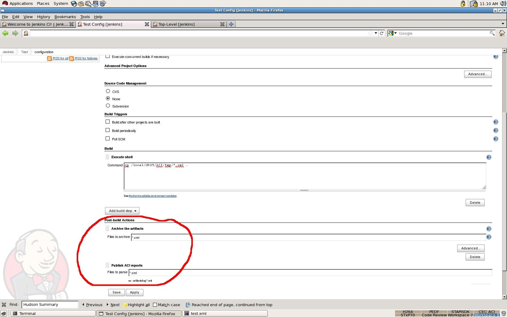
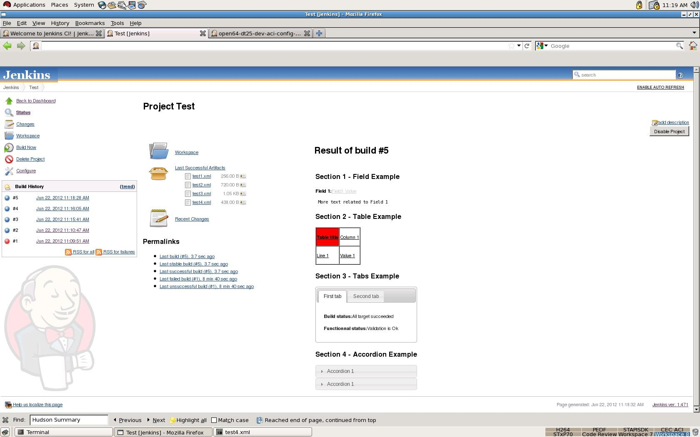
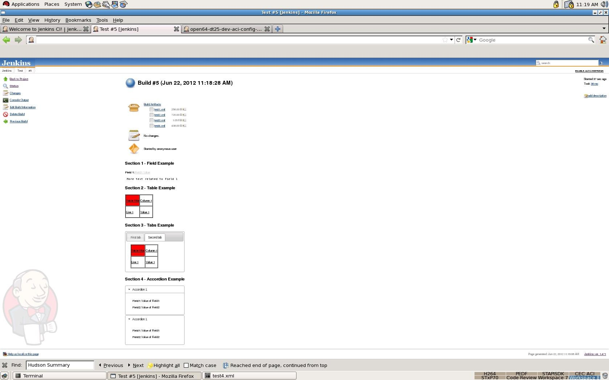

  
This plugin allows an easy and fully customized build report display.

# Table of Content

# Plugin Information

Display an extended summary report in project and build pages.

# Features

-   Allow a rich summary report visible from both project and build page
-   Reports must be written in an XML format according to the syntax
    described in section Syntax Description
-   This plugin allow the parsing of several XML files
-   Reports displayed are ordered according to the XML file names
-   Element displayed are based on 

# Usage

-   In order to activate the plugin you must:
    -   Activate result archiving of xml reports
    -   Activate ACI report publication of the xml summary reports



# Examples

-   Result at project level:



-   Same result at build page

  
  

# Syntax Description

The Summary\_report Hudson plugin can parse XML report with this
structure:   
Only one section can be use in each XML file.

### Section

Sections are created using *\<section\> ... \</section\>* tags.  
Section attributes are:

-   **name**: section name
-   **fontcolor**: section font color

Example:

``` syntaxhighlighter-pre
<section name="Performance Summary" fontcolor="#ffffff">
</section>
```

### Field

Fields are created using *\<field\> ... \</field\>* tags.  
Fields attributes are:

-   **name**: field name
-   **value**: field value
-   **href**: HTTP link, relative to the project build. For instance, to
    access artifact dir, you can specify href="artifact/artifacts"
-   **titlecolor**: font color for the field title
-   **detailcolor**: font color for the field details
-   **\<!\[CDATA\[ \]\]\>**: the CDATA term is used about text data that
    should not be parsed by the XML parser.  
    Everything inside a CDATA section is ignored by the parser. It can
    be used to insert HTTP link given an absolute reference, as
    specified in the example below. 

    > Only one CDATA is parsed between start and end field tag

Example:

``` syntaxhighlighter-pre
<field name="Field Name To Display" titlecolor="black" value="My Field Value" detailcolor="#000000" href="artifacts/field.txt">
    <![CDATA[
        ....TEXT....
        <a href="http://....">Link to something</a>
        ...Some more text...
     ]]>
</field>
```

### Table

Tables are created using *\<table\> ... \</table\>* tags.  
Fields attributes are:

-   ***sorttable="yes"****:* Each column become sortableTable structure:
-   Lines are created using *\<tr\>...\</tr\>* tags.
-   Column are created using *\<td\>...\</td\>* tags.

The number of column must be identical  in each line.

Attributes of a cell are:

-   **title**:\* \*The text to show when the cursor is over the table
    cell.
-   **bgcolor**: Cell background color.  
    Authorized values are: 
    -   red, 
    -   green, 
    -   black, 
    -   \#fffff....
-   **fontcolor**: Cell font color.  
    Authorized values are: 
    -   red,
    -   green, 
    -   black, 
    -   \#fffff....
-   **fontattribute**: Cell font attribute  
    Authorized values are:
    -   normal, 
    -   bold, 
    -   number between 100 and 900
-   **href**: Link, this link is relative from the artifact storage
    location.
-   **align**: The text alinment  
    Authorized values are:
    -   center, 
    -   left, 
    -   right, 
    -   justify
-   **width**: The width of the cell

Example:

``` syntaxhighlighter-pre
<table sorttable="yes">
        <tr>
                <td value="Table title" bgcolor="red" fontcolor="black" fontattribute="bold" href="report.xls" align="center" width="200"/>
                <td value="Column 1" bgcolor="white" fontcolor="black" fontattribute="normal" href="" align="center" width="200"/>
        </tr>
        <tr>
                <td value="Line 1" bgcolor="white" fontcolor="black" fontattribute="normal" href="" align="left" width="200"/>
                <td value="Value 1" bgcolor="white" fontcolor="black" fontattribute="normal" href="" align="none" width="200"/>
        </tr>
</table>
```

### Tabs

A tab set can contain a lot of tab. Tab sets are created using *\<tabs\>
... \</tabs\>* tags.

In a tab set, a tab is created using *\<tab\> ... \</tab\>* tags.

Tab attributes are:

-   **name**: Tab name

Content allowed for a tab:

-   field
-   table

> It's not possible to insert tabs or accordion.

Example:

``` syntaxhighlighter-pre
<tabs>
    <tab name="First tab">
        <field name="Build status" value="All target succeeded" />
        <field name="Functionnal status" value="Validation is Ok" />
    </tab>
    <tab name="Second tab">
        <table>
            <tr>
                <td value="Table title" bgcolor="red" fontcolor="black" fontattribute="bold" href="report.xls" align="center" width="200"/>
                <td value="Column 1" bgcolor="white" fontcolor="black" fontattribute="normal" href="" align="center" width="200"/>
            </tr>
            <tr>
                <td value="Line 1" bgcolor="white" fontcolor="black" fontattribute="normal" href="" align="left" width="200"/>
                <td value="Value 1" bgcolor="white" fontcolor="black" fontattribute="normal" href="" align="none" width="200"/>
            </tr>
        </table>
    </tab>
</tabs>
```

### Accordion.

Accordions are created using *\<accordion\> ... \</accordion\>* tags.  
Accordion* *attributes are:

-   **name**: Accordion name

Content allowed for nn accordion:

-   fields 
-   table.

> It's not possible to insert tabs or accordion.

### A Full Section Example

``` syntaxhighlighter-pre
<section name="" fontcolor="">
    // To display a field
    <field name="" titlecolor="" value="" detailcolor="" href=""> <![CDATA[  ]]> </field>

    // To display a table
    <table>
        <tr>
            <td value="" bgcolor="" fontcolor="" title="" fontattribute="" href="" align="" width=""/>
            <td value="" bgcolor="" fontcolor="" title="" fontattribute="" href="" align="" width=""/>
        </tr>
        <tr>
            <td value="" bgcolor="" fontcolor="" title="" fontattribute="" href="" align="" width=""/>
            <td value="" bgcolor="" fontcolor="" title="" fontattribute="" href="" align="" width=""/>
        </tr>
    </table>

    // To display tabs
    <tabs>
        <tab name="">
        // Only insert table or field in tab
        </tab>
        <tab name="">
        // Only insert table or field in tab
        </tab>
    </tabs>

    // To display an accordion
    <accordion name="">
    // Only insert table or field in tab
    </accordion>
</section>
```

# Changelog

### Version 1.15 (Jan 29, 2016)

-   Fix issue [JENKINS-33044](https://issues.jenkins-ci.org/browse/JENKINS-33044): implement
    SimpleBuildStep thanks to Egor Shchegolkov
-   Made project testable on windows thanks to Egor Shchegolkov

### Version 1.14 (Jan 29, 2016)

-   Fix issue [JENKINS-30146](https://issues.jenkins-ci.org/browse/JENKINS-30146)
    Plugin is hanging builds when running concurrently thanks
    to Shuaibing Li <Shuaibing.Li@lombardrisk.com>
-   Cleanup unused source files

### Version 1.13 (Apr 21, 2015)

-   Display on project page is now optional thanks to martinda
-   Project without builds no longer create errors thanks to martinda

### Version 1.12 (Nov 7, 2014)

-   Fix
    issue [JENKINS-25466](https://issues.jenkins-ci.org/browse/JENKINS-25466) thanks
    to Magnus Jacobsson 

### Version 1.10 (Sep 26, 2013)

-   Fixes for compatibility with jenkins version 1.532

### Version 1.9 (Feb 6, 2013)

-   Added some checks to avoid warning messages (Contribution from
    David-caro <david.caro.estevez@gmail.com>)

### Version 1.8 (Jan 8, 2013)

-   Avoid javascript conflicts and allow absolute links (Contribution
    from Mattias Holmund)
    -   Absolute links did not work, they were prefixed with a
        buildnumber
    -   There were javascript conflicts between the jquery included in
        summary\_report and the prototype.js used by jenkins
    -   There were javascript conflicts between sorttable and javascript
        code included in jenkins. It manifested itself for me with the
        claim-plugin, but I believe it can cause all sorts of mysterious
        problems.
-   Table output slightly restyled and can now be restyles more with
    css.

### Version 1.7 (Dec 10, 2012)

-   Use CSS classes for styling (Contribution from Mattias Holmund)

### Version 1.5 (Sept 12, 2012)

-   Align panel on right without any size limit
-   Add support for attribute title in cells (\<td title="my title"\>)

### Version 1.4 (Jul 5, 2012)

-   Fix for URL loading issue when using plugin from windows
-   Improve error reporting

### Version 1.3 (Jun 22, 2012)

-   Rename Git repository in summary\_report-plugin to follow rules.
-   Corrections in the documentation.

### Version 1.2 (Jun 22, 2012)

-   Rename plugin from Hudson Summary Display to Summary Display
-   Change keyword in the Jenkins prject configuration panel

### Version 1.1 (Jun 20, 2012)

-   Cleanup in the descriptors.

### Version 1.0 (Jun 13, 2012)

-   Initial Release.
