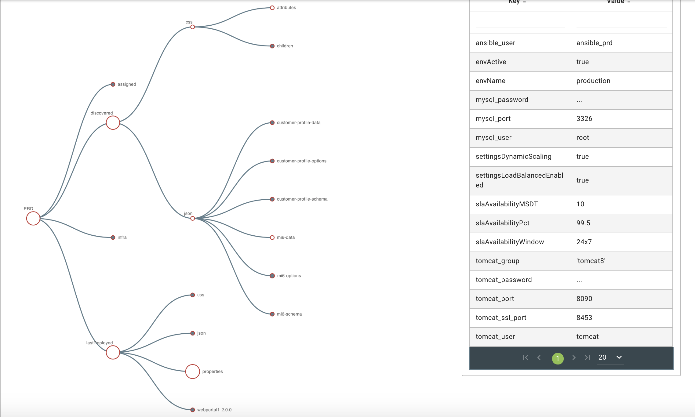
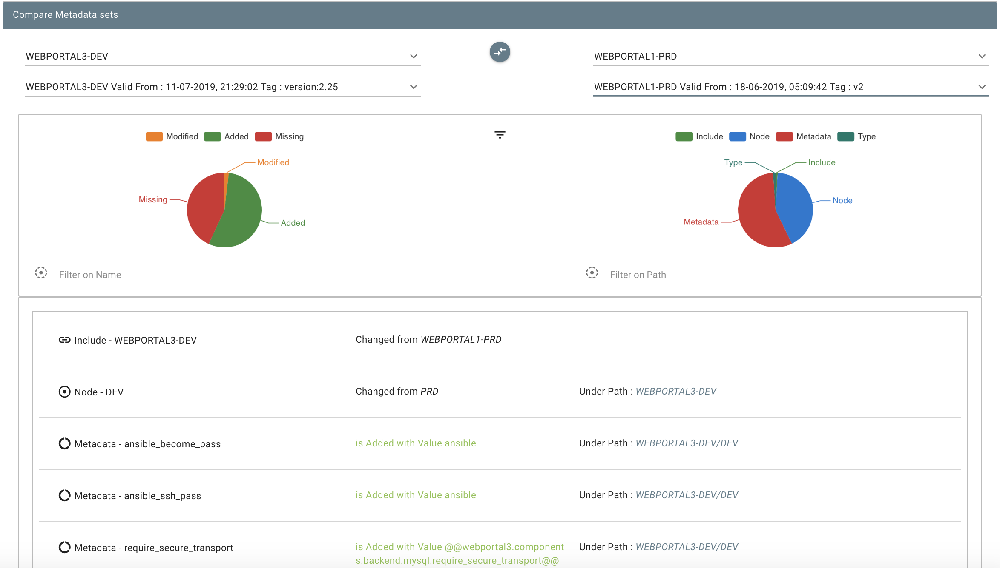
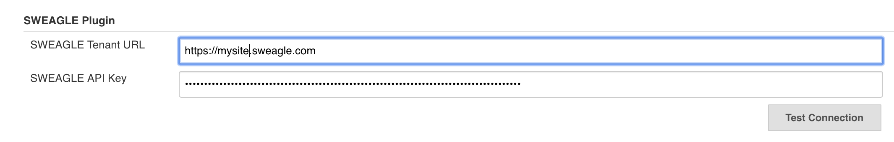
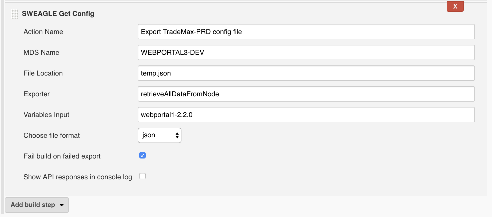

# [{height="200"}](https://sweagle.com/)

# A quality gate for your configuration data.

SWEAGLE is a SaaS or On-Premise platform for managing, consolidating &
continuously validating all kinds of configuration data which is crucial
to your CI/CD pipeline.  This plugin allows for uploading config data
into SWEAGLE so it can be versioned, validated, and made consumable in
many different formats.   More info about SWEAGLE can be found
at <https://www.sweagle.com/>.   

For more information about the SWEAGLE API, register for an account
at [https://support.sweagle.expert](https://support.sweagle.expert/).

The SWEAGLE plugin for Jenkins supports Jenkins Pipeline.  See an
example pipeline script
here:<https://wiki.jenkins.io/display/JENKINS/SWEAGLE+pipeline+example>

{width="450"}{width="450"}

  

  

The plugin supports 4 types of Jenkins build steps for stages of a
config data lifecycle. 

## Upload --\> Validate --\> Snapshot --\> Export

Global Config

{width="790"}

|                    |                                                                                               |
|--------------------|-----------------------------------------------------------------------------------------------|
| SWEAGLE API Key    | API key from API type user with appropriate permissions required for automating SWEAGLE tasks |
| SWEAGLE Tenant URL | SaaS or On-Premise URL of your SWEAGLE instance                                               |

  

All actions have an Action Name parameter and a Show API responses
parameter that provide more context for the action in the Jenkins
console log.  

  

|                                   |                                                                                  |
|-----------------------------------|----------------------------------------------------------------------------------|
| Action Name                       | Give each action a descriptive name to precede the job's output in the console.  |
| Show API Responses in Console Log | If checked, SWEAGLE REST API responses will be displayed in the job console.     |

## Upload Build Step

[{width="790"}](https://github.com/jenkinsci/sweagle-plugin/blob/master/screenshots/upload.png)

[TABLE]

## Validate Build Step

{width="790"}

[TABLE]

## Snapshot Build Step

[{width="790"}](https://github.com/jenkinsci/sweagle-plugin/blob/master/screenshots/snapshot.png)

|                        |                                                                                                                                  |
|------------------------|----------------------------------------------------------------------------------------------------------------------------------|
| MDS Name               | Exact name of pending metadata set for which the snapshot should be taken                                                        |
| Description            | Description of the snapshot                                                                                                      |
| Tag                    | A single string as TAG for that snapshot - cannot contain spaces but can utilize Jenkins variable4s ex "release1.2.${BUILD\_ID}" |
| Fail Build on Snapshot | If the snapshot should fail for any reason, fail the build.                                                                      |

## Get Config Build Step

{width="790"}  
  

|               |                                                                                       |
|---------------|---------------------------------------------------------------------------------------|
| MDS Name      | The stored Metadata set to use for retrieving the config data.                        |
| File Location | The location and filename in the Jenkins workspace to save the retrieved config data. |
| Exporter      | The SWEAGLE exporter to use when retrieving the config data.                          |
