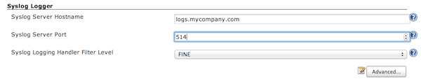
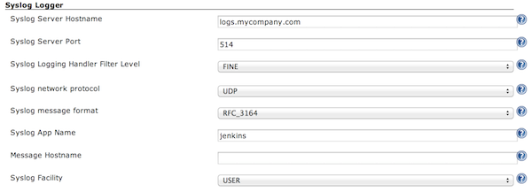

This plugin send jenkins logs to syslog.

# Description

The Jenkins Syslog Logger Plugin send the Jenkins logs to a Syslog
Server.

Features:

-   Network protocol: 
    -   UDP is currently the only supported network protocol. 
    -   TCP ([RFC 6587: Transmission of Syslog Messages over
        TCP](https://tools.ietf.org/html/rfc6587))
        -   Message delimitation is done with "\\r\\n" (aka "3.4.2.
            Non-Transparent-Framing"). Delimitation indicating the
            message size (aka "3.4.1. Octet Counting") is not
            implemented for the moment.
    -   TCP + SSL ([RFC 5425: Transport Layer Security (TLS) Transport
        Mapping for Syslog](https://tools.ietf.org/html/rfc5425))
        -   The certificate of the Syslog server must be trusted by the
            JVM, no mechanism has been implemented for the moment to
            provide a specific trust store and/or to disable certificate
            validation.
        -   Client Authentication is not supported for the moment.
-   Message format: both [RFC 3164: The BSD syslog
    Protocol](https://tools.ietf.org/html/rfc3164) and [RFC 5424: The
    Syslog Protocol](http://tools.ietf.org/html/rfc5424) are supported .

# Configuration

The Jenkins Syslog Logger Plugin can be configured in the "Configure
System" screen.

## Basic Configuration

## Advanced Configuration

# Changelog

### Version 1.0.5 (Nov 10, 2015)

-   Fix
    [JENKINS-31189](https://issues.jenkins-ci.org/browse/JENKINS-31189)
    Add setters on configuration for Groovy scripting

### Version 1.0.4 (Apr 16, 2015)

-   Fix
    [JENKINS-27959](https://issues.jenkins-ci.org/browse/JENKINS-27959) -
    define UDP as the default transport

### Version 1.0.3 (Feb 25, 2015)

-   Upgrade
    [syslog-java-client](https://github.com/CloudBees-community/syslog-java-client)
    to version
    [1.0.5](https://github.com/CloudBees-community/syslog-java-client/releases/tag/syslog-java-client-1.0.5)
    for bug fixes

### Version 1.0.2 (Sept 28, 2014)

-   Add support for new Syslog transports: TCP and TCP + SSL

### Version 1.0.1 (Apr 15, 2014)

-   Fix "Infinite loop in java.util.logging when logging is enabled on
    UdpSyslogMessageSender"

### Version 1.0.0 (Apr 7, 2014)

-   Initial version
