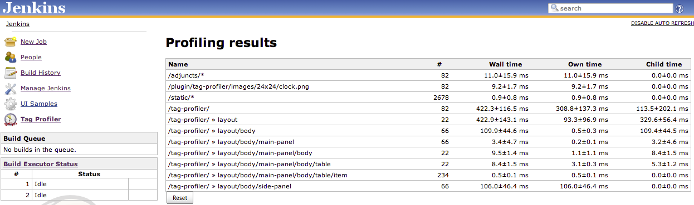

# Tag Profiler Plugin

This plugin is aimed at plugin developers. It allows you to profile
different sections of jelly tags in order to identify response
bottlenecks.

By default this plugin will profile all requests. To profile a specific
part of a page just surround that part of the page with a \<p:profile
name="..."\>...\</p:profile\> tag, e.g.

``` syntaxhighlighter-pre
<j:jelly xmlns:j="jelly:core" xmlns:st="jelly:stapler" xmlns:l="/lib/layout"
         xmlns:f="/lib/form" xmlns\:p="/lib/profile">
  <l:layout title="${it.displayName}">
    <p:profile name="side-panel">
      <st:include page="sidepanel.jelly"/
    </p:profile>
    <p:profile name="main-panel">
      ...
    </p:profile>
  </l:layout>
</j:jelly>
```

You can also use the profiler from within your code, e.g.

``` syntaxhighlighter-pre
import org.jenkinsci.plugins.tagprofiler.ProfileStats;
...
    ProfileStats.enter("critical");
    try {
        ...
    } finally {
        ProfileStats.leave();
    }
```

The profiling results are available from the /tag-profiler root action.
They look something like this:
  
The Reset button will reset the current measurements. The ± value is the
standard error of the mean.

# Tips & Tricks

-   When using hpi:run, be aware that the jelly pages are checked for
    modification on every access, so performance can appear worse than
    when running in stock Jenkins
-   This kind of profiling is only really intended for those cases where
    a regular profiler will not help, namely when profiling within jelly
    tags. Very often there are some simple changes in jelly that will
    result in a major performance boost.
-   If you are repeatedly evaluating the same EL fragment, consider
    caching that fragment with \<j:set var="" value=""/\> this can have
    a major performance boost where the EL fragment is time-costly to
    evaluate.

# Version History

## Version 0.2 (2013-02-15)

-   Added configuration options to disable profiling and to turn off the
    request URI categorization of profile segments

## Version 0.1 (2013-02-15)

-   Initial release
