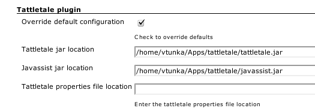
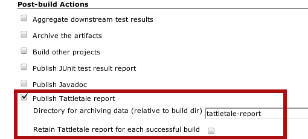
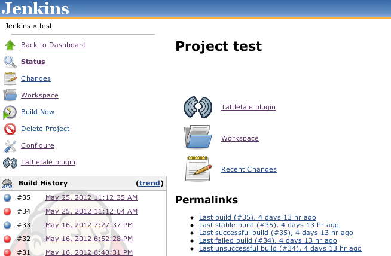
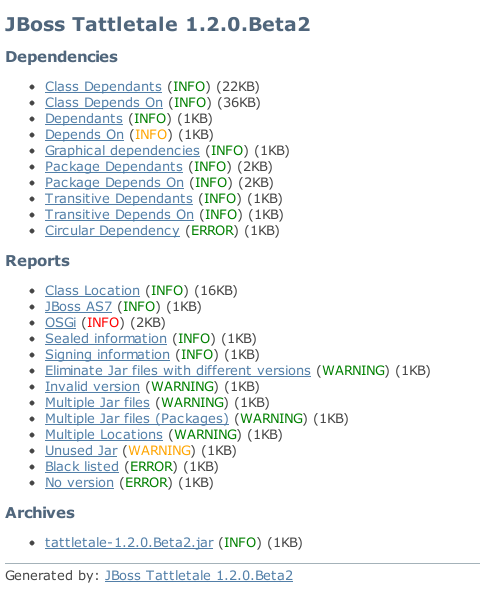



| Plugin Information                                                                                       |
|----------------------------------------------------------------------------------------------------------|
| View Tattletale [on the plugin site](https://plugins.jenkins.io/tattletale-plugin) for more information. |

**This plugin is up for adoption.** Want to help improve this plugin?
[Click here to learn
more](http://localhost:8085/display/JENKINS/Adopt+a+Plugin "Adopt a Plugin")!

This plugin generates [Tattletale](http://www.jboss.org/tattletale)
reports, mostly useful for jar file analysis.

Tattletale can:

-   Identify dependencies between JAR files
-   Find missing classes from the classpath
-   Spot if a class/package is located in multiple JAR files
-   Spot if the same JAR file is located in multiple locations
-   With a list of what each JAR file requires and provides
-   Verify the SerialVersionUID of a class
-   Find similar JAR files that have different version numbers
-   Find JAR files without a version number
-   Find unused JAR archives
-   Identify sealed / signed JAR archives
-   Locate a class in a JAR file
-   Get the OSGi status of your project
-   Remove black listed API usage
-   And generate the same reports for your .WAR and .EAR archives  

Installation Requirements

This plugin requires tattletale and javassist unzipped on filesystem.

Latest release download location:
<http://maven.jenkins-ci.org:8081/content/repositories/releases/org/jenkins-ci/plugins/tattletale-plugin/0.3/>

# Description

The Tattletale plug-in can generate tattletale reports and archive them
for each build.

The following features are provided by this plug-in:

-   Tattletale execution using embedded mechanism
-   Configuring which files to scan after each build.
-   Report archivation for each build or per project
-   Easy access and viewing of Tattletale reports

# How To Use

1.  Download
    [Tattletale](http://sourceforge.net/projects/jboss/files/JBoss%20Tattletale/) or
    use tattletale maven or ant integration
2.  Install plugin, Manage Hudson\> manage plugins \>Available
3.  Configure the tattletale and javassist (contained with tattetale
    download) location
4.  Restart app server/ Hudson
5.  If you want the plugin to execute Tattletale add "Invoke Tattletale"
    build step otherwise use maven or ant tattletale integration in your
    project
6.  Check "Publish Tattletale report" in the post-build actions in your
    project 
7.  Explore generated reports on project / build page

Step no. 3 - configuring global plugin settings:  

Step no. 4 - invoking Tattletale for your project:  

Step no. 5 - archiving reports:  

Step no. 6 - Tattletale reports on project / build page:

 

Example report:  

# Changelog

Release 0.3

-   Initial release
-   Support for direct Tattletale execution (or usage of maven/ant
    integration)
-   Support for archiving reports per build or per project
