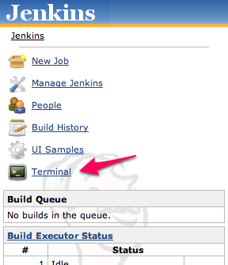
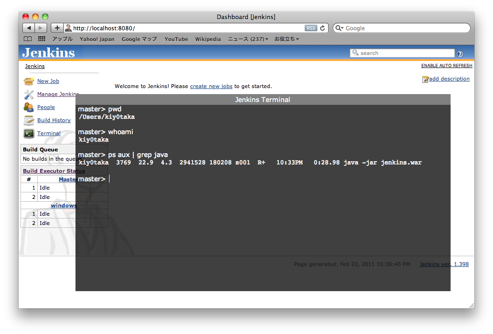
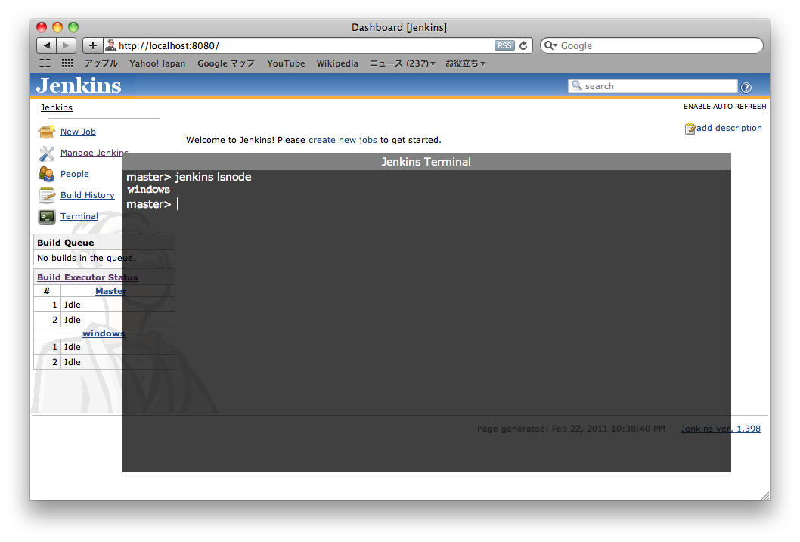
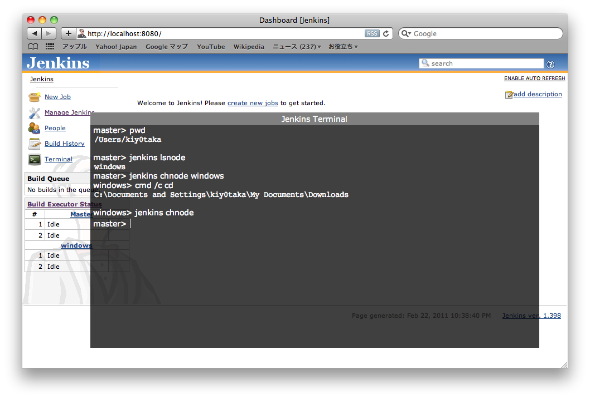

This plugin allows you to execute OS commands.

# Usage

### Show Terminal

### Run command

### Show node list

### Run command at slave

# See also

[Remote Terminal Access
Plugin](https://wiki.jenkins.io/display/JENKINS/Remote+Terminal+Access+Plugin)

# Version History

## Version 1.4 (May 23, 2013)

-   Use POST method instead of GET.
    [JENKINS-18057](https://issues.jenkins-ci.org/browse/JENKINS-18057)

## Version 1.3 (Mar 1, 2011)

-   Rename to Jenkins.
-   Time out error handling bug fix.

## Version 1.1 (Jan 30, 2011)

-   Fix bug when running with --prefix=xxx option.
    [JENKINS-8609](http://issues.jenkins-ci.org/browse/JENKINS-8609 "JENKINS-8609")

## Version 1.0

-   Initial release
