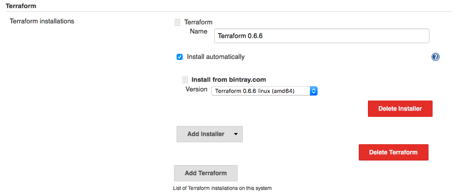
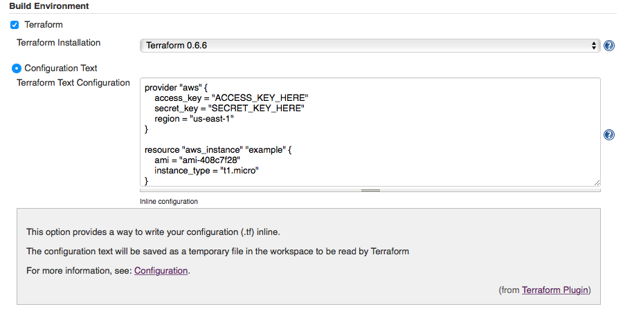
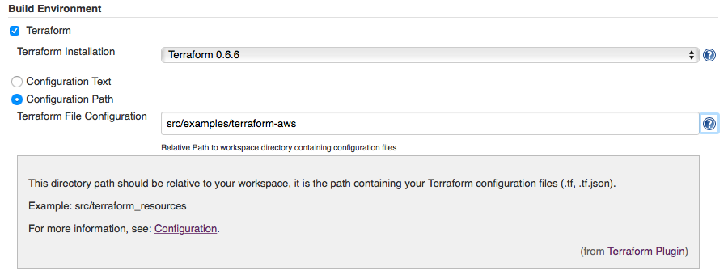
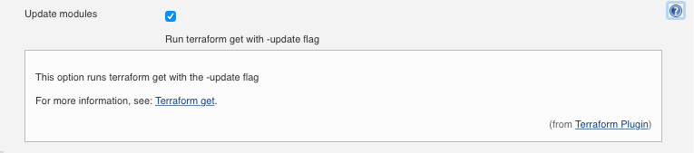
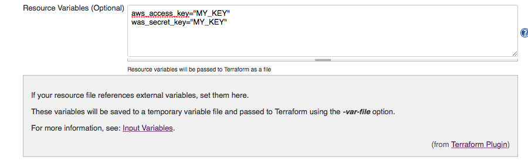
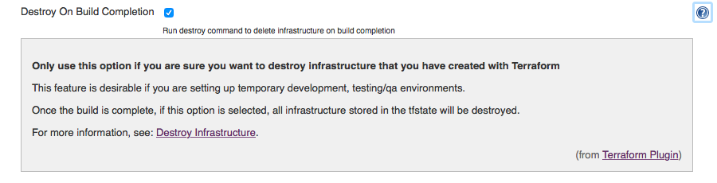

Allows users to launch infrastructure
using [Terraform](https://terraform.io/) as a build wrapper.

## Configuration

### System Configuration

This plugin provides an auto-installer to install the Terraform binary
from [bintray.com](http://bintray.com/). To install, select the version
you would like for your platform.

### Job Configuration

This plugin works as a build wrapper and can be invoked by selecting
Terraform under the Build Environment section of your job configuration.

A workspace directory **terraform-plugin** will be created, this is
where temporary files are created and automatically deleted after runs.

This directory also contains the generated tfstate file
**terraform-plugin.tfstate**.

This generated tfstate file is not deleted and is always passed to
Terraform using
**-state=workspace/terraform-plugin/terraform-plugin.tfstate** as an
extra safety measure so as to not use any other tfstate file you might
have in a workspace.

The first step is to decide how you would like to pass your
configurations to Terraform, there are 2 options:

##### Option 1: Configuration Text

This option allows you to copy what would be in a resource file (.tf)
into a textarea. This text will then be written to a temporary file
(workspace/terraform-plugin/terraform-TEMP.tf) and parsed by Terraform.

##### Option 2: Configuration Path

This option provides a directory path (relative to your workspace) to
enter where your configuration files (.tf) exist. If no path is given,
it defaults to the workspace path.

##### Update modules (Optional)

Terraform will run the get command by default, use this option to run
Terraform get with the -update flag.

##### Resource variables (Optional)

If you are using resource files that reference external variables, set
these variables here.

These variables will be written to a temporary file
(workspace/terraform-plugin/variables-TEMP.tfvars) and will be passed to
Terraform using the **--var-file=** option.

##### Advanced

If you want to destroy the architecture you have created once the build
is complete, click the advanced button and check Destroy On Build
Completion.

This will call Terraform with the **destroy --force** option which will
look at the generated terraform-plugin.tfstate file
(workspace/terraform-plugin/terraform-plugin.tfstate) and destroy
everything under Terraform supervision.

## Changelog

### Release 1.0.9 (November 7, 2016)

-   Fix for pipeline tool auto-install

### Release 1.0.8 (November 3, 2016)

-   Adding apply as an optional step

### Release 1.0.6 (July 29, 2016)

-   Bugfix for modules

### Release 1.0.5 (July 17, 2016)

-   Added terraform get command by default, with optional -update flag

### Release 1.0.4 (March 19, 2016)

-   Redundant debug output log line removed

### Release 1.0.3 (March 19, 2016)

-   No changes from 1.0.2

### Release 1.0.2 (March 19, 2016)

-   Support for environment variable substitution when using inline
    configuration and optional variable file

### Release 1.0.1 (Dec 04, 2015)

-   Release snafu, No changes from 1.0.0

### Release 1.0.0 (Dec 04, 2015)

-   Initial release
