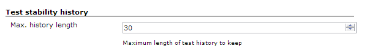
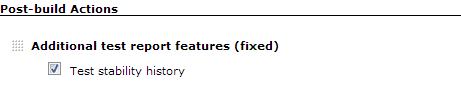
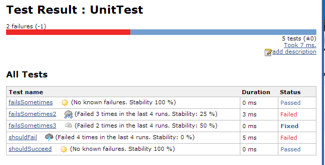

#### Developed By [](http://www.esailors.de/en/)

------------------------------------------------------------------------

  

This plugin adds historical information about the stability of tests -
i.e. the percentage how often they failed.

## Version 2.x

The plugin now implements newer APIs which allow it to work with
Pipeline builds. The version has been bumped to 2.x because the
test-stability plugin now requires Jenkins Core 1.596 (instead of 1.480)
and no longer supports the old *Additional test report features (fixed)*
workaround.

## Configuration

### Global

Configure the maximal history length (default is 30)



### Per-Job

Enable the *Additional test report features*.

###### **For Jenkins \< 1.530 only!** *(Plugin version 1.0 only)*

Note that for maven jobs you must use the *Additional test report
features (fixed)* as the built-in Jenkins one is broken up until Jenkins
1.529.



## Pipeline usage *(Plugin version 2.x or later)*

Instead of using this in your Jenkinsfile to collect test results:

``` syntaxhighlighter-pre
    junit '**/*.xml'
```

you should use this:

``` syntaxhighlighter-pre
    junit testResults: '**/*.xml', testDataPublishers: [[$class: 'StabilityTestDataPublisher']]
```

## Test health

Example test result:


