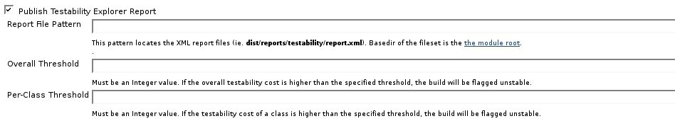
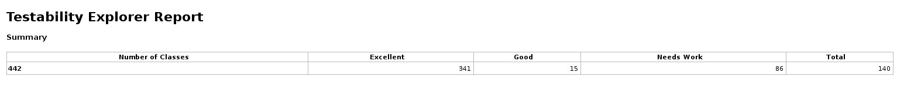
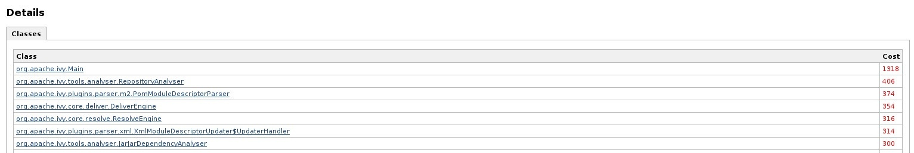
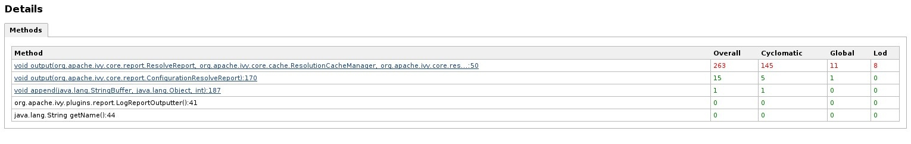
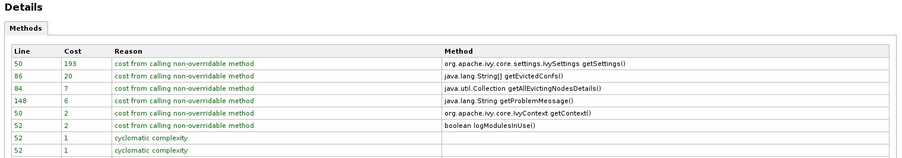
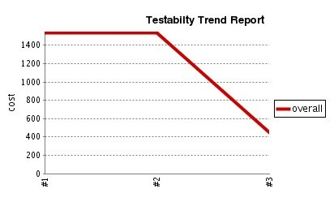
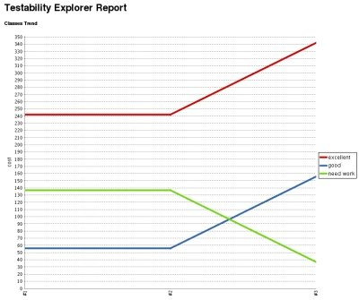

This plugin generates trend reports for the [Testability
Explorer](http://code.google.com/p/testability-explorer/), an open
source program which uses byte-code analysis to look for testability
pitfalls in Java code. 

# Description

Testability Explorer is an open-source tool that identifies hard-to-test
Java code. Testability Explorer provides a repeatable objective metric
of "testability." This metric becomes a key component of engineering a
social change within an organization of developers. The Testability
Explorer report provides actionable information to developers which can
be used as measure of progress towards a goal and a guide to refactoring
towards a more testable code-base. Further information can be found
[here](http://googletesting.blogspot.com/2008/10/testability-explorer-measuring.html).

# The Plugin

The following features are provided by this plug-in:

-   Configuration
    -   Configuration of the XML report files to scan after a build.
    -   Configurable threshold value at which a build will become
        unstable if your code's testability is beyond this number.
-   Trend reports
    -   Overall testability cost for your project.
    -   Number of excellent, good and poor testable classes in your
        project.
    -   Detailed information how the testability cost is aggregated per
        class.

The current release is available in the [download
section](https://hudson.dev.java.net/servlets/ProjectDocumentList?folderID=10351&expandFolder=10351&folderID=5818).
This plug-in is developed and maintained by [Reik
Schatz](http://javasplitter.blogspot.com/). Please use the Hudson
[mailing
lists](https://hudson.dev.java.net/servlets/ProjectMailingListList) or
the Testability Explorer [mailing
list](http://groups.google.com/group/testability-explorer) to ask
questions, create feature request or bug reports.

# Installation

Use the Hudson plugin browser or
[Download](https://hudson.dev.java.net/servlets/ProjectDocumentList?folderID=10351&expandFolder=10351&folderID=5818)
and install the plugin. Restart Hudson, then go to your project and
click on `Configure` in the left menu.

# Configuration

Check `Publish Testability Explorer Report`. Enter the correct path to
your Testability Explorer report files. The path will be relative to
your project root. The project root is usually where your build.xml
(Ant) or pom.xml (Maven) file is located. Let's say as part of your
build, you create the Testability Explorer report in
`reports/testability/result.xml`, then the **Report File Pattern** for
Hudson would have to be `reports/testability/result.xml` or
`reports/testability/*.xml` if you want to use a Wildcard.

The **Overall Threshold** is a number value representing an overall
testability cost. By setting this threshold you define that your project
code base, must not have a higher overall testability cost than this
number. If the testability cost is higher, the build will become
unstable. As a rule of thumb, a good testability is below 100 but aim
for a score below 50. The Hudson core project has more than 500 classes
and a great testability score of just 22!

The **Per-Class Threshold** is a number value representing a testability
cost on a per class basis. By setting this threshold you define that not
a single class in your project may have a higher testability cost than
this value. If the testability cost of any class is higher, the build
will become unstable.

# Reports

For each individual build you can review the testability scores. Click
on a single build in the left column then on the Testability Explorer
Report icon in the screen center. This will bring up the detailed
report. You can see a summary on a class basis, which will show you the
number of classes in your project and how many of them a excellent, good
and poor testable. The total is the overall testability score for your
project.

In the lower section of the start screen, you will see the 20 least
testable classes in your project.

You can click on any of these classes to see an aggregation of what is
causing the cost on a method level. For every method in the selected
class, you can see how much testability cost is associated. The methods
will be ordered by their cost - highest first. Depending on the
testability cost, the rows will be marked red, yellow or green. The
colors map to what Testability Explorer considers excellent, good and
poor.

Then for each method, you can go into further detail and see how the
cost is computed. Within the method, as your code executes, every line
might come with a testability cost. This screen will tell you what is
causing the cost.is found within a

# Trends

In the main project page, you have a testability trend graph to the
right side. This is how your overall testability is evolving during the
different builds. The **Testability Explorer Report** icon in the center
and the left menu, will bring you to a testability trend graph on the
class level. You can see how many excellent, good or poor testable
classes you have and how this number is changing over time.

### Changelog

##### Version 0.4 (May 29, 2012)

-   Restored functionality

##### Version 0.3 (Dec 29, 2009)

-   Added support for report aggregation
-   Report improvements
    -   Better html output
    -   Tabbing with context header
    -   Conditional rendering depending on the amount of results
        available
-   I18N modifications + Dutch translations
-   Updated uses of deprecated APIs

##### Version 0.2 (Jan 14, 2009)

-   fixed bug where number of classes in report summary will always be
    between 1 and 20
-   added colors to rows in report summary
-   added new configuration value "per-class threshold"
-   method signatures in report screens are not abbreviated after 130
    characters
-   fixed a bug where no report classes showed up in report summary if
    you had only 1 class in your project
-   methods in report screens are ordered by their testability cost
-   added method details and cost reason as report screens
-   fixed a bug where trendline in graphs was interrupted in builds

##### Version 0.1

-   First version
