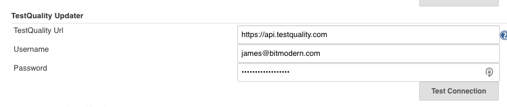
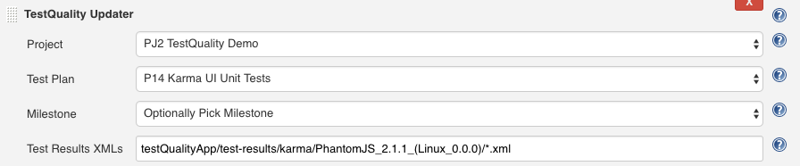

This plugin allows you to automatically upload test results to
TestQuality for further analysis.

# Usage

In order to upload test results you will first have to create a Test
Plan in TestQuality. Each testing job in jenkins should get it's own
Test Plan. Otherwise the system might assume tests have been removed
when alternating between different test results with different tests.

### Setup

Under Manage Jenkins \> Configure System. 

Fill in your username and password for TestQuality and push Test
Connection.

For the Jenkins job, add a Post-build Action. Choose TestQuality
Updater.

Select Project, Test Plan and Milestone. The Test Results XMLs, works
the same as JUnit Test Result plugin.

# Changelog

### Version 1.0

Initial version also for automatic upload of test results. 

### Version 1.3

Bug fixes.
