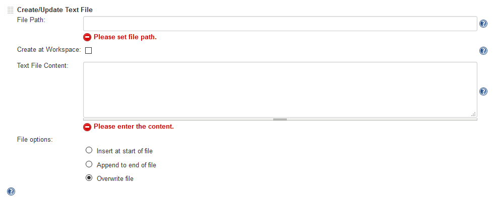

Provides a build step to create or update text file with specified
content.

Common use cases: Create readme, build details, batch files or any
scripts which can be executed later.

## Features:

-   Create a new text file or overwrite existing file
-   Update existing files

## How to use?

File Path: Path to create text file (variables can be used here).

Create at Workspace: Enable this to create the file at workspace
directory else full path must be specified.

Text File Content: The content of the file (variables can be used here).

File Options: You may overwrite, append to end or insert at start of a
file. To create a new file use Overwrite option.

## Version History:

### V1.3.2 (April 08, 2016):

-   Fixed
    [JENKINS-32694](https://issues.jenkins-ci.org/browse/JENKINS-32694)
    &
    [JENKINS-33899](https://issues.jenkins-ci.org/browse/JENKINS-33899)
    : Exception during logging.

### V1.3.1 (March 26, 2016):

-   Fixed
    [JENKINS-32694](https://issues.jenkins-ci.org/browse/JENKINS-32694)
    : Directory or path separator fixed for \*nix systems.

### V1.3.0 (March 20, 2016):

-   Fixed
    [JENKINS-32694](https://issues.jenkins-ci.org/browse/JENKINS-32694)
    : Introduced "Create at Workspace" checkbox, if enabled then  the
    file will be created at workspace directory.
-   Fixed
    [JENKINS-33221](https://issues.jenkins-ci.org/browse/JENKINS-33221)
    : Added logging
-   Fixed issue with adding multiple end of lines when appending to end
    of file or insert at start.

### V1.2.1 (December 23, 2015):

-   First release of plugin
