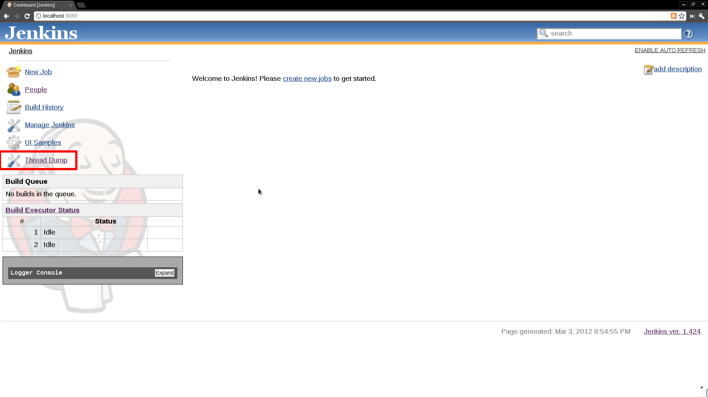
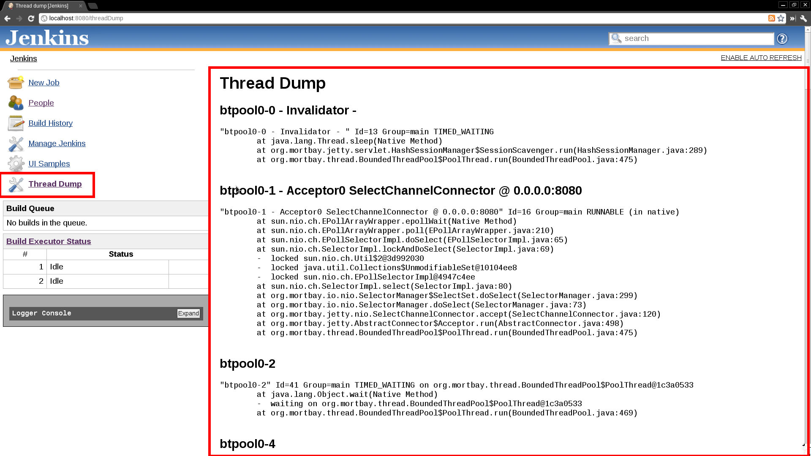

# Thread Dump Action Plugin

Provides an easy mechanism to obtain a Jenkins thread dump.

  

------------------------------------------------------------------------

  

|             |                                                                                                                                         |                                         |
|-------------|-----------------------------------------------------------------------------------------------------------------------------------------|-----------------------------------------|
| Root Action |       | The root action to launch a Thread Dump |
| Thread Dump |  | The Jenkins generated thread dump       |

  

------------------------------------------------------------------------

  

### Changelog

#### 1.0 (released 2012-03-03)

-   fully I18N
-   initial implementation
