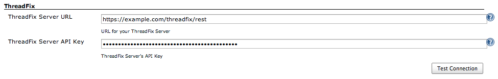
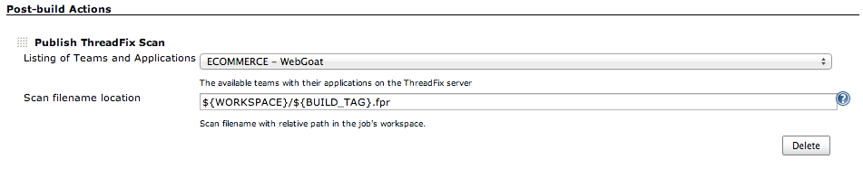

Uploads any supported ThreadFix scan file to your ThreadFix server

### *Note:*

-   This plugin is *NOT* maintained by **Denim Group**
-   Plugin version 1.0 supports ThreadFix versions 1.0 and 2.0.

## Features

-   Upload any supported scan file(s) from your Jenkins Slave/Master to
    your ThreadFix web server using your ThreadFix API Keys.
-   Ability to specify any scan filename under the Project's workspace
    using Jenkin's environmental variables.
-   ThreadFix [REST
    API](https://github.com/denimgroup/threadfix/wiki/Threadfix-REST-Interface)
    is used for all communication from the Jenkins Server.

## Jenkins Global Config

## Jenkins Project Config

## Installation & Setup

A [ThreadFix server](http://www.threadfix.org/download/) deployment with
an API Key created from your ThreadFix installation.

## Contact

otto \[at\] automationdomination \[dot\] me

## Changelog

### 1.5.3 (Aug 02, 2016)

-   Added ability to configure multiple scan files for uploading
