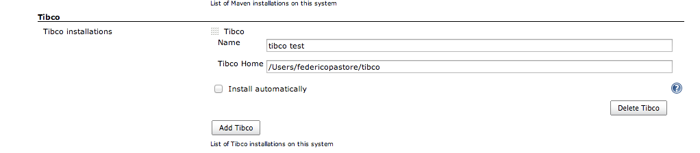
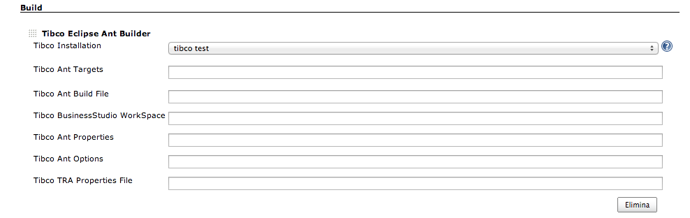

# **About this plugin**

This plugin allows your Jenkins installation to launch TIBCO wrappers as
a build step.

Once Installed it enables two builder: 

1.  AmxEclipseAntBuilder: this builder allow to launch builds over TIBCO
    AMX Service Grid projects(SCA Composites including AMX
    Businessworks) and AMX BPM
2.  StudioToolsBuilder: this builder allow to launch build over Business
    Events projects(actually this plugin is in "work in progress" in
    order to enrich options for any allowed of operation)

# User guide

AmxEclipseAntBuilder works as the built-in Ant builder; it simply wraps
Tibco "amx\_eclipse\_ant" executable to execute your build scripts.

You need a valid TIBCO installation to execute correctly your builds,
please read TIBCO documentation for correct installation info.

Actually this plugin has been tested over Supported Windows
environments(Windows Seven 64 bit for example) and over TIBCO AMX
ServiceGrid 3.1.5

Once you have installed your TIBCO environment, define your Tibco Home
directory in Jenkins Control Panel, where "Tibco Home" is the root
directory where you have installed the products

The next Step is configure your build step like Ant Builder

Here you can:

1.  define your Tibco Installation to use
2.  define ant target(no target means use "default" ant target deined
    into you build file)
3.  define your build file location
4.  define a custom Tibco BusinessStudio workspace to use (if you don't
    want use default workspace)
5.  set Ant properties
6.  set ant options
7.  define a custom "amx\_eclipse\_ant.tra" to use, if you don't want
    use default

Finally, launch your build! 

# Next Steps

-   Improve StudioTools builder, adding the other options for category
    operations
-   add helps for installation and configure fields
