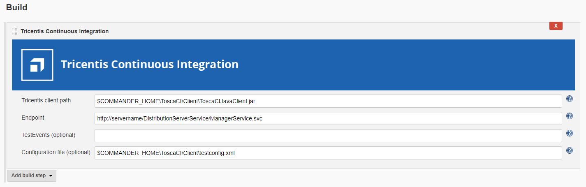
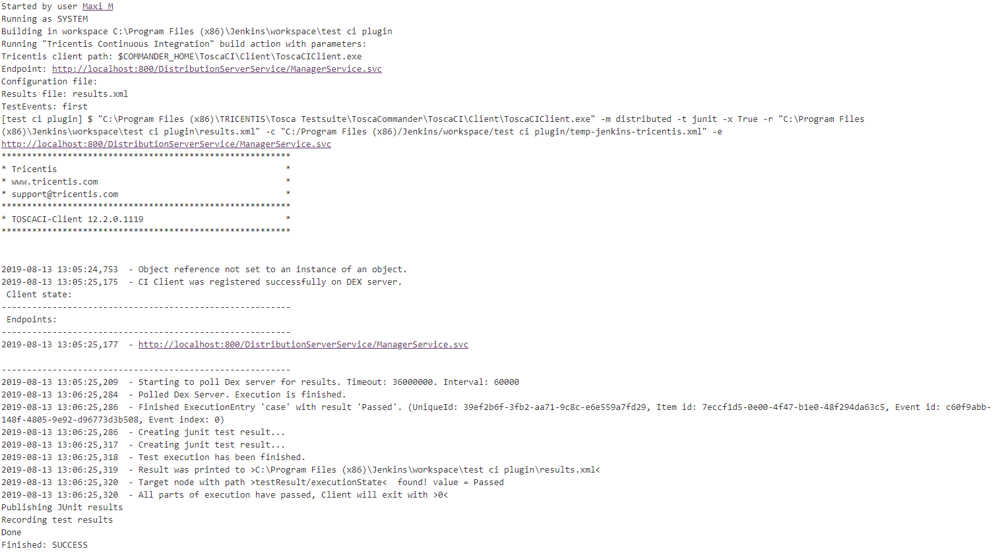
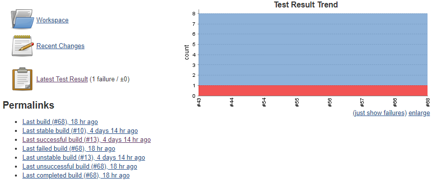

The Tricentis Continuous Integration plugin integrates Jenkins with
Tricentis Tosca CI. With this plugin, you can execute Tricentis Tosca
tests via Jenkins.

To configure Jenkins for the execution of Tricentis Tosca tests, perform
one of the following actions:

-   [Add a new Tricentis Continuous Integration build step to your
    project.](http://localhost:8085/display/JENKINS/Tricentis+Continuous+Integration#TricentisContinuousIntegration-add_build_step)
-   [Configure your Jenkins pipeline for Tricentis Continuous
    Integration](http://localhost:8085/display/JENKINS/Tricentis+Continuous+Integration#TricentisContinuousIntegration-configure_pipeline).

Once you have configured Jenkins for Tricentis Continuous Integration,
[execute your
tests.](http://localhost:8085/display/JENKINS/Tricentis+Continuous+Integration#TricentisContinuousIntegration-execute_tests)

  

For more information on Tricentis Tosca and Tosca Continuous
Integration, see the following links:

-   [Tricentis Tosca in 60
    seconds](https://www.youtube.com/watch?v=6469lMkeMiM)
-   [Tosca Continuous Integration
    documentation](https://support.tricentis.com/community/manuals_detail.do?lang=en&url=continuous_integration/concept.htm)

You can execute your tests via [Tosca Remote
Service](https://support.tricentis.com/community/manuals_detail.do?lang=en&url=continuous_integration/set_up_ci_remote.htm)
or [Tosca Distributed
Execution](https://support.tricentis.com/community/manuals_detail.do?lang=en&url=continuous_integration/set_up_ci_dex.htm).

  

##  Add a new Tricentis Continuous Integration build step 

To execute tests in Tricentis Tosca CI, add a new Tricentis Continuous
Integration build step:



  

[TABLE]

##  Configure the Jenkins pipeline for Tricentis Continuous Integration 

If you use [Jenkins
Pipelines,](https://jenkins.io/doc/book/pipeline/getting-started/)
specify Tricentis Tosca build logic with pipeline script:

**Pipeline configuration**

``` syntaxhighlighter-pre
pipeline {    
    agent any
    stages {
       stage('Build') {
          steps {
             tricentisCI tricentisClientPath: '$COMMANDER_HOME\\ToscaCI\\Client\\ToscaCIClient.exe', configurationFilePath: 'configuration.xml', endpoint: 'http://localhost:8732/TOSCARemoteExecutionService/'
          }
       }
    }
}
```

##  Execute tests 

After you configure the job, run it.

### Jenkins job output example



### Tricentis reports automatically published to Jenkins

  


