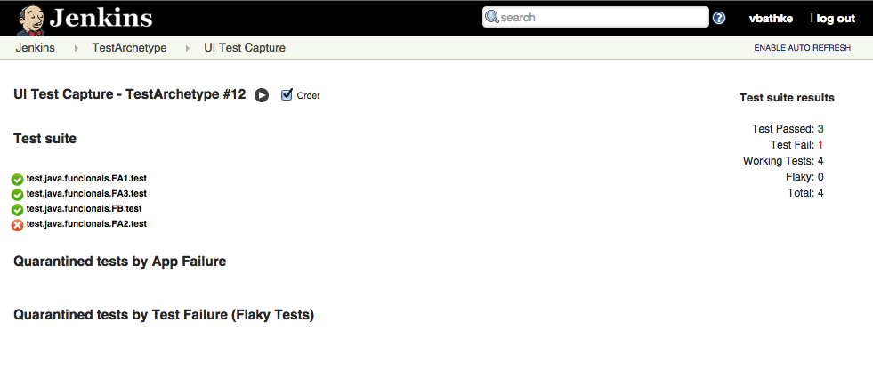
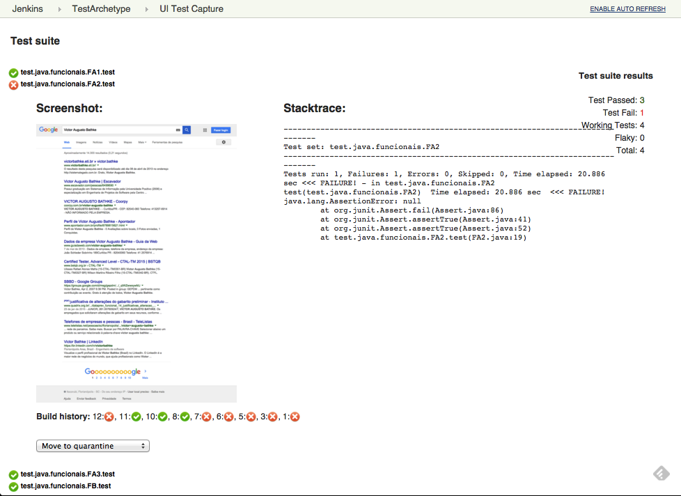
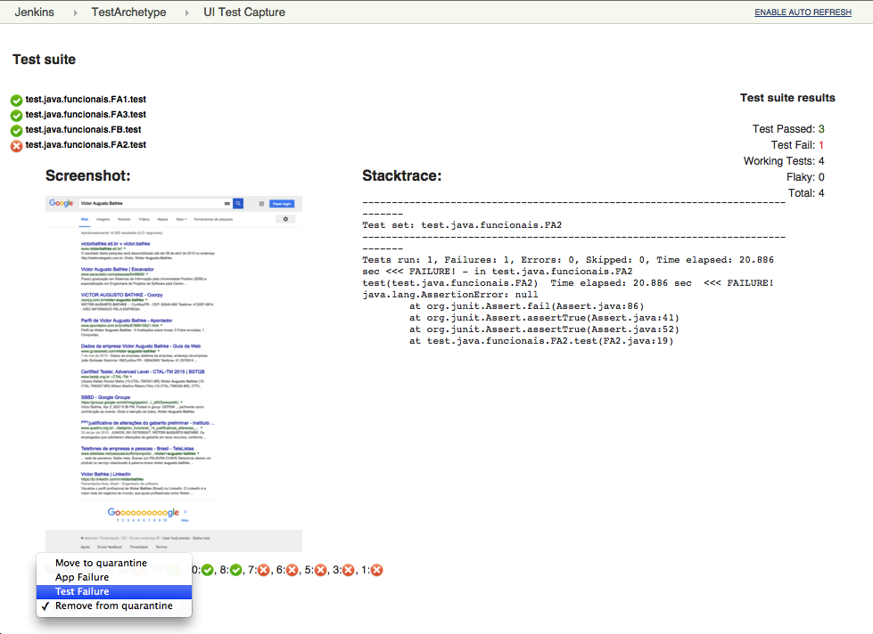
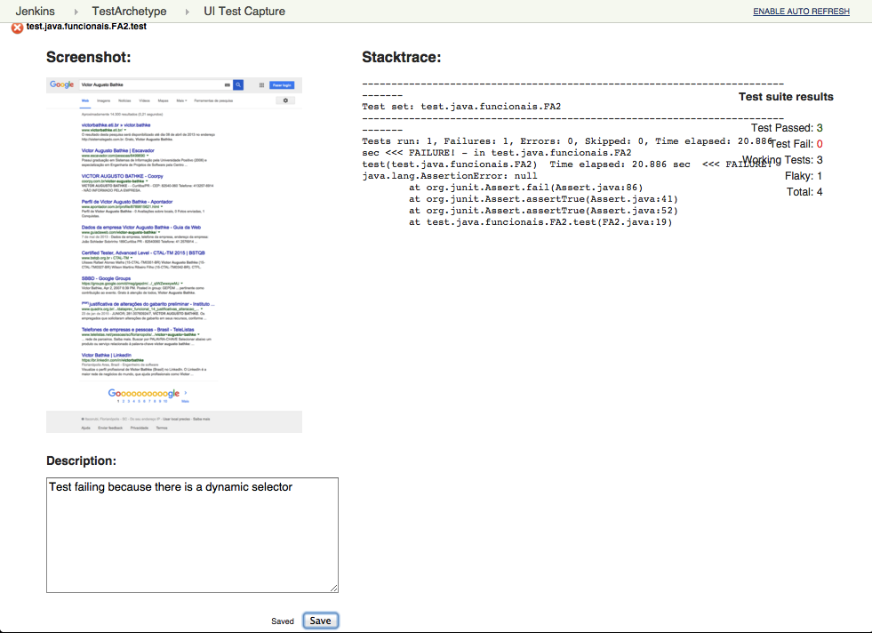

# Summary

Stream, persist and classify UI Test Results from a running Build.

The plugin is agnostic about what test engine you use if the required
informations was provided.

# Features

### See the results while they conclude



### If some test fail you can look at its screenshot and Build History



### If some tests are Flaky and you want to separate from other tests you can classify them in "App failure" and "Test failure" 

### Write coments about tests to facilitate maintenance



# Configuration

### 1. Implement the instrunctions to write the screenshot of the test method before the test close with the following filename convention:

``` syntaxhighlighter-pre
    target/screenshots/[Test Method].png
```

Exemple in Selenium with Java:

``` syntaxhighlighter-pre
    String actualTest = this.getClass().getName()+"."+testname.getMethodName();
    File scrFile = ((TakesScreenshot)FabricaWebDriver.getDriver()).getScreenshotAs(OutputType.FILE);
    FileUtils.copyFile(scrFile, new File("target/screenshots/"+actualTest+".png"));
```

### 2. Also before the test finish, append the test result informations in a text file located on "target/teststream.txt" with the following format:

``` syntaxhighlighter-pre
    {"metodo":"[Test Method], "status":"[Test Result]", "classe":"[Test Class]", "descricao:":"[Display Test Method]"}
```

Exemple in Selenium with Java:

``` syntaxhighlighter-pre
    @Rule
    public TestWatcher watcher = new TestWatcher() {     @Override
     protected void failed(Throwable e, Description description) {
         status= "falha";
     }
     @Override
     protected void skipped(AssumptionViolatedException e, Description description) {
         status= "skiped";
     }
     @Override
     protected void succeeded(Description description) {
         status= "sucesso";
     }
     @Override
     protected void finished(Description d) {
         try {
             PrintWriter out = new PrintWriter(new BufferedWriter(new FileWriter("target/teststream.txt", true)));
             out.println("{\"metodo\":\""+actualTestMethod+"\", \"status\":\""+status+"\", "
        + "\"classe\":\""+actualTestClass+"\", \"descricao\":\""+actualTestMethod+"\"}");
             out.close();
         } catch (IOException e) {
          e.printStackTrace();
         }
     }    
    };
```

### 3. Jenkins Configuration

1\. On the Job configuration active this plugin with the action "UI Test
Capture" on Post-build Action  
2. Add the action 'Arquive Artifacts' on Post-build Action with the
value:

``` syntaxhighlighter-pre
    target/screenshots/**/*
```

# Changelog

### Release 1.0.41 (25 October 2015)

-   First public release
