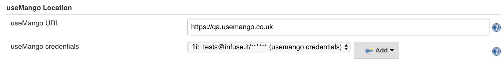
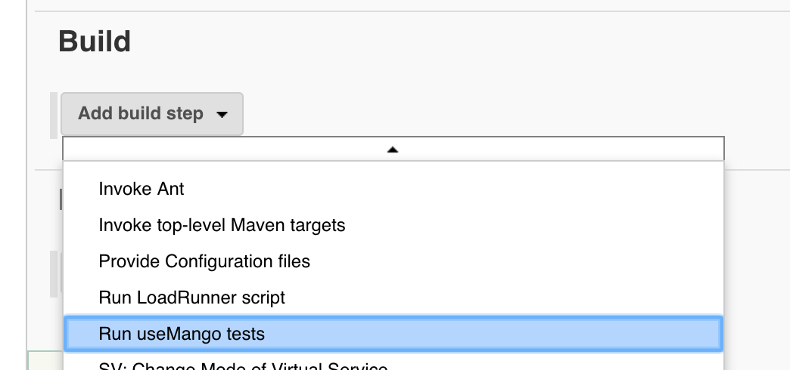
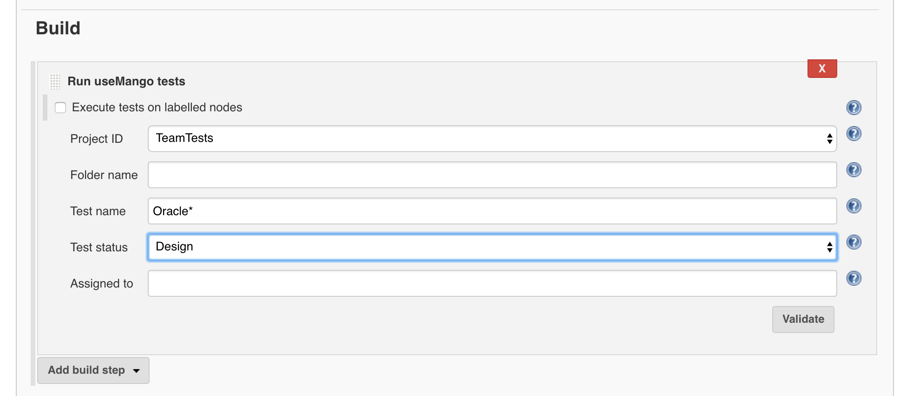
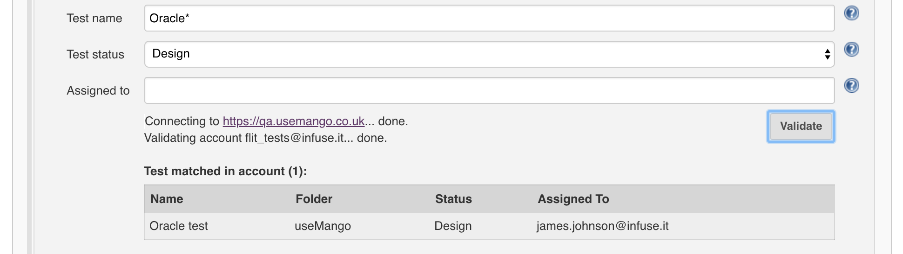
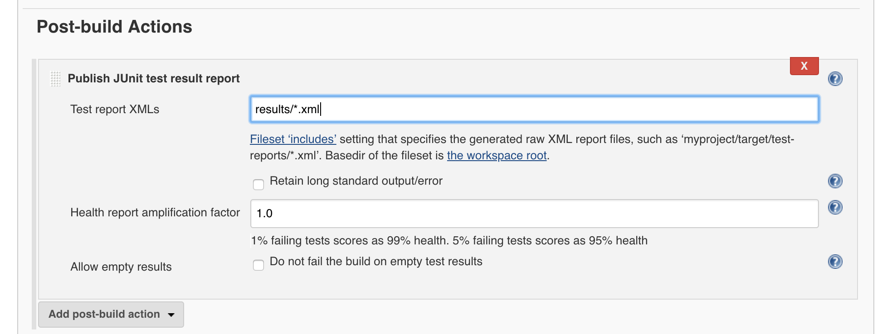

Jenkins plugin for running useMango tests.  
  
Description

Allows users to execute useMango tests on Jenkins.  
  
Features  

-   Execute useMango tests on Jenkins
-   Filter tests using account settings
-   Run tests in parallel across multiple nodes
-   Generate JUnit reports

## Usage

#### Global Configuration

 Add your useMango account credentials to the global configuration:

  

{width="650"}

#### Running Tests

 After setting your useMango account credentials, you can start running
tests.  To do this, create a Freestyle project and configure.  
  

-   Add the build step *Run useMango tests:*

{width="350"}``

-   Set your *Project ID* (i.e. the name of your project in your
    useMango account) along with any other filtering:

{height="250"}  
  

-   Click *Validate* to validate your settings (Note: only the tests
    shown will be executed during the build):

{width="570"}  
  

-   Optional: Add the post-build action *Publish JUnit test result
    report* and enter *results/\*.xml* as the value for *Test report
    XMLs:  
    *

*{height="250"}*

## Dependencies

In order to use the useMango Runner plugin, you will need the following:

-   [Credentials](https://wiki.jenkins-ci.org/display/JENKINS/Credentials+Plugin)
-   [Test Results
    Analyzer](https://wiki.jenkins.io/display/JENKINS/Test+Results+Analyzer+Plugin)
-   Windows node(s) with useMango installed: To run useMango tests you
    must have Windows slave nodes configured in your Jenkins setup, with
    useMango installed on each node. To run useMango tests on your
    Windows node(s), give each node the same label then
    check `Execute tests on labelled nodes` and enter the label as the
    value for `Label Expression`.

  
