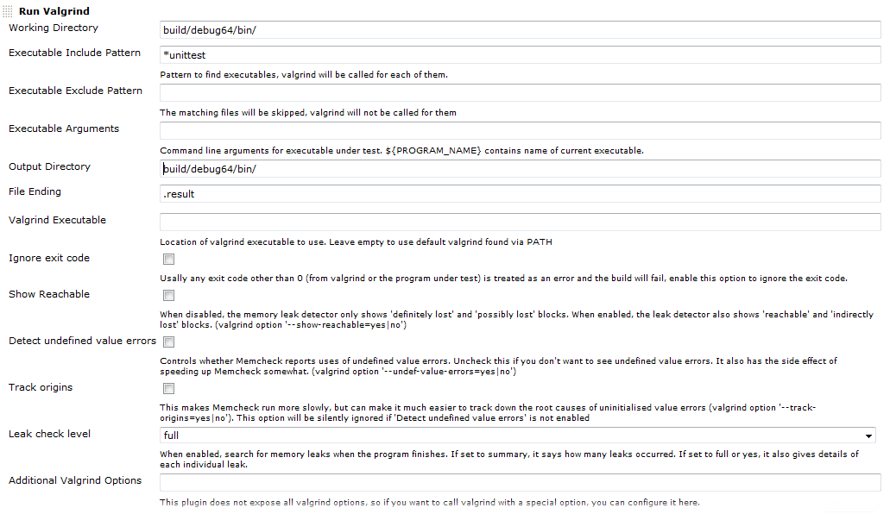
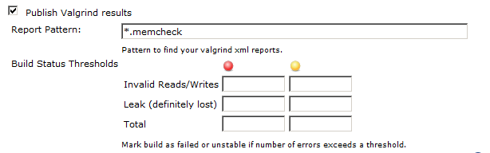
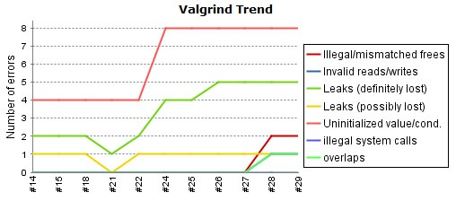
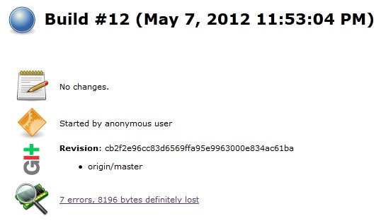
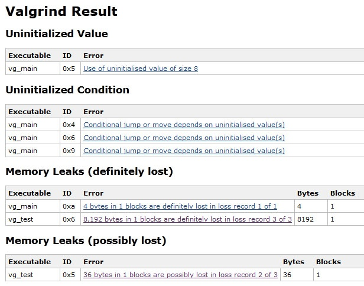
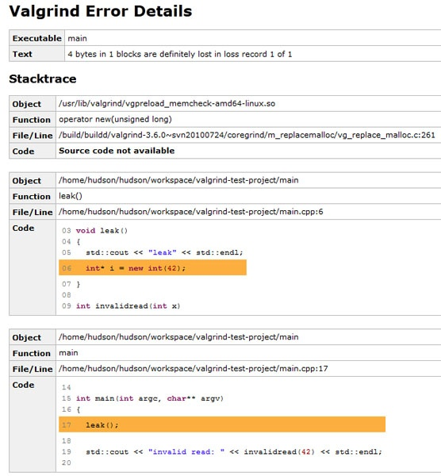
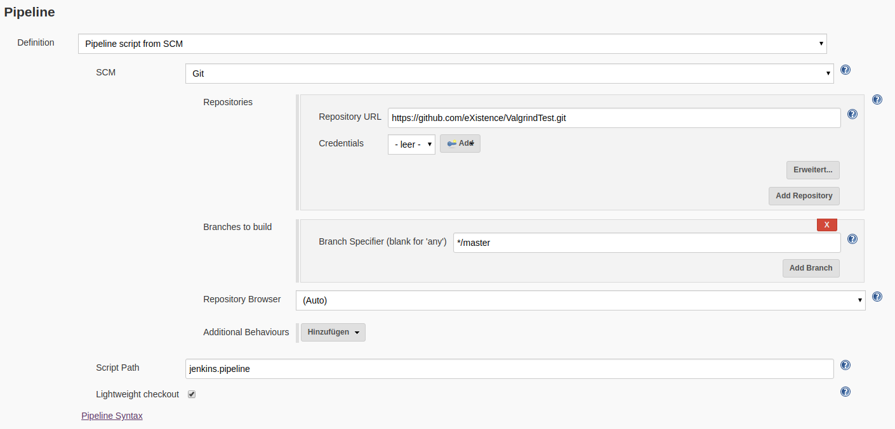

  

  

| Plugin Information                                                                            |
|-----------------------------------------------------------------------------------------------|
| View Valgrind [on the plugin site](https://plugins.jenkins.io/valgrind) for more information. |

The current version of this plugin may not be safe to use. Please review
the following warnings before use:

-   [Stored XSS
    vulnerability](https://jenkins.io/security/advisory/2020-09-01/#SECURITY-1830)
-   [XXE
    vulnerability](https://jenkins.io/security/advisory/2020-09-01/#SECURITY-1829)

Integrates [Valgrind](http://www.valgrind.org/) in Jenkins.This Plugin
integrates [Valgrind](http://www.valgrind.org/) (memcheck to be exact)
into Jenkins by providing:

-   Valgrind Runner: to run valgrind with your executables
-   Valgrind Publisher: to record valgrind xml reports

Those two things work independently from each other. So if your build
system already calls valgrind (as part of your unit tests or whatever)
just use the publisher to record and analyze the xml reports.

Feedback, bug reports and feature requests are highly appreciated, just
create a JIRA issue or drop me a email.

##### Runner Options



##### Publisher Options



##### Trend graph



##### Summary on build page



##### Error overview



##### Error details with stacktrace



##### Example project with a simple pipeline configuration

{height="250"}

Example pipeline script

 Expand source

``` syntaxhighlighter-pre
node {
   stage('Checkout') {
      git 'https://github.com/eXistence/ValgrindTest.git'
   }
   stage('Build') {
      sh 'sh build.sh'
   }
   stage('Valgrind') {
        runValgrind (
          childSilentAfterFork: true,
          excludePattern: '',
          generateSuppressions: true,
          ignoreExitCode: true,
          includePattern: 'bin/test_leak',
          outputDirectory: '',
          outputFileEnding: '.memcheck',
          programOptions: '',
          removeOldReports: true,
          suppressionFiles: '',
          tool: [$class: 'ValgrindToolMemcheck',
            leakCheckLevel: 'full',
            showReachable: true,
            trackOrigins: true,
            undefinedValueErrors: true],
          traceChildren: true,
          valgrindExecutable: '',
          valgrindOptions: '',
          workingDirectory: ''
        )

        publishValgrind (
          failBuildOnInvalidReports: false,
          failBuildOnMissingReports: false,
          failThresholdDefinitelyLost: '',
          failThresholdInvalidReadWrite: '',
          failThresholdTotal: '',
          pattern: '*.memcheck',
          publishResultsForAbortedBuilds: false,
          publishResultsForFailedBuilds: false,
          sourceSubstitutionPaths: '',
          unstableThresholdDefinitelyLost: '',
          unstableThresholdInvalidReadWrite: '',
          unstableThresholdTotal: ''
        )
   }
}
```

  

## Change Log

##### Release 0.28 (March 06, 2018)

-   added ability to substitue source paths (thx J-cztery) 
-   fixed several findbugs warnings (thx tern-nils)
-   added pipeline support (thx wulkop)
-   fixed problem with short valgrind arguments

##### Release 0.24 (November 24, 2014)

-   fixed include/exclude patterns being relative to working directory,
    patterns are now always relative to workspace (fixed JENKINS-24971).
    **This change might break some configurations!**
-   generated report files are automatically excluded from executables
-   added option to the runner to generate and display suppression
    information for easy use in suppression files (fixed JENKINS-16218)
-   added option to the runner to use suppression files
-   added option to the runner to remove all old report files from
    workspace before running valgrind (useful if you are not doing a
    clean checkout)
-   added environment variable PROGRAM\_DIR that contains the directory
    of the executable currently under test (useful for setting the
    working directory or other stuff relative to the executable)
-   requires Jenkins 1.480

##### Release 0.23 (November 23, 2014)

release failed, version skipped

##### Release 0.22 (September 16, 2014)

-   fixed: don't crash on invalid input data

##### Release 0.21 (August 31, 2014)

-   fixed 'Ignore Exit Code' setting (JENKINS-16859)

Thanks to Prunier Charles-Yves!

-   added publisher option to fail build on missing xml report files
    (JENKINS-24256)
-   added publisher option to fail build on invalid xml report files
    (JENKINS-24256)

##### Release 0.20 (August 23, 2013)

-   greatly improved memory footprint (only affects new builds)

Thanks to Marco Miller (Ericsson) and Jakub Pawlaczyk!

-   fixed: wrong error names on Process Details page
-   fixed: wrong/missing number of leaked bytes for some errors

##### Release 0.19 (March 03, 2013)

-   fixed: multiple arguments for executable did not work
-   added more process details to record (pid, ppid, arguments)
-   errors are listed per process
-   added support for process hierarchies
-   added valgrind options trace-children, child-silent-after-fork
-   added options to publish results for failed or aborted builds
-   improved navigation between the different result pages (overview,
    process details, error details)

##### Release 0.18 (October 23, 2012)

-   added exclude pattern for executables
-   added option to ignore valgrind exit code
-   added support for older valgrind versions (tested with 3.1.1, 3.2.0
    and 3.7.0)

##### Release 0.17 (September 23, 2012)

-   fixed null pointer exception on empty error list
-   display "no errors" on result page if error list is empty

##### Release 0.16 (September 19, 2012)

just a test, no changes

##### Release 0.15 (September 18, 2012)

-   added valgrind option "--track-origins"
-   added support for auxiliary messages and stacktraces
-   "Valgrind Result" on project page always links to most recent build
    with valid valgrind result, even if that build failed

##### Release 0.14 (September 14, 2012)

-   fixed handling of multiple valgrind and program command line options

##### Release 0.13 (September 14, 2012)

-   fixed error after upgrading from older version to 0.12

##### Release 0.12 (September 13, 2012)

-   added support for arbitrary valgrind options
-   added support for program options

##### Release 0.11 (July 27, 2012)

-   moved some settings to an “advanced” block, to encourage an “out of
    the box” usage
-   made the memcheck option “leak-check” configurable (defaults to
    "full")

Thanks to Alexandre Sanches from Thales!

##### Release 0.10 (July 11, 2012)

-   fixed: name of configured valgrind executable didn't show up

##### Release 0.9 (June 24, 2012)

-   expand configuration strings with env vars (to support parameterized
    builds via *${my\_var}*)
-   configure valgrind executable location for each job separately (or
    leave empty to use default valgrind location from PATH)

##### Release 0.8 (May 15, 2012)

-   replaced quick fix from 0.7 with a better solution

##### Release 0.7 (May 15, 2012)

-   quick fix for broken configuration

##### Release 0.6 (May 15, 2012)

-   fixed exception with Jenkins 1.463
-   fixed thresholds (error count must truly exceed them)
-   improved naming and documentation of some settings

##### Release 0.5 (May 9, 2012)

-   lowered required Jenkins version to 1.424
-   fixed crash on unknown valgrind error
-   validate input pattern and file ending
-   added support for more valgrind errors: Overlap, SyscallParam,
    InvalidFree and MismatchedFree
-   show more error types in trend graph
-   added descriptive text and a link to the valgrind manual to each
    type of error

##### Release 0.4 (May 8, 2012)

-   internal fixes: added name to pom.xml

##### Release 0.3 (May 8, 2012)

-   internal fixes: added wiki url and license to pom.xml

##### Release 0.2 (May 8, 2012)

-   integrated "Uninitialized Condition" and "Uninitialized value"
    errors
-   improved labeling of global config options
-   show Unique ID from Valgrind XML output

##### Release 0.1 (May 7, 2012)

-   Initial Release
