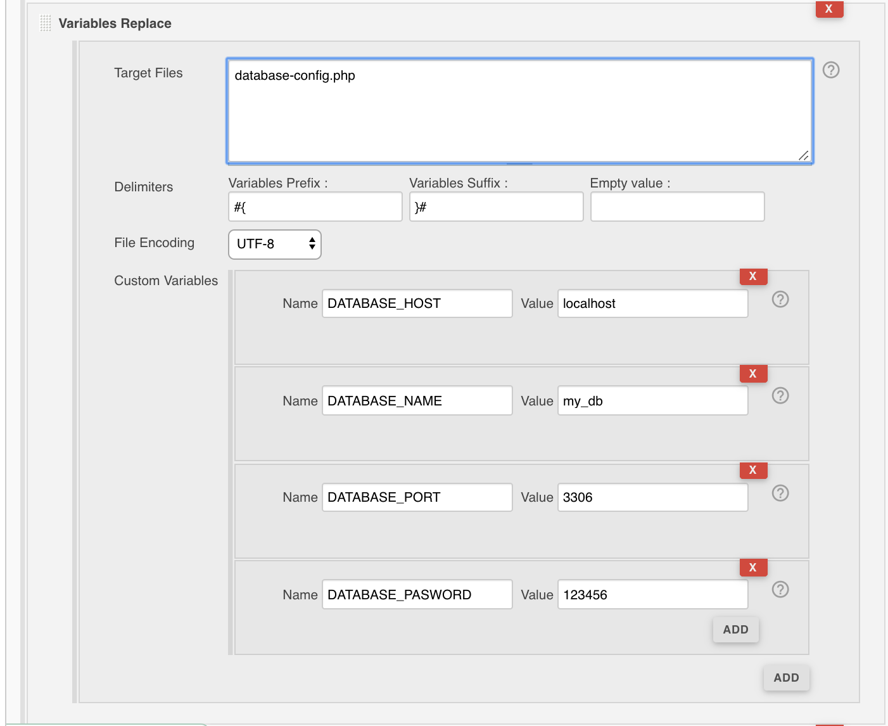

This Jenkins plugin allow to replace easily variables in files
content.  

## Features

-   Search and replace variables using

        - FilePath,

        - Variables prefix,

        - Variables suffix

        - Variables list ( Name / Value )

## Requirements

### Jenkins

Jenkins [version 2.7.3](https://jenkins.io/changelog#v2.7.3) or newer is
required.

  

#### Freestyle job configuration

  



#### Pipeline job configuration

``` syntaxhighlighter-pre
variableReplace(
    configs: [
        variablesReplaceConfig(
            configs: [
                variablesReplaceItemConfig( 
                    name: 'DATABASE_HOST',
                    value: 'localhost'
                ),
                variablesReplaceItemConfig( 
                    name: 'DATABASE_NAME',
                    value: 'my_db'
                ),
                variablesReplaceItemConfig( 
                    name: 'DATABASE_PORT',
                    value: '3306'
                ),
                variablesReplaceItemConfig( 
                    name: 'DATABASE_PASSWORD',
                    value: '123456'
                )
            ],
            fileEncoding: 'UTF-8', 
            filePath: 'database-config.php', 
            variablesPrefix: '#{', 
            variablesSuffix: '}#'
            )]
)
```
