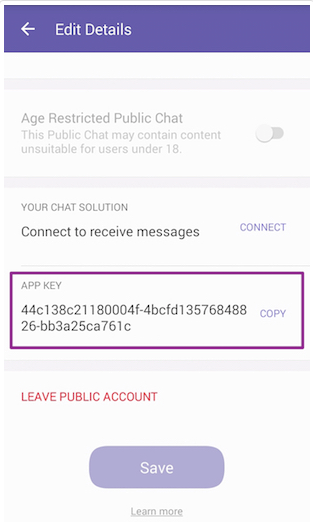
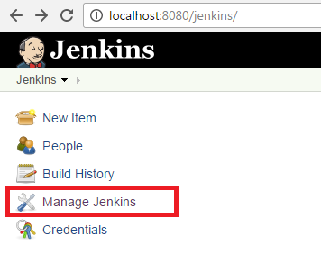
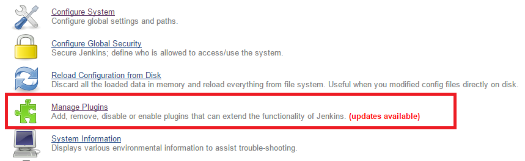
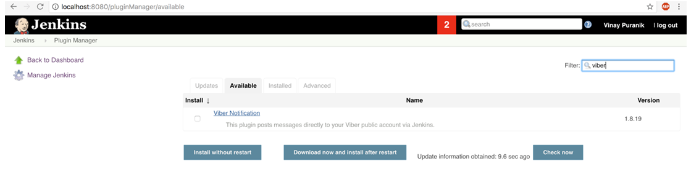
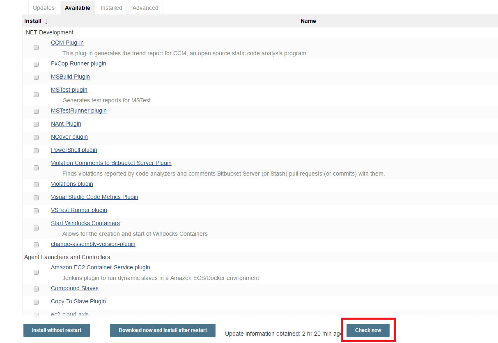
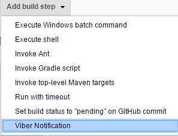
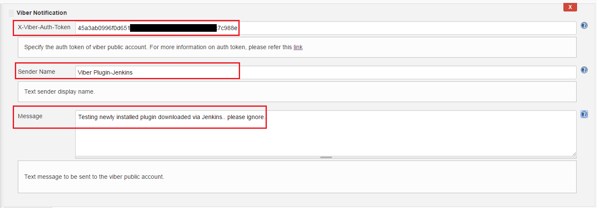
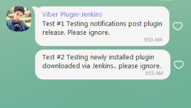

**  
**

**Viber notification plugin for Jenkins **

** **This plugin sends out notifications/text messages directly to your
Viber public account via Jenkins.  Each public account would an unique
authentication token which you need to configure in Jenkins.  The
authentication token (also known as application key) is a unique and
secret account identifier. It is used to authenticate requests in the
Public Accounts API and to prevent unauthorized persons from sending
requests on behalf of a Public Account. You will need this token during
the integration process (Viber public account + Jenkins). The
authentication token is generated upon Public Account creation and can
be viewed by the account's admins in the "edit info" screen of their
Public Account.

 

 

Below link would guide you on  how to create your own viber public
account.

<https://support.viber.com/customer/portal/articles/2733413-create-a-public-account>

Once account is created, add members and you're good to go.

 

**Steps to add Viber notification plugin to your Jenkins job:**

** **

Simple demonstration of how you can add the plugin and send a simple
text message to Viber public account via Jenkins.

 

1.  Launch Jenkins & click on ‘Manage Jenkins’.  
    

 

      2. Click on ‘Manage Plugins’

   
 

 

      3.Click on ‘Available’ tab and then search for Viber Notification
plugin

 

 

(If the plugin is not listed then, click on ‘Check Now’ button as shown
below. This will sync your Jenkins with the central plugin repository. )
Once this is done, search for Viber notification plugin.

 

 

     4. Install the plugin and restart your Jenkins.

   
 

     5.Go to your project, click on configure and in the build steps
select Viber Notification

   
 

      6.Key in the auth token of the public account that you want to
send message to, sender name and the message content.

       7.Build your project.

 

Once build process is done , you’ll see the message in your Viber public
account.  (If you want to send the build status and want Jenkins to
trigger Viber notification post build process, you need to use this
plugin along with Flexible Publish plugin)

 

 

 

               

 
