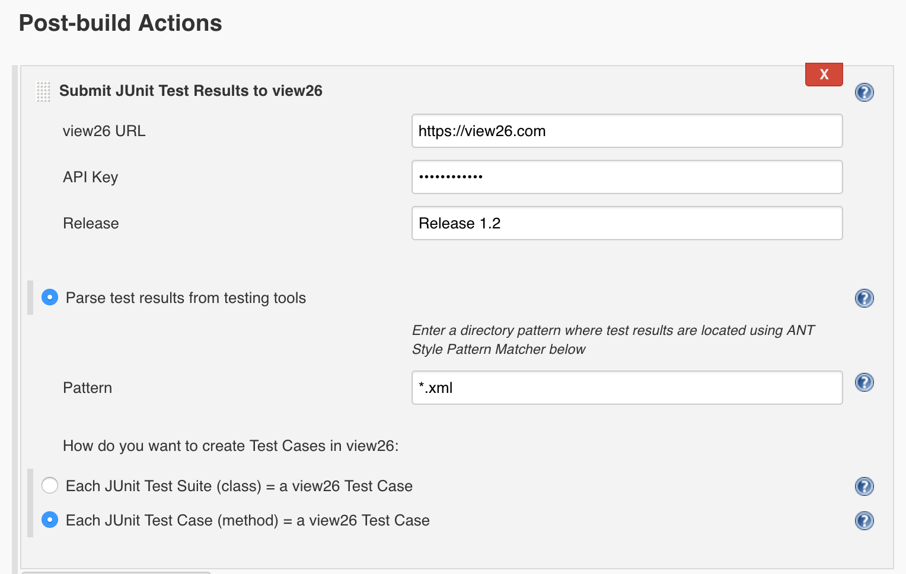
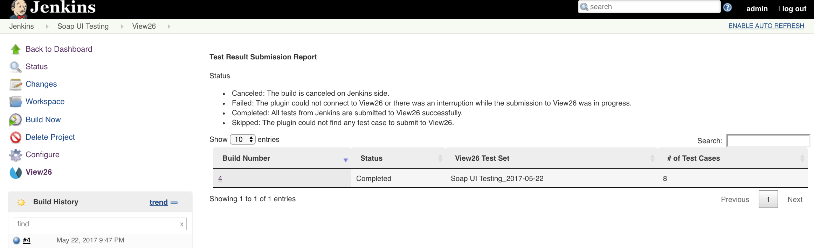
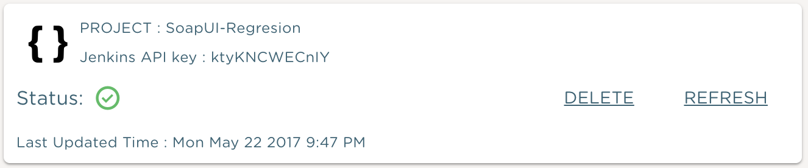

 

 

The current version of this plugin may not be safe to use. Please review
the following warnings before use:

-   [Credentials stored in plain
    text](https://jenkins.io/security/advisory/2019-10-16/#SECURITY-1440)

 

 

This add-on will collect JUnit test results from your builds and submit
them as Test Runs and Test Logs to VIEW26. The view26 plugin supports
all testing frameworks that are capable of generating JUnit XML format
test reports.

 

After installing, you can set up a post build action and easily
configure the connection to your view26 Dashboard by using a API Key
generated by adding a API type dashboard.

## Major features

-   Test Cases, Test Runs and Test Set folder automatically created in
    VIEW26 model for executed JUnit tests
-   View JUnit test results for build deployments
-   Track JUnit test results across multiple builds
-   View the submission status of JUnit tests sent to VIEW26
-   Import test cases based of method or class

## Usage

-   After installing VIEW26 Plugin on Jenkins, you can set up a post
    build action and easily configure the connection to your VIEW26
    Dashboard (shown below).

{width="700"}

 

 

 

view26 URL

VIEW26 URL for SaaS Dashboard -
 [https://view26.com](https://view26.com/)

VIEW26 URL for JIRA Plugin Dashboard
-  [https://jira-plugin.view26.com](https://jira-plugin.view26.com/)

API key is obtained by adding an API type Datasource within a VIEW26
Dashboard.

 

 

 

-   Build the Jenkins Project. Results are logged as shown below in the
    Test Result Submission Report.  
      
    {width="700"}  
      
      
-   Test Execution & Summary charts will automatically be updated in
    VIEW26 Dashboard   
      
    {width="500"}

## Version history

### Version 1.0.3 (May 23, 2017)

-   Added documentation URL

### Version 1.0.2 (May 19, 2017)

-   Initial Release
