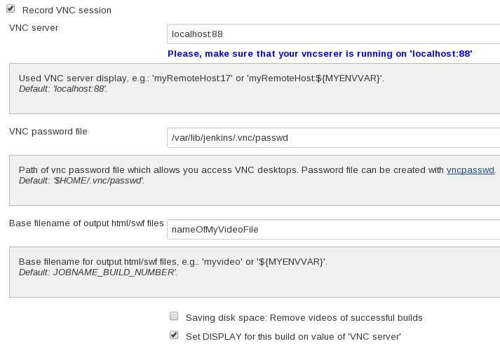
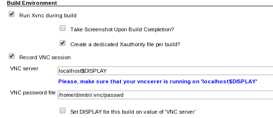
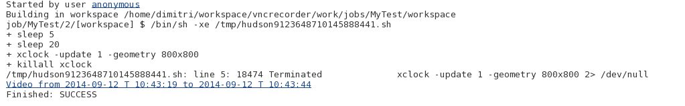
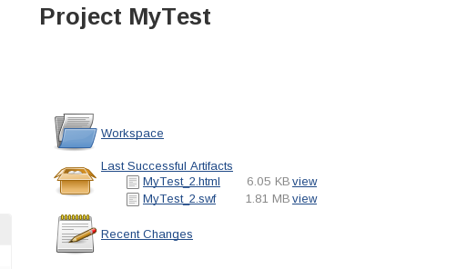
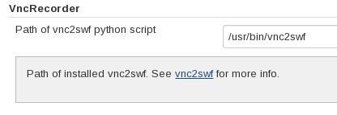

This plugin records screen of current build or other configured VNC
session as Shock Wave Flash (swf) file during a build and stores it as
an artifact. This plugin can be used in combination with
[VncViewer](http://localhost:8085/display/JENKINS/VncViewer+Plugin) and
[Xvnc plugin](http://localhost:8085/display/JENKINS/Xvnc+Plugin).

After the build, the video file gets also published as a HTTP link in
the "Console output" of the build. The generated HTML file embeds a
video and makes it possible to navigate within a recorded video directly
in browser.

# Requirements

-   Linux on Jenkins master node
-   [vnc2swf](http://rpm.pbone.net/index.php3?stat=3&limit=1&srodzaj=3&dl=80&search=pyvnc2swf) on
    Jenkins master node

# How you use the plugin in a job

## Example for usage together with [Xvnc plugin](http://localhost:8085/display/JENKINS/Xvnc+Plugin)

# Result: video in your Browser

## Link in "Console output"

------------------------------------------------------------------------

## Store as build artifact

The generated HTML file
[MyTest\_2.html](http://localhost:8085/download/attachments/74055684/MyTest_2.html?version=1&modificationDate=1410512066000&api=v2) embeds
video
[MyTest\_2.swf](http://localhost:8085/download/attachments/74055684/MyTest_2.swf?version=1&modificationDate=1410512061000&api=v2) and
makes it possible to navigate within a video directly in browser.

# Path of vnc2swf

Path of used vnc2swf can be customized under "Jenkins System
configuration / Global settings". Default is the vnc2swf found in the
PATH variable.

# JIRA issues

type

key

summary

assignee

reporter

priority

status

resolution

created

updated

due

Data cannot be retrieved due to an unexpected error.

[View these issues in
Jira](https://issues.jenkins-ci.org/secure/IssueNavigator.jspa?reset=true&jqlQuery=project%20=%20JENKINS%20AND%20status%20in%20%28Open,%20%22In%20Progress%22,%20%20%22Closed%22,%20%22Resolved%22,%20Reopened%29%20AND%20component%20=%20vncrecorder-plugin%20ORDER%20BY%20issuetype%20ASC,%20priority%20DESC,%20key%20ASC&tempMax=1000&src=confmacro)
