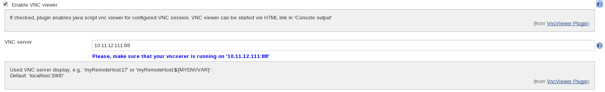
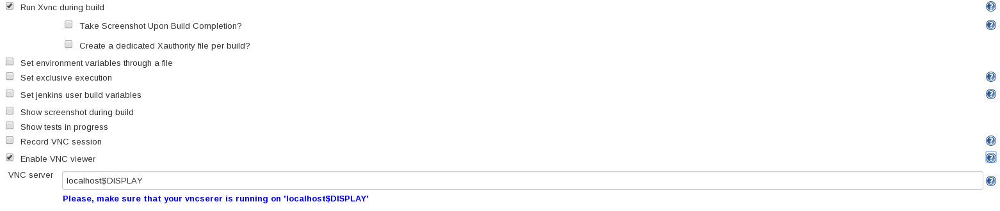
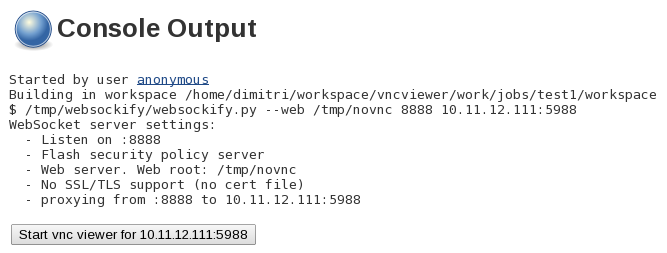

VncViewer lets you monitor or operate GUI of your running build. You can
start HTML5 based VNC viewer via HTML link directly from 'Console
output'. This plugin can be used in combination
with [Xvnc](https://wiki.jenkins.io/display/JENKINS/Xvnc+Plugin) and [VncRecorder](https://wiki.jenkins.io/display/JENKINS/VncRecorder+Plugin)
plugins.

The plugin uses internally HTML5 based VNC
client [noVNC](http://kanaka.github.io/noVNC/). 

# Requirements

-   Linux on Jenkins master node

# How you use the plugin in a job

## Example for usage together with [Xvnc plugin](https://wiki.jenkins.io/display/JENKINS/Xvnc+Plugin)

# Start VNC viewer from "Console output"

# JIRA issues

type

key

summary

assignee

reporter

priority

status

resolution

created

updated

due

Data cannot be retrieved due to an unexpected error.

[View these issues in
Jira](https://issues.jenkins-ci.org/secure/IssueNavigator.jspa?reset=true&jqlQuery=project%20=%20JENKINS%20AND%20status%20in%20%28Open,%20%22In%20Progress%22,%20%20%22Closed%22,%20%22Resolved%22,%20Reopened%29%20AND%20component%20=%20vncviewer-plugin%20ORDER%20BY%20issuetype%20ASC,%20priority%20DESC,%20key%20ASC&tempMax=1000&src=confmacro)
