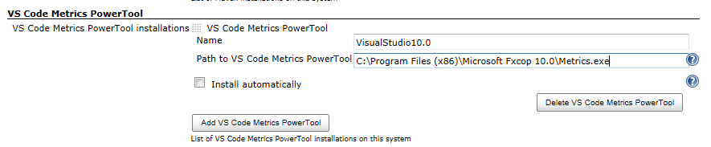
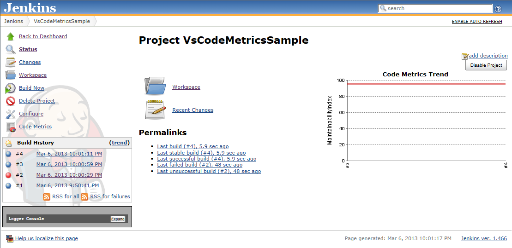
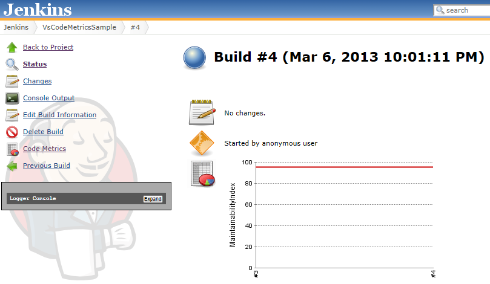
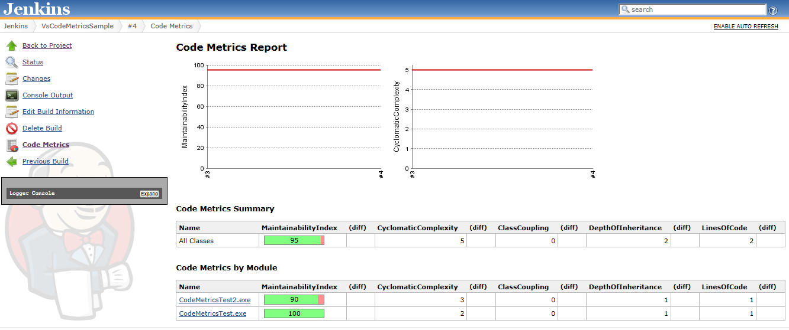
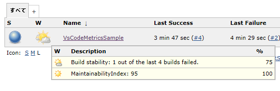
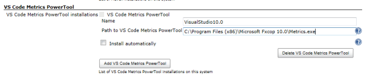
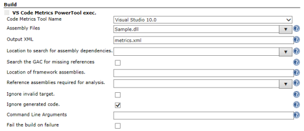
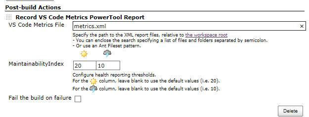

[Visual Studio Code Metrics
PowerTool](http://www.microsoft.com/en-us/download/details.aspx?id=9422)
execute plugin.  
And record the metrics report.

# Image

| Installation                                                                                                                   | Build                                                                                                                          | Post-build Actions                                                                                                             |
|--------------------------------------------------------------------------------------------------------------------------------|--------------------------------------------------------------------------------------------------------------------------------|--------------------------------------------------------------------------------------------------------------------------------|
|  |  |  |

| Project Trend                                                                                                                  | Build Trend                                                                                                                    | Report                                                                                                                         |
|--------------------------------------------------------------------------------------------------------------------------------|--------------------------------------------------------------------------------------------------------------------------------|--------------------------------------------------------------------------------------------------------------------------------|
|  |  |  |

| Health Report                                                                                                                  |
|--------------------------------------------------------------------------------------------------------------------------------|
|  |

# Description

[Visual Studio Code Metrics
PowerTool](http://www.microsoft.com/en-us/download/details.aspx?id=9422)
execute plugin.  
And record the metrics report.

Install the Visual Studio 2010 or [FxCop
10.0](http://www.microsoft.com/en-us/download/details.aspx?id=6544) to
use the [Visual Studio Code Metrics
PowerTool](http://www.microsoft.com/en-us/download/details.aspx?id=9422).

Maintainability Index description are listed below.  
<http://msdn.microsoft.com/library/vstudio/bb385914>

# Configuration

## System configuration

1.  Open the system configuration page "Manage Jenkins-\>Configure
    system"
2.  Enter the path to the Visual Studio Code Metrics PowerTool, that
    should be used by Jenkins.

-   Example: **C:\\Program Files (x86)\\Microsoft Visual Studio
    10.0\\Team Tools\\Static Analysis Tools\\FxCop\\Metrics.exe**

## Job configuration

[TABLE]

## Post-build Action configuration

[TABLE]

# Changelog

##### Version 1.7 (03/14/2014)

-   Fix : Add flag to set build to Unstable if failure
    ([JENKINS-20573](https://issues.jenkins-ci.org/browse/JENKINS-20573))
-   Add ignoregeneratedcode field.

##### Version 1.6 (06/26/2013)

-   Fix : Jenkins lock metrics.xml file
    ([JENKINS-18369](https://issues.jenkins-ci.org/browse/JENKINS-18369))

##### Version 1.5 (05/30/2013)

-   Edit help-directory.html

##### Version 1.4 (05/29/2013)

-   Specify multiple directories. ([Pull Requests
    \#1](https://github.com/jenkinsci/vs-code-metrics-plugin/pull/1))

##### Version 1.3 (03/31/2013)

-   Build trend width change.(300px -\> 500px)
-   Performance tuning.

##### Version 1.2 (03/18/2013)

-   Project trend width change.(400px -\> 500px)

##### Version 1.1 (03/07/2013)

-   Remove default 'Path to VS Code Metrics PowerTool' value.

##### Version 1.0 (03/06/2013)

-   Initial release.
