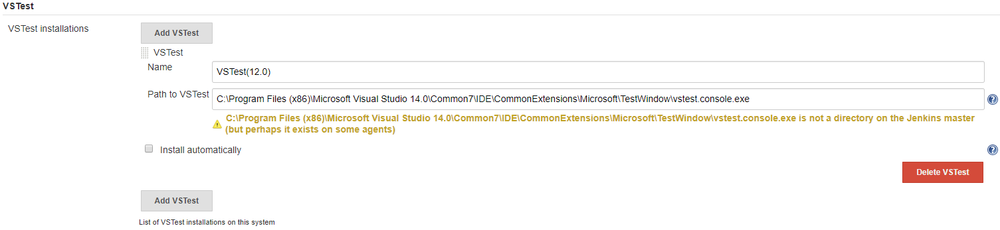
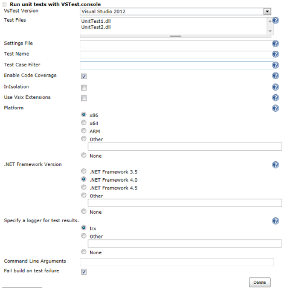

This plugin allow you to execute test using
[VsTest](http://msdn.microsoft.com/en-us/library/vstudio/ms182486.aspx)
command line tool.

# Description

This plugin allow you to execute test using
[VsTest](http://msdn.microsoft.com/en-us/library/vstudio/ms182486.aspx)
command line tool.  
VSTest are test classes for .NET framework which are integrated into
Visual Studio.

# Configuration

## System configuration

{height="250"}

1.  Open the system configuration page "Manage Jenkins→Global Tool
    Configuration"
2.  Enter the path to the VsTest command line client, that should be
    used by Jenkins.

-   The path location is as instance: C:\\Program Files (x86)\\Microsoft
    Visual Studio
    14.0\\Common7\\IDE\\CommonExtensions\\Microsoft\\TestWindow\\vstest.console.exe.

## Job configuration

[TABLE]

# Changelog

##### Version 1.0.5 (10/24/2017)

-   To be updated with description of changes and links to the resolved
    issues.

##### Version 1.0.4 (08/31/2014)

-   Make trx and coverage files paths available to further build steps
    in VSTestRunner plugin.
    ([JENKINS-22450](https://issues.jenkins-ci.org/browse/JENKINS-22450))([Pull
    Requests
    \#2](https://github.com/jenkinsci/vstestrunner-plugin/pull/2))

##### Version 1.0.3 (10/21/2013)

-   Changed to extend BuildStepDescriptor. ([Pull Requests
    \#1](https://github.com/jenkinsci/vstestrunner-plugin/pull/1))

##### Version 1.0.2 (07/24/2013)

-   Supports Jenkins variable.  
    I can be used in the following items.
    -   Test Files
    -   Settings File
    -   Test Name
    -   Test Case Filter
    -   Command Line Arguments

&nbsp;

-   I Fixed a bug that was not used by the "Command Line Arguments".

##### Version 1.0.1 (03/09/2013)

Mod default value.

-   Plaform Field: None
-   .NET Framework Version Field: None
-   Specify a logger for test results. Field: trx

##### Version 1.0.0 (01/29/2013)

Initial release.
