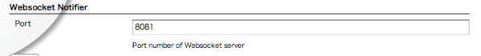
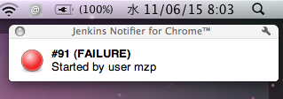
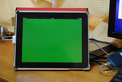

This plugin notifies build results via Websocket.

## **Features**

-   Notify build result via Websocket
-   If you use modern web browser (e.g. Chrome, Firefox, Safari), you
    receive realtime build result by Javascript. It includes
    iPhone/iPad.
-   Offcourse, websocket is independent from browser. You could your
    favorite laungage to receive realtime build result.

## **Setup**

At Manege Jenkins \> Configure System \> Websocket Notifier, you could
configure websocket port.

At (your project) \> Configure \> Post build Actions, you could enable
websokcet notification.

## **Usage Example**

### **Chrome Extension**

[Jenkins Notifier for
Chrome](https://chrome.google.com/webstore/developer/detail/mnjbjjllbclkpnebaddhkoonjelmiekm)
supports websocket. So you could receive a notification in realtime.

### **iPad/iPhone as XFD**

If you upload
<https://github.com/jenkinsci/websocket-plugin/blob/master/xfd.html> at
same host as jenkins, you could use iPhone/iPad as XFD.

### Windows client

<https://d.hatena.ne.jp/griefworker/20110928/jenkins_web_socket_notifier_client>

## Version History

### **Version 1.0.6 (26 July, 2013)**

-   Added: "Enable Websocket pings to keep connections alive" option
-   Added: "Use status format" option
-   Updated: webbit version (0.4.7 -\> 0.4.15)

### **Version 1.0.4 (16 April, 2012)**

-   Fixed: configurations were not loaded
-   Updated: webbit version (0.3.0 -\> 0.4.7)

### **Version 1.0 (6 June, 2011)**

-   Initial release
