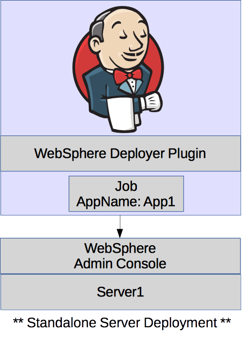
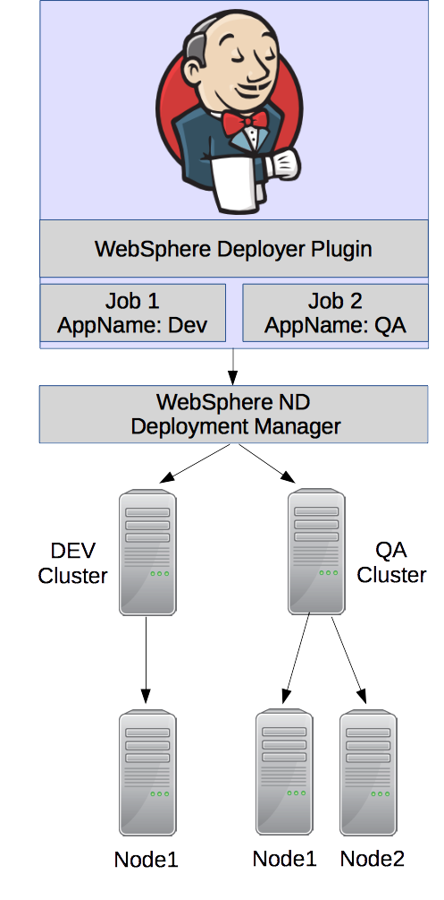

This is a collection of two separate plugins that provide deployment
functionality to most versions of IBM WebSphere Application Server, IBM
WebSphere Portal and IBM WebSphere Liberty Profile.Please add comments
if your issues are addressed on your version of WebSphere, note the
fixes proposed in the Change Log below.

#### Plugin Features

-   Deployment to a running remote or local instance of WebSphere
    7.0.x - 9.0.x 
    -   Note: WebSphere 6.0.x - WebSphere 8.0.x (4/30/2018) is no longer
        supported by IBM
-   Deployment to a running remote or local instance of WebSphere
    Liberty Edition 8.x.x
-   Support for deployments when SSL is activated on WebSphere (Global
    Security)
-   Support for most versions of WebSphere (Portal,Liberty,ND,Extreme
    Scale, Express, Standard, etc...)
-   Support for updating JSR286/JSR186 Portlets
-   Support for deploying to different WebSphere instances/types per
    build
-   Support for cluster, node, cell, and server level deployments
-   Support for pre-compiling JSPs on WebSphere during deployment (When
    stress testing as part of build process)
-   Support for disabling JSP reloading (When stress testing as part of
    build process)
-   Support for not starting application after deployment
-   Support for updating an existing application (to prevent losing
    application settings after redeployment)
-   Supports fully stopping, uninstalling, installing and starting an
    application during deployment process
-   Support for using a single deployment manager across multiple
    clusters or servers
-   Support for virtual hosts when deploying EAR files
-   Smart detection of existing deployed application state (to prevent
    failures when a system admin stops your application without you
    knowing)

### Frequently Asked Questions (FAQs)

See the most [frequently asked
questions](https://wiki.jenkins.io/display/JENKINS/Frequently+Asked+Questions)
and issues

# **Common Configurations**

Scenario 1: Single instance of WebSphere

{width="300"}

Scenario 2: A clustered deployment on WebSphere ND

\*\* Note: Same application with the same context root can be  
deployed using the same deployment manager as long as  
you use different application names in the job configuration \*\*

{width="300"}

  

Deploying portlets to IBM WebSphere Portal (Updates existing deployed
portlets, themes and skins are not supported)  
Deploying to [IBM WebSphere Application
Server](http://wiki.jenkins-ci.org/display/JENKINS/IBM+WebSphere+Configuration)  
Deploying to [IBM WebSphere Liberty
Server](https://wiki.jenkins-ci.org/display/JENKINS/IBM+WebSphere+Liberty+Configuration)

### Required Libraries For Deployments To IBM WebSphere Application Server

| Jar File                                  | Source Location              | Destination                                                 | Required                                                                        |
|-------------------------------------------|------------------------------|-------------------------------------------------------------|---------------------------------------------------------------------------------|
| com.ibm.ws.admin.client\_\*.jar           | $WAS\_INSTALL\_ROOT/runtimes | $USER\_HOME/.jenkins/plugins/websphere-deployer/WEB-INF/lib | Yes                                                                             |
| com.ibm.ws.orb\_\*.jar                    | $WAS\_INSTALL\_ROOT/runtimes | $USER\_HOME/.jenkins/plugins/websphere-deployer/WEB-INF/lib | Yes (otherwise 'No' if running under IBM J9 JRE, WAS v7 doesn't need it either) |
| com.ibm.ws.security.crypto.jar            | $WAS\_INSTALL\_ROOT/plugins  | $USER\_HOME/.jenkins/plugins/websphere-deployer/WEB-INF/lib | Yes (for v1.6.0+ of this plugin)                                                |
| com.ibm.ws.webservices.thinclient\_\*.jar | $WAS\_INSTALL\_ROOT/runtimes | $USER\_HOME/.jenkins/plugins/websphere-deployer/WEB-INF/lib | Maybe (Depends if application uses web services)                                |

### Required Libraries For Deployments To IBM WebSphere Liberty Profile

| Jar File                                              | Source Location                     | Destination                                                 | Required |
|-------------------------------------------------------|-------------------------------------|-------------------------------------------------------------|----------|
| com.ibm.websphere.appserver.api.basics\_\*.jar        | $LIBERTY\_INSTALL\_ROOT/dev/api/ibm | $USER\_HOME/.jenkins/plugins/websphere-deployer/WEB-INF/lib | Yes      |
| com.ibm.websphere.appserver.api.endpoint\_\*.jar      | $LIBERTY\_INSTALL\_ROOT/dev/api/ibm | $USER\_HOME/.jenkins/plugins/websphere-deployer/WEB-INF/lib | Yes      |
| com.ibm.websphere.appserver.api.restConnector\_\*.jar | $LIBERTY\_INSTALL\_ROOT/dev/api/ibm | $USER\_HOME/.jenkins/plugins/websphere-deployer/WEB-INF/lib | Yes      |
| restConnector.jar                                     | $LIBERTY\_INSTALL\_ROOT/clients     | $USER\_HOME/.jenkins/plugins/websphere-deployer/WEB-INF/lib | Yes      |

####  Issues or Feature Requests

Getting issues...

#### Roadmap

-   Add Pipeline Support
-   Add support for Jenkins slaves
-   ~~Add rollback support for install/update failures to prevent
    breaking applications for QA/UAT team  
    ~~
-   ~~Add promotion support for other environments (QA,STAGE,PRE-PROD,
    etc.) without repackaging EAR/WAR~~
-   ~~Add support for multiple target deployments~~
-   Fix path issue when locating artifacts to deploy
-   Provide support for Liberty Profile (support confirmed, will be
    available soon)
-   Provide support for EAR/WAR/WAB/OSGI deployments to Liberty Profile
    (support confirmed, will be available soon)
-   Remove external dependency on client jars for each configuration (to
    simplify initial configuration) (not possible)
-   Send notifications when application fails to start (outside of build
    process)
-   Add cluster support (release v1.3)
-   Support for WAR deployments on WebSphere Application Servers (Full
    Profile)

#### Change Log

###### Version 1.6.0 (release)   

Added support for earlier versions of Jenkins (version 1.608)   
Added support for listing server targets  
Fixes for multithreading to speed up deployments  
Includes all beta changes listed below

###### Version 1.4.8 (beta) - WAS Full Profile Updates 

Option to trust SSL certificates and hostnames (fix for PKIX issues)  
Attempt to allow for deployment across multiple environments

###### Version 1.4.4 (beta) - WAS Full Profile Updates

Fix for virtual host configuration when deploying EAR artifacts  
Added support for SharedLib when deploying EAR artifacts

###### Version 1.4.3 (beta) - WAS Full Profile Updates

Added support for virtual host configuration when deploying EAR
artifacts

###### Version 1.4.1 (beta) - WAS Full Profile Updates

Fix for those of us who don't use global security  
Attempt to fix ObjectName issue (Appears to be 2 classloaders loading
the ObjectName, who knows why this is happening on some machines)  
Support for deployments when build is unstable

###### Version 1.4.0 (beta) - WAS Full Profile Updates

Added reloading support  
Fixed JSP reloading issue  
Fixed classloader order bug  
Added classloader policy suppoort  
Added context override for generated EARs  
Added support for multiple target deployments (cluster or multiple
nodes)  
Changed UI layout

###### Version 1.3.4 (release) - WAS Full Profile Updates

Several bug fixes and enhancements (see details below)  
Added "operations" to allow for either updating or complete
re-installation of artifacts  
Added support for path variables (contribution)  
Tested support for updating Portlets on a remote WebSphere Portal
Instance

###### Version 1.3.3 (beta) - WAS Full Profile Updates

Disabled host verification for complex deployment environments.  
Provided option for verbose logging.

###### Version 1.3.2 (beta) - WAS Full Profile Updates

Added more connector options.  
Fixed SSL caching so multiple deployments to different servers should
work.

###### Version 1.3.1 (beta) - WAS Full Profile Updates

Added support for updating applications instead of complete
reinstallation of artifacts.

###### Version 1.3 (beta) - WAS Full Profile Updates

Fix for generated EARs  
Java EE7 support  
Timeout parameter for large EAR deployments (contribution)  
Classloader policy support  
Context fix for generated EAR (contribution)  
WebSphere ND support when deploying through Deployment Manager  
Cluster support (experimental)

###### Version 1.2 - Liberty / WAS Full Profile Updates

Support for WebSphere Liberty Profile  
Fixed path issues with WebSphere Application Server (full profile)

###### Version 1.1

Initial release performed

###### Version 1.0

Beta Testing Passed for WebSphere v8.5.5 for both remote and local
deployments
