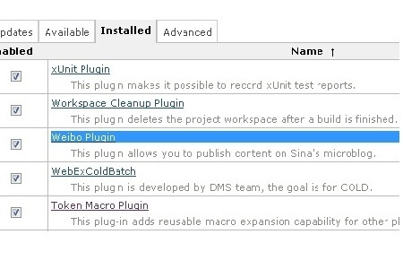
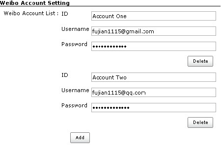
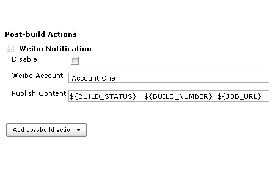

This plugin allow you to post customized message to Sina microblog.

**Introduce**

The content which be published to Sina microblog can contain customized
content which supports environment vars and some customized vars, such
as BUILD\_STATUS. if the content contain DEFAULT\_CONTENT,, it will be
replaced with BUILD\_STATUS-JOB\_NAME:BUILD\_NUMBER-JOB\_URL.

Demo site can check the [URL](http://weibo.com/jenkinsplugin).

Any issues you can contact with author: fujian1115@gmail.com or [Sina
microblog](http://www.weibo.com/fujianthinking).

All versions can check the [Maven
Repo](http://maven.jenkins-ci.org:8081/content/repositories/releases/org/jenkins-ci/plugins/weibo).

**Setup**

The Weibo plugin depends on
the [Token-Macro-Plugin](https://wiki.jenkins-ci.org/display/JENKINS/Token+Macro+Plugin),you
should setup the plugin before using Weibo plugin.

**Usage**

# **Version History**

## Version 1.0.1 (Oct 19, 2013)

-   change artifact from weibo4jenkins to weibo

## Version 1.0.0 (Oct 17, 2013)

-   Initial release
