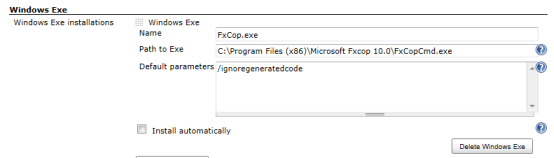
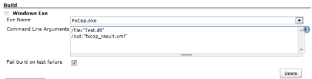

This plug-in is used to run the Windows Exe.

# Description

This plug-in is used to run the Windows Exe.

# Configuration

## System configuration

1.  Open the system configuration page "Manage Jenkins-\>Configure
    system"
2.  Enter the path to the Windows exe, that should be used by Jenkins.

## Job configuration

| name                       | description                                                                                |
|----------------------------|--------------------------------------------------------------------------------------------|
| Exe Name                   | Select Windows Exe.                                                                        |
| Command Line Arguments     | You can specify multiple command line arguments by separating them with new-line or space. |
| Fail build on test failure | Fail build on test failure.                                                                |

# Changelog

##### Version 1.3 (11/01/2018)

Supports [Token Macro
Plugin](https://wiki.jenkins.io/display/JENKINS/Token+Macro+Plugin)

Works with Pipeline

##### Version 1.2 (08/19/2013)

Support [Promoted Builds
Plugin](https://wiki.jenkins-ci.org/display/JENKINS/Promoted+Builds+Plugin).

##### Version 1.1 (04/06/2013)

Add index.jelly.

##### Version 1.0 (03/26/2013)

Initial release.
