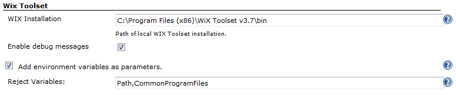
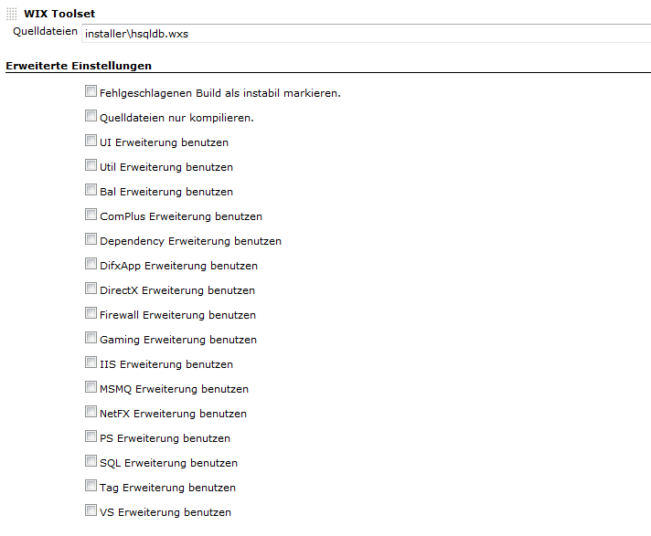

# Overview

With WIX Toolset Plugin you are able to build MSI packages from Windows
Installer XML (WiX) files with Jenkins.  
WiX - the Windows Installer XML toolset - lets developers create
installers for Windows Installer, the Windows installation engine.

The core of WiX is a set of build tools that build Windows Installer
packages using the same build concepts as the rest of your product:
source code is compiled and then linked to create executables; in this
case .exe setup bundles, .msi installation packages, .msm merge modules,
and .msp patches. The WiX command-line build tools work with any
automated build system. Also, MSBuild is supported from the command
line, Visual Studio, and Team Build.

WiX includes several extensions that offer functionality beyond that of
Windows Installer. For example, WiX can install IIS web sites, create
SQL Server databases, and register exceptions in the Windows Firewall,
among others.

\- from [www.wixtoolset.org](http://www.wixtoolset.org/)

Please note that this plugin only works on Windows-driven Jenkins
installations. Use version **1.11** of the Wix Toolset Plugin if you
drive a Jenkins master on Unix and and one or mor slaves on Windows.
Versions prior to **1.11** do not work properly because they use
absolute file paths or missing the full usage of Jenkins internal
process launcher.

------------------------------------------------------------------------

**This plugin is up for adoption.** Want to help improve this plugin?
[Click here to learn
more](http://localhost:8085/display/JENKINS/Adopt+a+Plugin "Adopt a Plugin")!

# Pre-requisites

Additional to this plugin you have to download and install [WIX
toolset](http://wixtoolset.org/) on your Jenkins build node.

You can add your Wix Installation directory to system environment
variable PATH or you adjust the installation path in global
configuration settings. See the appropriate section below. Make sure
that you include the bin-subdirectory in the PATH variable. Using the
default settings provided by the Wix toolset installer this means you
have to add *C:\\Program Files (x86)\\Wix Toolset v3.X\\bin* to PATH.

Since Version **1.10** you no longer have to set an installation path in
global configuration settings. The plugin will show a warning if
installation path is missing but will try to execute candle.exe and
light.exe.

# Installation

1.  Download current version of WIX Toolset from
    [www.wixtoolset.org](http://www.wixtoolset.org/) (Tested with 3.7).
2.  Follow the installation instructions for the Toolset.
3.  Add the bin directory to your local PATH variable (e.g. C:\\Program
    Files (x86)\\WiX Toolset v3.7\\bin).
4.  Install WIX Toolset Plugin with Jenkins Update Center.
5.  Go to the System configuration and add the WIX Toolset installation
    path as seen in the Screenshot below. This is only a fallback
    mechanism if you do not added the Toolsets executables to your PATH
    variable.
6.  If you want to see details during build process, please activate
    debug messages globally.

# Global Configuration

Before you can use the WiX Toolset plugin, you have to configure the
plugin and set some options.

### Wix Installation

Enter the path to the installation directory of your local WiX Toolset.
There is no problem with whitespaces in the directory name. While typing
the full path to the binary directory, the plugin checks if the compiler
candle.exe and linker light.exe are found in the given directory. Or
leave this input field empty if you have added Wix Toolset to PATH.

### Enable debug messages

If something went wrong, enable debug messages and have a closer look at
things happening in the background. If you like to contact me for
further assistance, a debug log will help analyzing your problem.

### Add environment variables as parameters

Since version **1.9** you can decide, if you want all availabale
environment variables added as parameters to candle.exe and light.exe.
Because not all values or naming types for parameters are allowed, the
plugin itself decides which variables to ignore (reject). Additionally
you can define yourself which environment variables should be ignored.  
The rejection list can also be used for variables which cause a strange
behaviour to candle.exe or light.exe. If you encounter errors like **The
system cannot find the file XXX** check if XXX is not the value of an
environment variable. If this is the case, add this variable to the
rejection list.

With version **1.10** there were some fixes in the algorithm so
directories in environment variables are no longer filtered.

# Job Configuration

Job configuration is easy. Just enter the relative path to your xml file
and activate the needed extensions. For graphical installers you always
have to activate "UI Extension". For details about the different
extensions, please refer to the handbook of WIX toolset.

Special options available in Jenkins plugin:

-   **Source files:** You can use Ant-style file patterns like
    \**/*.wxs. All found source files are compiled to a single object
    file and linked into a single MSI package. The definition of source
    files are as follows:
    -   ***\*/.wxs*** will find all source files inside the build
        project
    -   ***\***/**v13****.wxs*\* will compile and link all files
        containing v13 in their filenames.
    -   ***source1.wxs, source2.wxs*** will compile and link only
        source1.wxs and source2.wxs

&nbsp;

-   **MSI package:** The MSI package is named setup.msi by default. You
    can change the name for the output file here.
-   **Mark build as unstable:** Sometimes Installer builds (post build)
    may fail while the normal build steps where successful. While the
    installer build fails, Jenkins will mark the whole build as failed.
    Enabling this option will mark the build as unstable instead of
    failed.
-   **Compile only sources:** Enabling this option does not create an
    MSI package. Only the object files are created and can be used by
    other post-build jobs to integrate in a global setup.

# Changelog

The latest changes are documented on **[GitHub
Changelog](https://github.com/jenkinsci/wix-plugin/blob/master/CHANGELOG.md)**.

# Assistance

Further information about WIX Toolset Plugin you may find on
**[wix-plugin.berg-systeme.de](http://wix-plugin.berg-systeme.de/)**. If
you need help or want a new feature, feel free to leave a comment, file
an issue at JIRA or even better directly at GitHub.
