  

# Description

This is the official Worksoft Supported Plugin.  The plugin adds build
steps for interacting with a Worksoft's Execution Manager to run your
Certify processes or ALM labs.

# Installation

**Note**: This plugin requires Worksoft's Execution Manager version
10.0.20 or later.  If you use an earlier version of Execution Manager
you will see a runtime error 405 Method Not Allowed.

##### Update Center

1.  Open Jenkins in a browser (e.g. http://\<*jenkins-host*\>:8080)
2.  Navigate to **Manage Jenkins → Manage Plugins** view
3.  Under the **Available** tab find the *Worksoft Execution Manager*
    plugin and check the box adjacent to the plugin and click **Install
    without restart**:

  

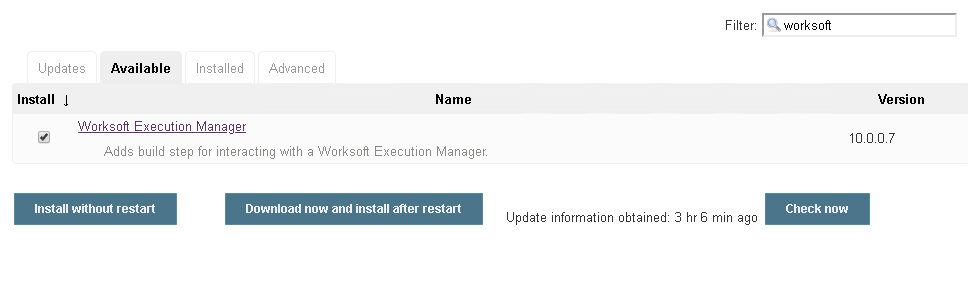

##### Manual

1.  Download **ws-execution-manager.hpi**
    from <https://plugins.jenkins.io/ws-execution-manager>
2.  Open Jenkins in a browser (e.g. http://\<*jenkins-host*\>:8080)
3.  Navigate to **Manage Jenkins** → **Manage Plugins** and select the
    **Advanced** tab.
4.  Click the **Choose File **button in the **Upload Plugin** section.
5.  Find the location of the **ws-execution-manager.hpi** file and click
    the **Open** button and **Upload** the file.
6.  Restart Jenkins, if necessary.

# Usage

## Configure Global Worksoft Execution Manager Settings

The plugin provides a means to configure an Execution Manager's URL and
credentials used by all Execution Manager build steps (unless
overridden). To configure this, navigate to *Jenkins global
configuration settings and paths* (Jenkins → Manage Jenkins → Configure
System) and locate the **Global Worksoft Execution Manager Settings**
section:

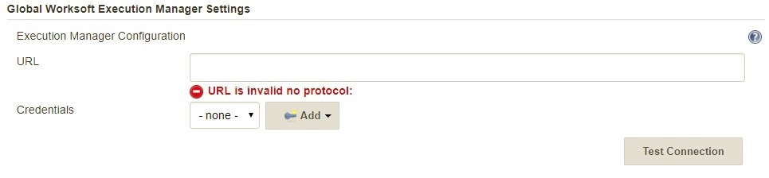{height="224"}

Configure the URL of the Execution Manager (typically
http://\<em-host\>/executionmanager):

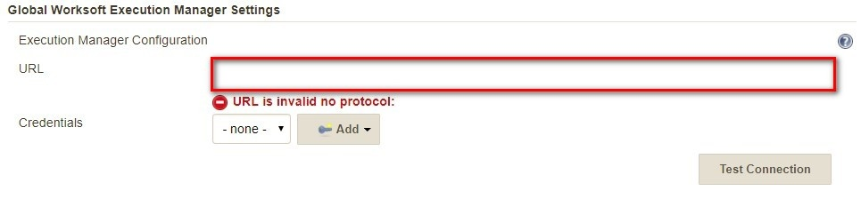{height="224"}

And credentials:

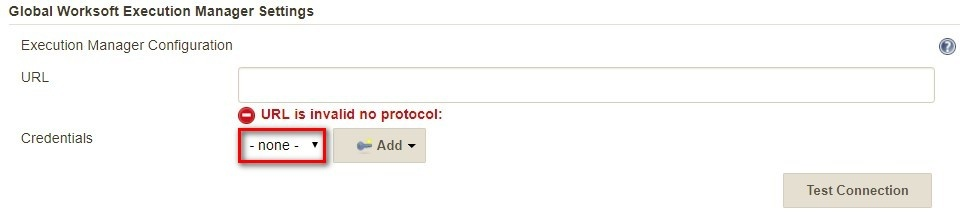{height="224"}

Save these configuration settings after which they can be used by
Execution Manager build steps (Freestyle and Pipeline).

## Freestyle Project

Create a Freestyle project and add the **Run Execution Manager
Request** build step: 

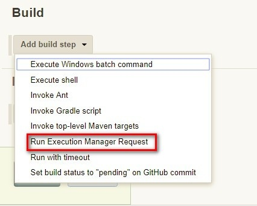{height="400"}

Select the type of request to execute:

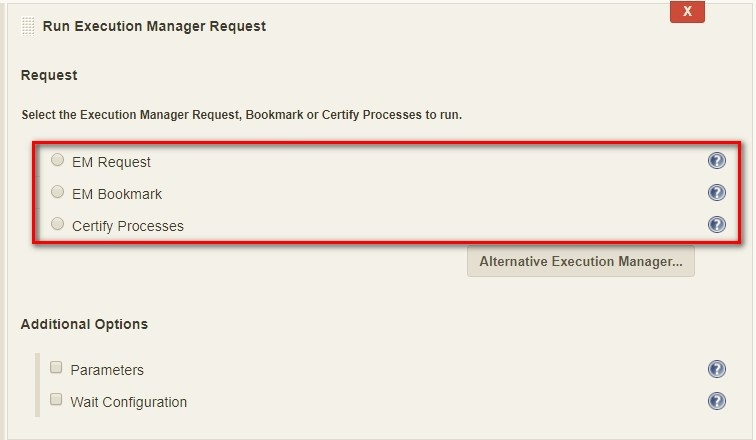{height="400"}

### Execution Manager Request

Select **EM Request** to run a predefined request configured on the
Execution Manager. The **Name** list box will be populated with all
available requests of which one must be selected.

{height="212"}

### Execution Manager Bookmark

Select **EM Bookmark** to run a predefined bookmark configured on the
Execution Manager via the Management Studio. The **Name** list box will
be populated with all available bookmarks of which one must be selected.

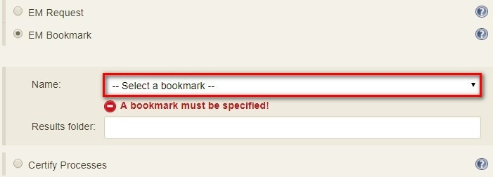{height="250"}

Optionally, a result folder can be specified by filling in the **Results
folder** text box:

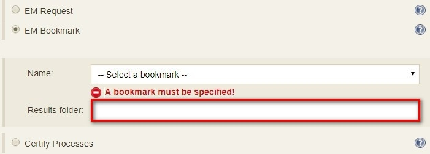{height="250"}

### Certify Processes

Select **Certify Processes** to execute a list of Certify processes
without creating a request or bookmark first.

## 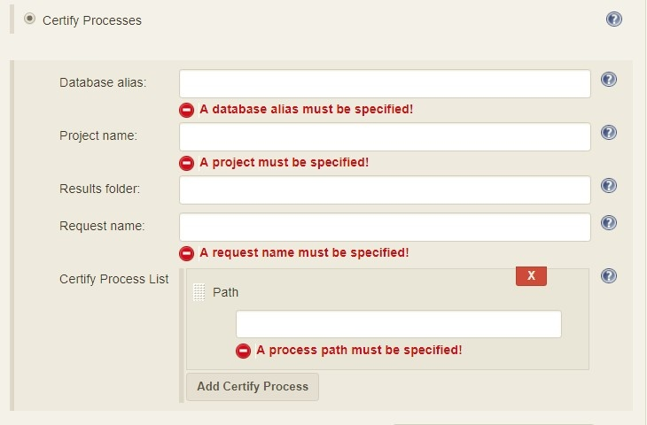{height="400"}

Provide an database alias name of the Certify connection saved in
Management Studio -\> Configuration -\> Certify Configuration:

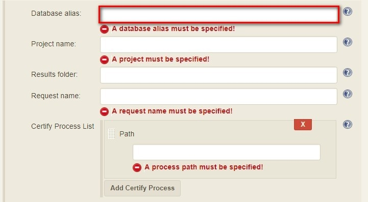{height="400"}

Specify the Certify project where processes reside:

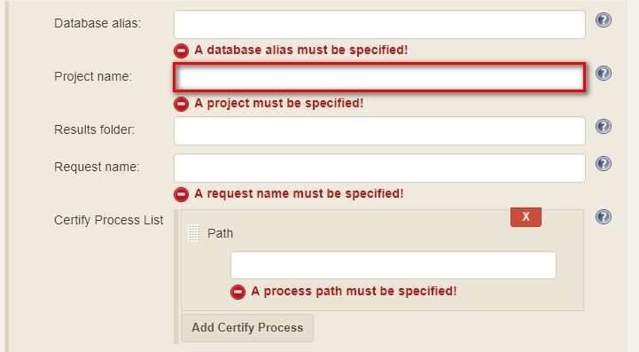{height="400"}

Optionally, specify a folder where Certify Results will be saved. If not
specified, results go to the root results folder:

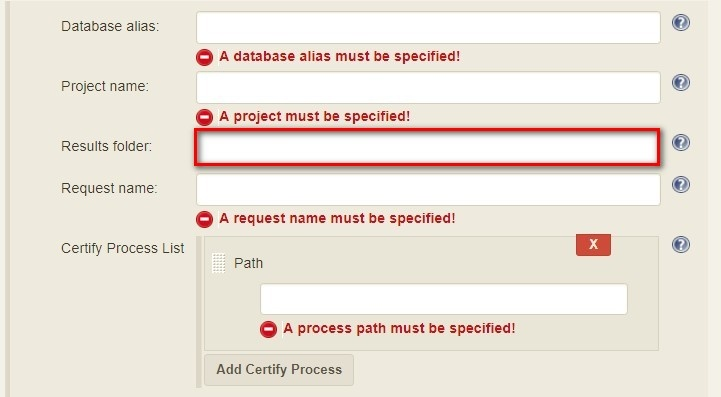{height="400"}

Specify a name to be given to the request execution:

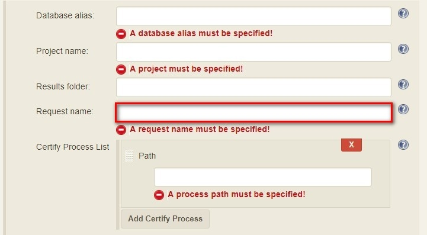{height="400"}

Provide a fully qualified path to each process to execute:

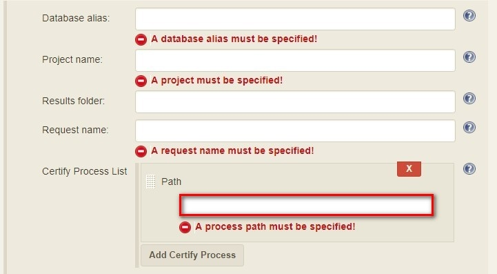{height="400"}

Add additional processes by clicking the Add Certify Process button:

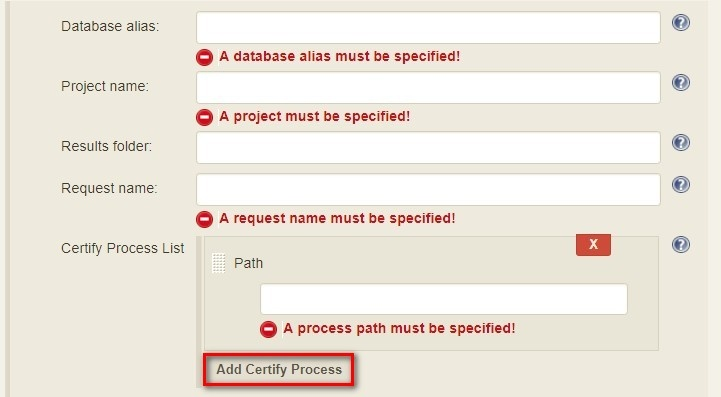{height="400"}

### Configure Alternative Execution Manager

An Execution Manager build step can override the globally Execution
Manager configuration (see above) by configuring an alternative:

{height="77"}

Configure the URL of the Execution Manager (typically
http://\<em-host\>/executionmanager):

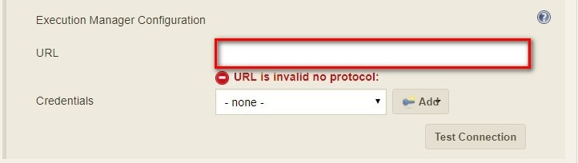{height="204"}

And credentials:

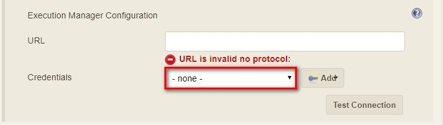{height="204"}

### Additional Options

Each request type (request, bookmark and processes) can be configured to
be executed with additional Certify parameters and wait configuration:

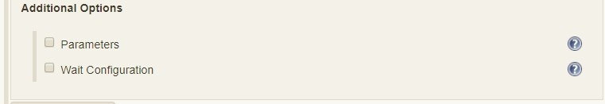{height="131"}

#### Certify Parameters

Optionally, Certify parameters can be specified. Both a key and value
must be specified. The value can refer to Jenkins environment variables
using this syntax - **${***JENKINS\_ENV\_VAR***}**. For example -
**${BUILD\_ID}**:

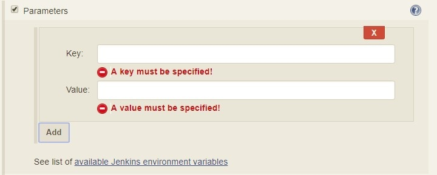{height="250"}

Optionally, execution wait configuration can be specified. Both the
polling interval and maximum run time must be specified in seconds:

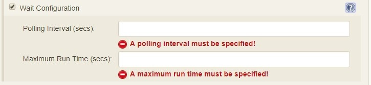{height="168"}

## Output

Plugin version 10.0.1 and later outputs the Worksoft Execution Manager
result set in JSON format to a file named - **execMan-result.json** - in
the associated Jenkins job's workspace directory. For example:

        {
            "Status": "Completed",
            "Description": "FAILED",
            "ExecutionStatus": "FAILED",
            "Tasks": [
                {
                    "Name": "test login",
                    "ExecutionStatus": "Failed",
                    "ResourceName": "CKAgentBox1",
                    "LastReportedError": "",
                    "Status": "Completed",
                    "CertifyDatabaseAliasName": "CK_Certify",
                    "CertifyResultID": 20075
                }
            ]
        }

**Note: **See Certify Execution Manager's API specification for a
complete description of the result set.

This file can be read/processed in either a freestyle or pipeline job.
For example, in a freestyle job, to retrieve from Certify the failed
test steps, add a Groovy build step with Groovy code like:

        // Requires Groovy plugin - http://wiki.jenkins-ci.org/display/JENKINS/Groovy+plugin
        import groovy.json.JsonSlurper
        import groovy.json.JsonOutput
        import hudson.*
        import hudson.model.*
        import java.lang.*
          
        def build = Thread.currentThread().executable
        def resolver = build.buildVariableResolver
        def workspace = build.getModuleRoot().absolutize().toString()
        
        // Retrieve job paramaters
        def API_TOKEN = resolver.resolve("API_TOKEN")
        def API_URL = resolver.resolve("API_URL")
        
        def execManResult = new FilePath(build.getModuleRoot().getChannel(), workspace + "/execMan-result.json")
        if (execManResult.exists()) {
            def result = new JsonSlurper().parse(execManResult.read())
            println "result=" + JsonOutput.prettyPrint(JsonOutput.toJson(result))
        
            // Loop through all tasks looking for failed tasks and their result ID
            for(int i=0; i < result['Tasks'].size(); i++) {
                def logHeaderID = result['Tasks'][i]['CertifyResultID']
                def executionStatus = result['Tasks'][i]['ExecutionStatus']
                if (logHeaderID != null && executionStatus.toUpperCase().equals("FAILED")) {
                    // Retrieve failed test steps from Certify and display them
                    def url = API_URL + "?logHeaderID=" + logHeaderID
                    def api = url.toURL().openConnection()
                    api.addRequestProperty("Accept", "application/json")
                    api.addRequestProperty("token", API_TOKEN)
                    api.setRequestMethod("GET")
                    api.connect()
        
                   println "Tasks[" + i +"] logHeaderID=" + logHeaderID + ":" +  JsonOutput.prettyPrint(api.content.text)
                }
            } 
        }

Similarly, a pipeline job could process the output file as follows:

        // Requires the following In-Process script approvals:
        //    method java.net.HttpURLConnection setRequestMethod java.lang.String
        //    method java.net.URL openConnection
        //    method java.net.URLConnection addRequestProperty java.lang.String java.lang.String
        //    method java.net.URLConnection connect
        //    method java.net.URLConnection getContent
        //    staticMethod org.codehaus.groovy.runtime.DefaultGroovyMethods getText java.io.InputStream
        //    staticMethod org.codehaus.groovy.runtime.DefaultGroovyMethods hasProperty java.lang.Object java.lang.String
        //    staticMethod org.codehaus.groovy.runtime.DefaultGroovyMethods toURL java.lang.String
        
        import groovy.json.JsonOutput
        
        pipeline {
            agent {
                node {
                    label "master"
                }
            }
            stages {
                stage('build') {
                    steps {
                        // Execute an Execution Manager request
                        execMan request: [name: '<an-execution-manager-request-name>'], requestType: 'request'
                        script {
                            if (fileExists('execMan-result.json')) {
                                def result = readJSON file: 'execMan-result.json'
                                echo "result=" + JsonOutput.prettyPrint(JsonOutput.toJson(result))
        
                                for(int i=0; i < result['Tasks'].size(); i++) {
                                    def logHeaderID = result['Tasks'][i]['CertifyResultID']
                                    def executionStatus = result['Tasks'][i]['ExecutionStatus']
                                    if (logHeaderID != null && executionStatus.toUpperCase().equals("FAILED")) {
                                        // Retrieve failed test steps from Certify and display them
                                        def url = API_URL + "?logHeaderID=" + logHeaderID
                                        def api = url.toURL().openConnection()
                                        api.addRequestProperty("Accept", "application/json")
                                        api.addRequestProperty("token", API_TOKEN)
                                        api.setRequestMethod("GET")
                                        api.connect()
        
                                        echo "Tasks[" + i +"] logHeaderID=" + logHeaderID + ":" + JsonOutput.prettyPrint(api.content.text)
                                    }
                                }
                            }
                        }
                    }
                }
            }
        }

## Pipeline

### DSL Reference - ***execMan: Run Execution Manager Request***

**requestType**

**Type:** String

  

**altEMConfig** (optional)

\| Optional alternative Execution Manager configuration. If provided,
these parameters override those specified in Jenkins global
configuration.

Nested object:

**url**

**Type**: String

**credentials**

**Type**: String

**  
**

**bookmark **(optional)

\| Select this to run a predefined bookmark configured on the Execution
Manager via the Management Studio.

Nested object:

**name**

**Type**: String

**folder **(optional)

**Type**: String

**  
**

**execParms **(optional)

\| Optional execution request parameters. Both a key and value must be
specified. The value can refer to Jenkins environment variables using
this syntax - **${***JENKINS\_ENV\_VAR***}**. For example -
**${BUILD\_ID}**.

**list** (optional)

**Type**: *ArrayList* of emParam

**key**

**Type**: String

**value**

**Type**: String

**  
**

**processList **(optional)

\| Select this to execute a list of Certify processes without creating a
request or bookmark first.

Nested object:

**database**

\| Alias name of the Certify connection saved in Management Studio -\>
Configuration -\> Certify Configuration.

**Type**: String

  

**project**

\| Certify project where processes reside.

**Type**: String

  

**processes**

\| List of the fully qualified path to each process.

***Type**: ArrayList* of certifyProcess

**processPath**

**Type**: String

  

**folder**

\| Folder where Certify Results will be saved. If not specified, results
go to the root results folder.

**Type**: String

  

**requestName**

\| Name given to the request execution.

**Type**: String

**  
**

**request **(optional)

\| Select this to run a predefined request configured on the Execution
Manager.

**name**

**Type**: String

  

**waitConfig **(optional)

\| Optional execution request wait configuration. Both the polling
interval and maximum run time must be specified in seconds

Nested object:

**pollInterval**

**Type**: String

**maxRunTime**

**Type**: String

### Example pipeline snippets

Simple Request execution:

execMan request: \[name: '*name-of-request*'\], requestType: 'request'

Simple Bookmark execution:

execMan bookmark: \[folder: '*result-folder-name*', name:
'*name-of-bookmark*'\], requestType: 'bookmark'

Simple Process List execution:

execMan processList: \[database: '*database-alias*', folder:
'*result-folder-name*', processes: \[\[processPath:
'*Project1\\\\Folder1\\\\Folder2\\\\Process1*'\], \[processPath:
'*testproject\\\\testfolder\\\\testprocess*'\]\], project:
'*certify-project-name*', requestName: '*request-name*'\], requestType:
'processList'

Bookmark request with wait config specified:

execMan bookmark: \[folder: '*result-folder-name*', name:
'*name-of-bookmark*'\], requestType: 'bookmark', waitConfig:
\[maxRunTime: '*600*', pollInterval: '*10*'\]

Request with Parameters:

execMan request: \[name: '*name-of-request*'\], requestType: 'request',
execParams: \[list: \[\[key: '*key1-name*', value: '*value1*'\], \[key:
'*key2-name*', value: '*value2*'\]\]\]

# Changelog

### Version 10.0.0.7 (Dec 11 2018)

-   Initial version

### Version 10.0.1.19 (April 24 2019)

-   Output Certify Execution Manager result set to
    *\<workspace-path\>****/execMan-result.json***

### Version 10.0.2.27 (August 16 2019)

-   Fix problem writing to
    *\<workspace-path\>****/execMan-result.json ***on slave nodes

  
