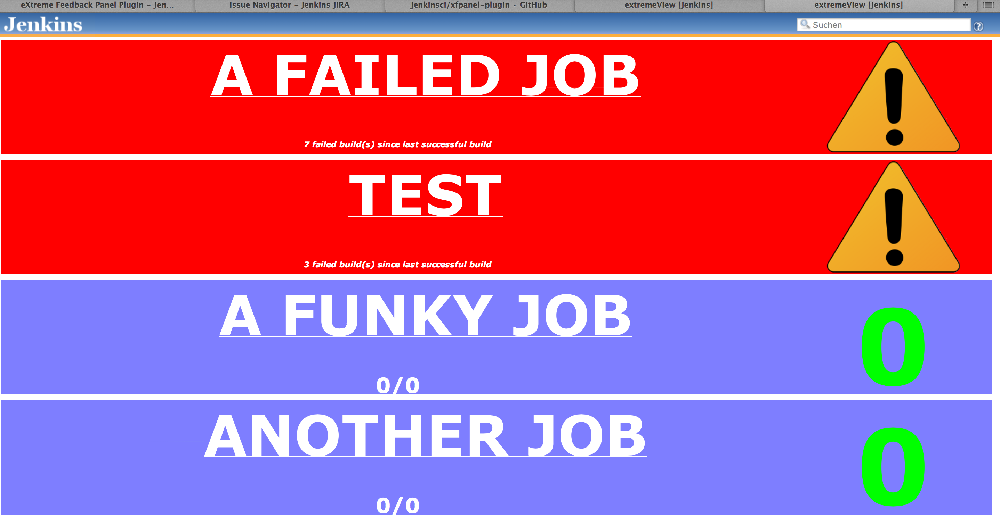
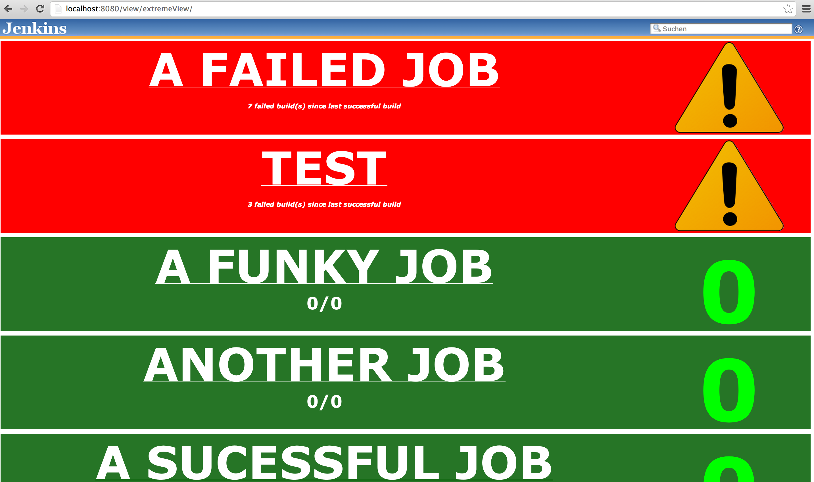
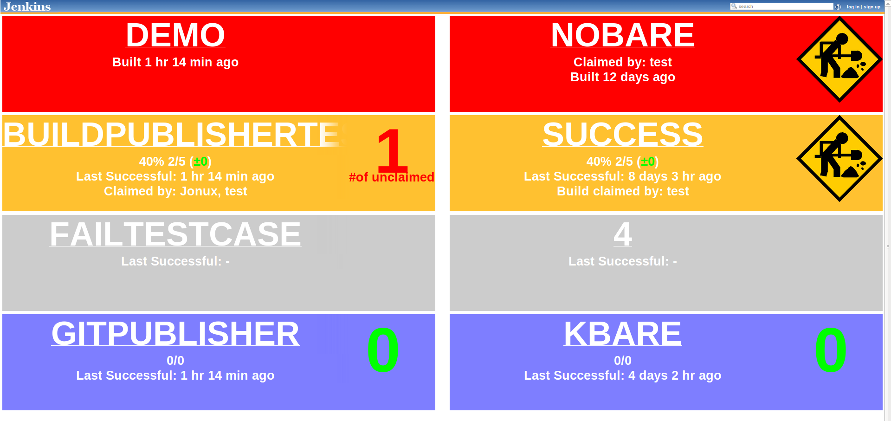
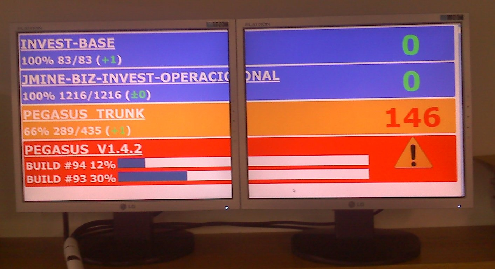
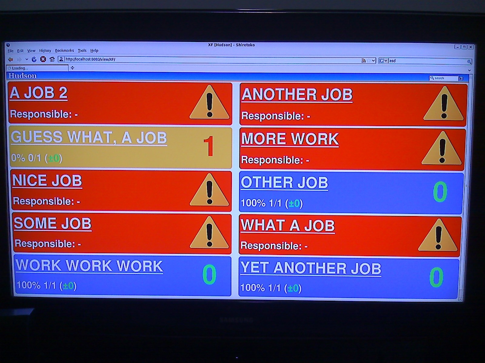

This plugin provides an eXtreme Feedback Panel that can be used to
expose the status of a selected number of Jobs.

Notice

Thanks to Mark Howard and his [Radiator View
Plugin](http://localhost:8085/display/JENKINS/Radiator+View+Plugin) from
which this plugin was inspired.

Notice

If the view misbehaves after updating please delete the view and add it
again. Sorry for the inconvenience.

Notice

In order to configure or delete the view append either *configure* or
*delete* to the view's url.

### **Shots**

Here is how it looks like (version 1.1.6):

|                                                                                                                                                             |                                                                                                                                |
|-------------------------------------------------------------------------------------------------------------------------------------------------------------|--------------------------------------------------------------------------------------------------------------------------------|
|  |  |

Here is how it looks like (version 1.1.3):  
{width="200"}

 version 1.0.xx: 

|                                                                                                                          |                                                                                                                          |
|--------------------------------------------------------------------------------------------------------------------------|--------------------------------------------------------------------------------------------------------------------------|
|  |  |

  

------------------------------------------------------------------------

### **Current features**

2.0.1 (Sep 18, 2015)

-   Bug fix: Crash when using Folders plugin ([issue
    \#23525](https://issues.jenkins-ci.org/browse/JENKINS-23525))

2.0.0 (Jul 21, 2015)

-   Bug fix: standard header and left side panel shown on top of panel
-   Bug fix: 'Replace nr. of failed test cases' option doesn't work
-   Bug fix: Some jobs are missing in "Available jobs" multichoice
    window
-   Improvement: Selected jobs are now displayed on top of jobs list -
    it is easier to manage them in case of hundred jobs
-   Improvement: Now it is possible to define up to 6 columns

1.2.3 (Nov 22, 2014)

-   Bugfix: Fixed broken links to job pages in the feedback panel view
    on some installations.

1.2.2 (Jun 17, 2013)

-   new improvement: Build colour options
-   new improvement: Marks selected job from the priority list
-   Bug fix: Adds warning about outdated config-file

1.2.1 (Jun 6, 2013)

-   new improvement: Manual sort option
-   **Important: Old configurations will NOT work directly! You can
    correct errors by regenerating configurations:
    HOST/view/YOUR\_VIEW/configure**

1.2.0 (Jun 3, 2013)

-   Bug fix: Shows progress bar if aborted build is building
-   Bug fix: Makes sort options and responsible options keep their value
    after refresh
-   Bug fix: Removed broken fadeout effect
-   Bug fix: Property "number of failed builds" to support special cases
    (like unbuilt builds)
-   New improvement: Adds option to modify timestamp's prefix text

1.1.6 (Dec 30, 2012)

-   new improvement: fixed Issues: 14895 / 12132 - added simple flag to
    have the ability to choose green color for successful build
-   new improvement: add possibility to show broken build count in xf
    panel number of failed builds since last successful build

1.1.4 (Aug 30, 2012)

-   Removes duplicate names from unstable claim info
-   Shows "claim image" when build is claimed or all test cases are
    claimed

1.1.3 (Aug 28, 2012)

-   automatic warning/claim image size
-   option to show claimers in unstable builds (even when build is
    building)
-   bug fix: doesn't show "\#of unclaimed" text anymore in successful
    builds

1.1.2 (Aug 20, 2012)

-   add option to replace number of failed test cases by number of
    unclaimed test cases (requires [Claim
    plugin](https://wiki.jenkins-ci.org/display/JENKINS/Claim+plugin)  )
-   fixed "hide successful builds" -option

*1.1.1 (Aug 15, 2012)*

-   add option to show responsible list
-   add option to sort jobs by build status
-   add option to show time from the last build
-   add option to show claim info, if [Claim
    plugin](https://wiki.jenkins-ci.org/display/JENKINS/Claim+plugin)
    installed
-   configure menu modified

*1.0.11* (Dec 9, 2011)

-   fixed a CSS bug that caused fonts to be extremely small on recent
    versions of Jenkins
-   moved plugin to be based on Jenkins

*1.0.9*   (Aug 11, 2010)

-   fixed a bug that prevents Hudson from getting reconfigured after the
    xfpanel view is created
    ([JENKINS-5256](https://issues.jenkins-ci.org/browse/JENKINS-5256))

*1.0.8*   (May 24, 2010)

-   add view option to display job description
    ([JENKINS-5957](https://issues.jenkins-ci.org/browse/JENKINS-5957))
-   add view option to sort jobs descending
    ([JENKINS-5958](https://issues.jenkins-ci.org/browse/JENKINS-5958))
-   add view option to hide test info for jobs without tests
    ([JENKINS-5959](https://issues.jenkins-ci.org/browse/JENKINS-5959))

*1.0.7*   (Jan 9, 2010)

-   Show when jobs are already queued and in what place

*1.0.6*   (Oct 11, 2009)

-   Corrected a bug that prevented status to be correctly updated
-   Added a FullHD checkbox on the view configuration that reduces sizes
    on the panel in order to accomodate more jobs on FullHD resolution
    (I've uploaded a picture in order to illustrate this with example
    jobs).

*1.0.5*

-   Optional dual column layout in order to accomodate more Jobs on a
    FullHD flat panel
-   Configurable refresh time independent from global auto-refresh

*1.0.4*

-   Provides a new **view** called eXtreme Feedback Panel
-   Shows some information for the selected jobs in a colorful manner
    -   Built jobs
        -   Percentage of passing tests
        -   Passing tests vs. total number of tests
        -   Evolution of passing tests in comparison to the last build
        -   Number of failing tests
    -   Broken jobs
        -   Elects a responsible for fixing the build (currently the
            last commiter of the build)
    -   Jobs in progress
        -   Progress bar, percentage of completion and build number
            (reference is last build building time)
        -   Correctly displays concurrent builds of a same job

### **Thoughts for next versions**

-   Configurable orderings for jobs
    -   Alphabetical (current)
    -   Status
    -   Absolut number of failed tests

### **Need Help?**

-   Join us on IRC \#hudson at chat dot freenode dot net
-   Tweet @julienrenaut
-   Or mail me julienrenaut at gmail dot com
