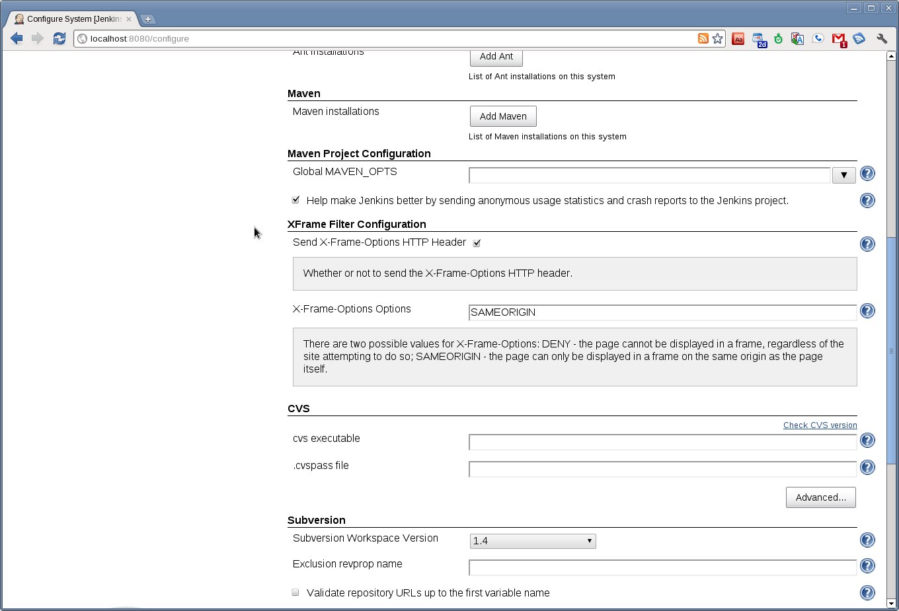

# XFrame Filter Plugin

  

Provides a very simple filter which adds a response header indicating
how frame/iframe requests should be handled.

  

The [X-Frame-Options HTTP response
header](https://developer.mozilla.org/en/The_X-FRAME-OPTIONS_response_header)
can be used to indicate whether or not a browser should be allowed to
render a page in a frame or iframe. Sites can use this to avoid
clickjacking attacks, by ensuring that their content is not embedded
into other sites.

  

| Configuration                                                                                                                             | X-Frame-Options Header                                                                                                             |
|-------------------------------------------------------------------------------------------------------------------------------------------|------------------------------------------------------------------------------------------------------------------------------------|
|  |  |

  

------------------------------------------------------------------------

  

### Changelog

#### 1.2 (Jun 30 2014)

-   [JENKINS-23105](https://issues.jenkins-ci.org/browse/JENKINS-23105)
    Plugin description broke display of Plugin Manager.
-   [JENKINS-22430](https://issues.jenkins-ci.org/browse/JENKINS-22430)
    Settings not loaded after restart.

#### 1.1 (Feb 21 2014)

-   [JENKINS-21881](https://issues.jenkins-ci.org/browse/JENKINS-21881)
    Work with 1.532.2+ and 1.551+, also offering a way of *disabling*
    the header in those versions.

#### 1.0 (released 2011-09-27)

-   initial implementation
-   fully I18N
