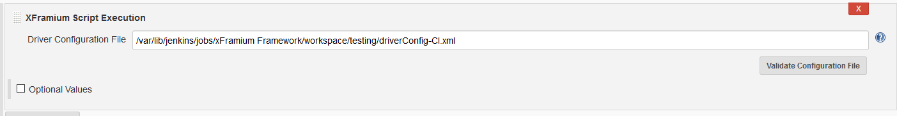
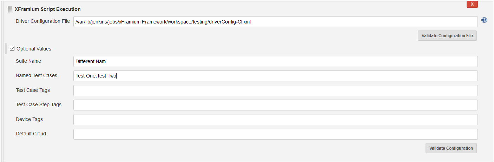

 

The xFramium Platform plugin allows users to execute xFramium scripts
inside of Jenkins and view reports.  Users can simply specify and
validate their driver configuration file

{width="1403"
height="183"}

Or they can modify the execute parameters to override the suite name,
specify test cases and tags or specify devices and clouds.

{width="1403"
height="461"}

 

View the xFramium reports directly from Jenkins

 

{width="1403"}

 
