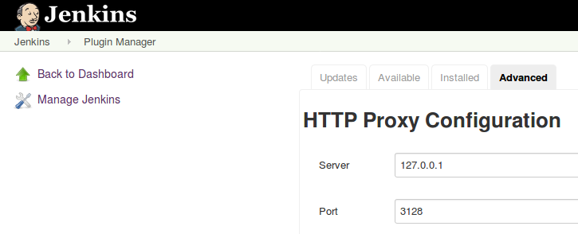
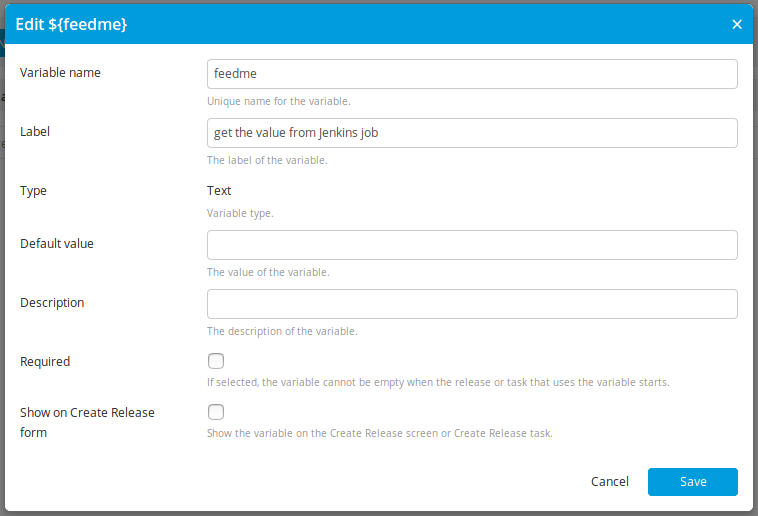
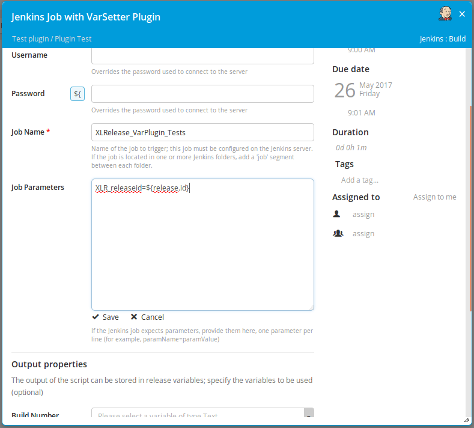
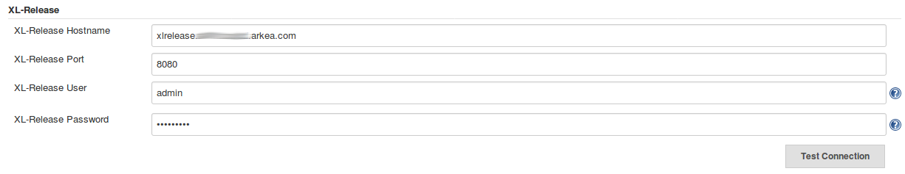
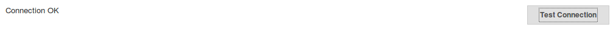
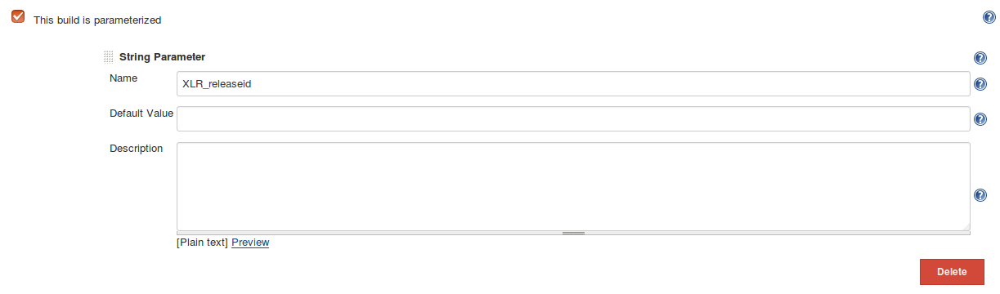
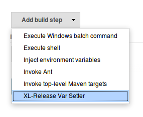
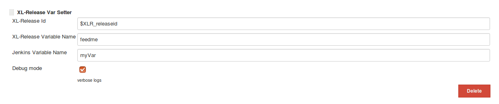
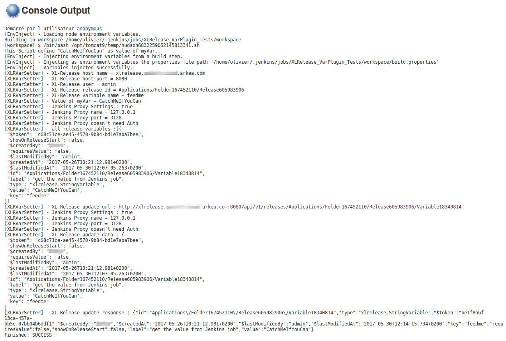

## Summary

XL Release Variables Setter is a plugin that permits to set variables
values into a running release.

This plugin uses native [XL Release REST
Api](https://docs.xebialabs.com/xl-release/6.2.x/rest-api/) ( [
Xebialabs](https://xebialabs.com/) [**©**](https://xebialabs.com/) ) to
communicate with.

## Installation

The plugin can be install with the differents methods described in the
Jenkins documentation : [Jenkins Plugins - How to install
plugins](https://wiki.jenkins-ci.org/display/JENKINS/Plugins#Plugins-Howtoinstallplugins)

## Usage

### prerequisites

#### Jenkins Environment

If your Jenkins server is behind a HTTP Proxy, the plugin is checking
its configuration first.

You can check or define it from this way : *Manage Jenkins* -\> *Manage
Plugins* -\> *Advanced* tab

 

#### XL Release Environment

Assuming your Jenkins server is already defined in XL Release ( *Shared
Configuration* -\> *Jenkins : Server* ), in a template, define a
variable with an empty value, and uncheck *required* :

Then, in a step configured as a Jenkins Job, add a Job Parameter for
carrying the release Id :

### Global Configuration

This section permits to define any parameters needed to access to a XL
Release server

*Manage Jenkins* -\> *Configure System*

 

-   XL-Release Hostname  : The host name of your XL-Release server
-   XL-Release Port           : The port number of your XL-Release
    server
-   XL-Release User          : The user used to connect to the
    Xl-Release server
-   XL-Release Password  : The password associated to the user used to
    connect to the Xl-Release server

 

Before saving parameters, use the *Test Connection* button to validate
the configuration.

### Jenkins Job Configuration

Add a String parameter, that have the same name as the variable name
defined in XL Release, to catch the release id.

### Jenkins Step Configuration

If the global configuration is done and all is correct, then in a
free-style project you can see the item **XL-Release Var Setter** in the
list build step.

 

To configure the job step, you need to set this parameters :

-   XL-Release Id : The Jenkins variable, defined as a string parameter,
    valued by XL Release.
-   XL-Release Variable Name : The XL Release variable name (without $
    character) you want to be updated in XL Release.
-   Jenkins Variable Name : The name of the Jenkins Variable, that the
    value herits from previous steps, to be send to XL Release.
-   Debug mode : Check for verbose logs.

Simple example of a job ( using the [EnvInject
Plugin](https://wiki.jenkins-ci.org/display/JENKINS/EnvInject+Plugin) )
:

### Execution

When the job is launched, you can follow the interactions between
Jenkins and XL Release in the console. If you have checked the debug
mode, the outputs are more verbose.

If the job have a problem, the console shows the stacktrace.

## Development

*TODO*

## License

*TODO*

## Version History

### 0.1 to 0.4 (2017-06-13)

*Minor changes since the first release (v0.1) to match Jenkins workflow
requirements.  
*
