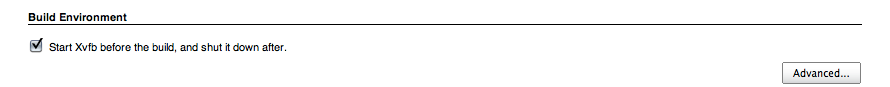
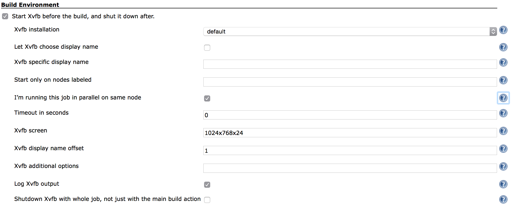
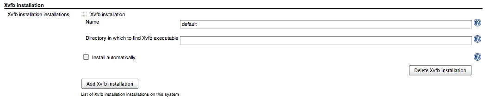

[](https://jenkins.ci.cloudbees.com/job/plugins/job/xvfb-plugin/badge/icon)

# What is it?

Lets you
control [Xvfb](http://www.x.org/archive/current/doc/man/man1/Xvfb.1.xhtml)
virtual frame buffer X11 server with each build. It starts Xvfb before
the build starts, and stops it with the build. This is very useful if
your build requires X11 access, for instance runs tests that require
GUI.

New feature in version 1.1.0 - Jenkins Pipeline support

With 1.1.0
[Pipeline](https://wiki.jenkins.io/display/JENKINS/Pipeline+Plugin)
support has landed, you can now use Xvfb to wrap other pipeline steps:

``` syntaxhighlighter-pre
node {
  wrap([$class: 'Xvfb']) {
    ... your steps here
  }
}
```

New feature in version 1.0.16 - Parallel build mode

Use **I’m running this job in parallel on same node** when running
multiple slaves (Jenkins nodes) on the same machine to prevent
collisions when jobs are run on same-numbered executors.

New feature in version 1.0.11 - Labels

Use **Start only on nodes labeled** option for multi platform builds.

New feature in version 1.0.9 - auto display name (on newer Xvfb
versions)

Use **Let Xvfb choose display name** option with Xvfb that supports
**displayfd** option to choose the display number automatically by Xvfb.

# Getting help

Please use the [users mailing list](https://jenkins.io/mailing-lists/),
[Stackoverflow](https://stackoverflow.com/questions/tagged/jenkins) or
ask on one of the [chats](https://jenkins.io/chat/). This page was not
designed for support, please do no comment on it asking for help. If you
encounter bugs or issues please create a ticket in the [issue
tracker](https://issues.jenkins-ci.org/), it would be really nice if you
would research first and see if the issue you're experiencing is due to
the Xvfb Jenkins plugin or with the Xvfb itself and the version of Xvfb
you're using.

# Usage

The plugin starts and stops the Xvfb virtual framebuffer X11 server so
your jobs can use X11 displays in headless environments such as servers,
or when dedicated X11 display is required for each job.

Start by going to *Manage Jenkins* / *Global Tool Configuration* on
Jenkins version 2.0 or *Manage Jenkins* / *Configure System* on earlier
version and setup your Xvfb installation. You need to give it a
arbitrary name like *default Xvfb* and directory in which the Xvfb
executable is located like */usr/X11R6/bin*. Unfortunately there is no
support for automatic installation of Xvfb. As of version 1.1.0 you can
define a single Xvfb tool installation or have a installation named
"default" and the jobs are going to run even if you don't define what
installation to use in the job configuration.

Typically you would use the defaults, which are that display numbers, a
unique number that is used to identify each X11 display (you might see
them shown as `:0`, `:1` or such), are based on the current Jenkins
executor number (the number you see next to the running job in the
*Build Executor Status* box). This is fine if display numbers
corresponding to the executor numbers are available for Jenkins to use.
If they're not you have several options:

-   use a fixed display number (*Xvfb specific display name*) by which
    you guarantee that the specified display number is reserved for the
    specified Jenkins job
-   use display numbers based on executor numbers but offset by some
    number (*Xvfb display name offset*) by which you reserve a range of
    display numbers for the specified Jenkins job, for instance if you
    use offset of 100, display names will be 100 and greater, up to the
    number of executors on a particular Jenkins executor (i.e. slave or
    master depending on where the job is run)
-   leave the choice of display number to Xvfb (*Let Xvfb choose display
    name*) – if your Xvfb version supports it, by which Xvfb chooses a
    free display number on its own

# Project Configuration

On the job configuration page, enable the "Start Xvfb before the build,
and shut it down after." under the Build Environment.


If you want to customize defaults click on Advanced... button.

{width="900"}

-   **Xvfb installation** lets you choose Xvfb installation to use,
    these are configured by the Jenkins administrator in the Tools
    section of Jenkins configuration. By default the first defined
    installation is used.
-   **Let Xvfb choose display name** Uses the -displayfd option of Xvfb
    by which it chooses its own display name by scanning for an
    available one. This option requires a recent version of xserver,
    check your installation for support. Useful if you do not want to
    manage display number ranges but have the first free display number
    be used.
-   **Xvfb specific display name** lets you customize what displayname
    should be created, enter a number here and that number prefixed by :
    will be the displayname (e.g. :1). If none is given display name is
    based upon Jenkins executor number increased by 1, or the
    configurable **Xvfb display name offset**.
-   **I’m running this job in parallel on same node** - if you have
    multiple slaves on the same machine, the build number will be
    generated based on the ordinal of the machine multiplied by 100 plus
    the executor number and any offset configured. Be careful Xvfb will
    not work with this enabled if you're running more than 595 nodes and
    35 executors per node.
-   **Start only on nodes labeled** lets you specify via label
    expressions on what node(s) to start Xvfb.
-   **Timeout in seconds** lets you specify the number of seconds before
    letting the build progress. Since Xvfb is started in background,
    certain builds might fail because Xvfb was not started quick enough,
    with this the build is paused the for specified seconds to let Xvfb
    startup. The default is not to pause the build.
-   **Xvfb screen** changes the screen resolution and pixel depth, it
    needs to be in WxHxD format (i.e. 1600x1200x24). The default
    is 1024x768x24.
-   **Xvfb display name offset** lets you specify a offset i.e. a number
    that will be added to the job's executor number that will form the
    display name used. This is handy if you run other X servers (Xvfb,
    Xvnc or similar) in order to ensure that display numbers do not
    overlap.
-   **Xvfb additional options** lets you specify any additional Xvfb
    command line options you might need.
-   **Log Xvfb output** redirects output of Xvfb into job log, useful if
    you need to troubleshoot Xvfb starting/stopping.
-   **Shutdown Xvfb with whole job, not just with the main build
    action** keeps Xvfb running for post build steps.

# Jenkins configuration

Jenkins administrator needs to define the Xvfb tool installation.


The directory in which to find Xvfb executable can be left blank, then
PATH is searched to find the executable.

# Version History

## **Version 1.1.3 (Mar 20, 2015)**

[JENKINS-32039](https://issues.jenkins-ci.org/browse/JENKINS-32039)
"screen" default does not work  
[JENKINS-33206](https://issues.jenkins-ci.org/browse/JENKINS-33206) Xvfb
plugin doesn't remember "Log Xvfb output" set via the configuration
page  
[JENKINS-33288](https://issues.jenkins-ci.org/browse/JENKINS-33288) Xvfb
error does not fail build

Thanks to Mark Leaky, Nathan Smith and Francis De Brabandere for
reporting issues!

## **Version 1.1.2 (Dec 10, 2015)**

[JENKINS-32005](https://issues.jenkins-ci.org/browse/JENKINS-32005) Xfvb
plugin doesn't remember displayname set via the configuration page

Thanks to Adriaan Wisse for reporting the issue!

## **Version 1.1.1 (Dec 5, 2015)**

[PULL\#8](https://github.com/jenkinsci/xvfb-plugin/pull/8) Screen name
was not being set from the configuration.

Thanks to Daniel Borges for the pull request!

## **Version 1.1.0 (Nov 24, 2015)**

Added support for the [Pipeline
Plugin](https://wiki.jenkins.io/display/JENKINS/Pipeline+Plugin)

## **Version 1.0.16 (Feb 8, 2015)**

[JENKINS-26848](https://issues.jenkins-ci.org/browse/JENKINS-26848) Does
not actually randomize DISPLAY

Thanks to Jo Shields for reporting and testing!

## **Version 1.0.15 (Jan 20, 2015)**

[JENKINS-26504](https://issues.jenkins-ci.org/browse/JENKINS-26504)
Cannot run low numbered builds with xvfb in Jenkins 1.597  
[JENKINS-26505](https://issues.jenkins-ci.org/browse/JENKINS-26505)
java.lang.IllegalArgumentException: Prefix string too short
org.jenkinsci.plugins.xvfb.XvfbBuildWrapper.launchXvfb(XvfbBuildWrapper.java:484)
[duplicate](https://wiki.jenkins.io/display/JENKINS/Xvfb+Plugin#)

Thanks to Jonathan Price and mturra for reporting the issue!

## **Version 1.0.13 (Oct 1, 2014)**

[Prevent NPE when NullConverter
registered](https://github.com/jenkinsci/xvfb-plugin/pull/5) pull
request by [Aleksandr Zhuikov](https://github.com/aleksz)

Thanks to Aleksandr Zhuikov for the pull request!

## **Version 1.0.12 (Jun 2, 2014) - bug-fix release**

-   [JENKINS-23267](https://issues.jenkins-ci.org/browse/JENKINS-23267)
    NullPointerException in XvfbBuildWrapper.setUp when configured
    without node label restrictions

Thanks to Alexander Clausen, Jarosław Strzelecki & elygre for reporting
and suggesting fix.

## **Version 1.0.11 (Jun 1, 2014)**

-   [JENKINS-23155](https://issues.jenkins-ci.org/browse/JENKINS-23155)
    Only run plugin under Linux

Thanks to cowwoc for reporting and testing!

## **Version 1.0.10 (Apr 23, 2014)**

-   [JENKINS-22719](https://issues.jenkins-ci.org/browse/JENKINS-22719)
    Xvfb plugin does not start before release plugin
-   Zombie slaying on Jenkins master failure

Thanks to Zoltan Nagy and Dmitry Katsubo for reporting and testing!

## **Version 1.0.9 (Mar 5, 2014)**

-   [JENKINS-20758](https://issues.jenkins-ci.org/browse/JENKINS-20758)
    Xvfb processes remain after slave disconnect
-   [JENKINS-19950](https://issues.jenkins-ci.org/browse/JENKINS-19950)
    DISPLAY variable is not overwritten when it already exists
-   [JENKINS-21548](https://issues.jenkins-ci.org/browse/JENKINS-21548)
    Xvfb failure does not fail build
-   New feature that lets Xvfb to pick the display name

Thanks to Marc Günther, Richard Cross and Jonathan Rogers for reporting
and beta testing!

## **Version 1.0.8 (Jun 29, 2013)**

-   [JENKINS-18094](https://issues.jenkins-ci.org/browse/JENKINS-18094)
    Xvfb plugin doesn't write any error message in build log

Thanks to Aleksey Alekseev for reporting and testing!

## **Version 1.0.7 (Dec 9, 2012)**

-   [JENKINS-15972](https://issues.jenkins-ci.org/browse/JENKINS-15972)
    No display available in post build actions

Thanks to Yves Langisch for reporting the feature request!

## **Version 1.0.6 (Nov 5, 2012)**

-   [JENKINS-15638](https://issues.jenkins-ci.org/browse/JENKINS-15638)
    Xvfb 'display name offset' defaults to 0, not 1 as described, if
    unset

Thanks to Fredrik Vihlborg for re-reporting issues!

## **Version 1.0.5 (Oct 30, 2012)**

-   [JENKINS-15638](https://issues.jenkins-ci.org/browse/JENKINS-15638)
    Xvfb 'display name offset' defaults to 0, not 1 as described, if
    unset

Thanks to Fredrik Vihlborg for reporting issues!

## **Version 1.0.4 (Oct 24, 2012)**

-   [JENKINS-14483](https://issues.jenkins-ci.org/browse/JENKINS-14483)
    Remaining Xvfb processes in matrix jobs
-   [pull request
    \#2](https://github.com/jenkinsci/xvfb-plugin/issues/2) Make sure
    the random display name is always more than 0.
-   [JENKINS-15608](https://issues.jenkins-ci.org/browse/JENKINS-15608)
    Xvfb 'specific displayname' selects a random display between 0..100,
    not 1..100.

Thanks to Thorsten Kahler for reporting the issue and exemplary patience
in testing, [JeroenVanHab](https://github.com/JeroenVanHab) for the pull
request and Fredrik Vihlborg for reporting the issue!

## **Version 1.0.3 (Sep 15, 2012)**

-   [JENKINS-14790](https://issues.jenkins-ci.org/browse/JENKINS-14790)
    NullPointerException starting Xvfb on remote slave
-   [JENKINS-15174](https://issues.jenkins-ci.org/browse/JENKINS-15174)
    Timeout option not retrieved correctly

Thanks to Brian Sipos and Daniel Piorkowski for reporting issues!

## Version 1.0.2 (Mar 12, 2012)

-   Field to add additional options to Xvfb command line (JENKINS-13046)

## Version 1.0.1 (Jan 29, 2012)

-   Initial release
