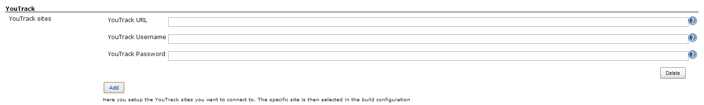
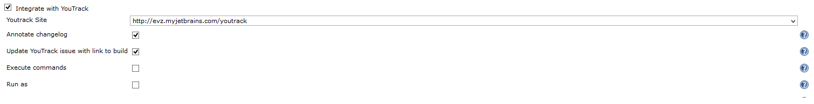
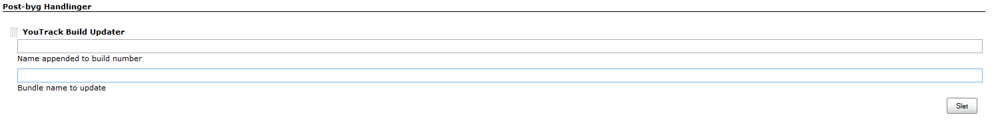

Older versions of this plugin may not be safe to use. Please review the
following warnings before using an older version:

-   [Credentials stored in plain
    text](https://jenkins.io/security/advisory/2019-04-03/#SECURITY-963)
-   [Arbitrary code execution
    vulnerability](https://jenkins.io/security/advisory/2017-04-10/)

This plugin provides some integration with
[YouTrack](http://jetbrains.com/youtrack). This version (0.7.x) has
backwards incompatible updates - so review your configurations

# Generel

The development of this plugin is in no way affiliated with JetBrains,
the creators of YouTrack.

This plugin adds integration in the following ways:

-   Link to issues, with dynamic tooltip
-   Execute commands from build steps
-   Update build bundle
-   Mark issues fixes as fixed in build

## Configuration

#### Global configuration

To use this plugin the YouTrack site to integrate with most be specified
on the global configuration page. Where you will nedd to specify a url,
username and password. The permissions needed for this user depends on
what kind of integrations you turn on, e.g. if you want to run commands
as the committer, then the user needs to have the Low-level
Administration permission. These sites are referenced from the jobs by
the url, so you will have to refresh the job configuration if you change
the url.  

#### Project configuration

#### 

When you have set up your site(s) in the global configuration you can
enable the integration on the job configuration page. You select the
site you want to integrate with and which integration options you want.

##### Annotate changelog

This option will annotate the changelog with links from issue ids to
YouTrack. The way it is determined if something is an issue id, is that
on each build the plugin will fetch the project codes available from
youtrack, and then expect all project code-number to be an issue id,
e.g. PC-23. It will also display a tooltip with the title and
description of the issue. This info is first loaded when the tooltip
will be displayed.

##### Update with link

This will add a comment with a link to this build into the issues
mentioned in the commit comment(s).

##### Execute commands

This will execute commands in YouTrack, if they are on the form
\#issue-id Fixed, e.g \#PC-23 Fixed. The command will be interpreted
from the issue id and to the end of the line. The line following will be
used as a comment.

###### Run as

By default it runs the commands as the user set up for the site in the
global configuration, if this box is checked however, it will run as the
user committed. The way users is matched is on the e-mail set by the
Jenkins Person who committed the change.

##### Update builds and Fixed in Build

To update the Build Bundle with the value for the current build, you
need to add the YouTrack Builder Updater Post-Build action. In this you
can set the build bundle you want to update, and optionally a name to be
appended afterwards.

This post build action also marks issues as Fixed in build, if a command
executed on them marks sets them to be Fixed, determined by checking
state before and after applying the command.  

## History

#### Version 0.5 (2014 May 04)

-   feature: post build step to create issue
-   feature: store processed commit ids to prevent applying a command
    multiple times
-   feature: link failed tests with issues.
-   feature: limit commands to certain projects
-   usability: only add command action to builds if there is commands
    applied
-   usability: tooltip markup to html
-   usability: tooltip handles images in issues
-   bugfix: encode related build comment
-   bugfix: tooltip when multiple issue links in same commit message
-   bugfix: multiline commit messages in git

#### Version 0.4 (2013 August 08)

-   feature: command log
-   usability: updated help

#### Version 0.3 (2013 June 02)

-   usability: test connection and YouTrack version on setup
-   usability: autocomplete on fields
-   usability: name for each setup
-   feature: possibility to run integrate silently (i.e. no
    notifications)
-   feature: expands variables in build name prefix

#### Version 0.2 (2013 May 12)

-   feature: option to only update build bundle when there is fixed
    issues in build
-   feature: option to specify visibility groups for build link comments
-   feature: customizable state field and fixed values
-   bugfix: only run comands once for multi-configuration projects
-   bugfix: fixed in build without run as enabled was not working

#### Version 0.1 (2013 Apr. 24)

-   Initial release
