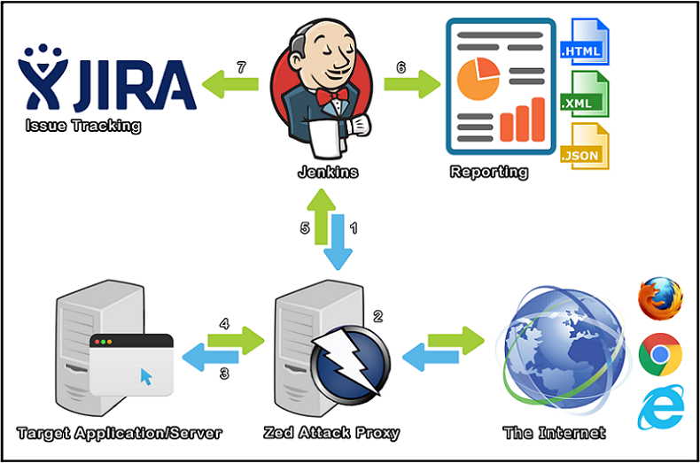

 

[](https://github.com/jenkinsci/zap-plugin/releases)
[](https://ci.jenkins.io/job/Plugins/job/zap-plugin/job/master/)
[](https://scan.coverity.com/projects/jenkinsci-zap-plugin)
[](https://bestpractices.coreinfrastructure.org/projects/490)
[](https://github.com/jenkinsci/zap-plugin/blob/master/LICENSE)

# Official OWASP Zed Attack Proxy Jenkins Plugin

The OWASP Zed Attack Proxy
(**[ZAP](https://www.owasp.org/index.php/OWASP_Zed_Attack_Proxy_Project)**)
is one of the world’s most popular free security tools and is actively
maintained by hundreds of  
international volunteers. It can help you automatically find security
vulnerabilities in your web applications while you are developing and  
testing your applications. It's also a great tool for experienced
pen-testers to use for manual security testing.

The **[Official OWASP ZAP Jenkins
Plugin](https://wiki.jenkins-ci.org/display/JENKINS/zap+plugin)**
extends the functionality of the
**[ZAP](https://www.owasp.org/index.php/OWASP_Zed_Attack_Proxy_Project)**
security tool into a CI Environment.

-   -   Manage Sessions (Load or Persist)
    -   Define Context (Name, Include URLs and Exclude URLs)
    -   Attack Contexts (Spider Scan, AJAX Spider, Active Scan)

You can also:

-   -   Setup Authentication (Form Based or Script Based)
    -   Run as Pre-Build as part of a
        **[Selenium](http://docs.seleniumhq.org/)** Build
    -   Generate Reports
        (**.xhtml**[](http://www.w3schools.com/html/html_xhtml.asp),
        **.xml**[](http://www.w3schools.com/xml/default.asp),
        **.json**[](http://www.w3schools.com/js/js_json_intro.asp))

### Table of Contents

-   [ZAP as a part of a CI
    Environment](http://localhost:8085/display/JENKINS/zap+plugin#zapplugin-ZAPasapartofaCIEnvironment) 
-   [Tech](http://localhost:8085/display/JENKINS/zap+plugin#zapplugin-Tech)
-   [Questions/Troubleshooting](http://localhost:8085/display/JENKINS/zap+plugin#zapplugin-Questions/Troubleshooting)
-   [Issue
    Tracking](http://localhost:8085/display/JENKINS/zap+plugin#zapplugin-IssueTracking)
-   [Security
    Vulnerabilities](http://localhost:8085/display/JENKINS/zap+plugin#zapplugin-SecurityVulnerabilities)
-   [Installation](http://localhost:8085/display/JENKINS/zap+plugin#zapplugin-Installation)
    -   [Jenkins](http://localhost:8085/display/JENKINS/zap+plugin#zapplugin-Jenkins)
    -   [Zed Attack Proxy –  Documentation, how to configure **ZAP** can
        be found
        **here**](http://localhost:8085/display/JENKINS/zap+plugin#zapplugin-ZedAttackProxy%E2%80%93Documentation,howtoconfigureZAPcanbefoundhere)
    -   [Firefox –  Documentation, how to configure **Firefox** can be
        found
        **here**](http://localhost:8085/display/JENKINS/zap+plugin#zapplugin-Firefox%E2%80%93Documentation,howtoconfigureFirefoxcanbefoundhere)
-   [Usage](http://localhost:8085/display/JENKINS/zap+plugin#zapplugin-Usage)
-   [Development](http://localhost:8085/display/JENKINS/zap+plugin#zapplugin-Development)
-   [Building the
    Plugin](http://localhost:8085/display/JENKINS/zap+plugin#zapplugin-BuildingthePlugin)
    -   [Prerequisites](http://localhost:8085/display/JENKINS/zap+plugin#zapplugin-Prerequisites)
    -   [Development
        Build](http://localhost:8085/display/JENKINS/zap+plugin#zapplugin-DevelopmentBuild)
    -   [To
        Install](http://localhost:8085/display/JENKINS/zap+plugin#zapplugin-ToInstall%3A)
    -   [Pre-Production
        Release](http://localhost:8085/display/JENKINS/zap+plugin#zapplugin-Pre-ProductionRelease)
    -   [Production
        Release](http://localhost:8085/display/JENKINS/zap+plugin#zapplugin-ProductionRelease)
-   [Development Rules and
    Guidelines](http://localhost:8085/display/JENKINS/zap+plugin#zapplugin-DevelopmentRulesandGuidelines)
-   [Contributors](http://localhost:8085/display/JENKINS/zap+plugin#zapplugin-Contributors)
-   [Version
    History](http://localhost:8085/display/JENKINS/zap+plugin#zapplugin-VersionHistory)
-   [Other](http://localhost:8085/display/JENKINS/zap+plugin#zapplugin-Other)
-   [Previous Release
    (Deprecated)](http://localhost:8085/display/JENKINS/zap+plugin#zapplugin-PreviousRelease(Deprecated))
-   [License](http://localhost:8085/display/JENKINS/zap+plugin#zapplugin-License)

### ZAP as a part of a CI Environment



1.  A Jenkins CI Build step initializes ZAP
2.  Traffic flows (Regression Pack) through ZAP (Web Proxy)
3.  ZAP modifies requests to include Vulnerability Tests
4.  Target Application/Server sends Response back through ZAP
5.  ZAP sends reporting data back to Jenkins
6.  Jenkins publishes and archives the report(s)
7.  Jenkins creates JIRA tickets for the alerts

### Tech

ZAP Jenkins plugin uses a number of open source plugins to work
properly:

-   -   **[ZAP
        API](https://github.com/zaproxy/zaproxy/wiki/ApiDetails)** –
        
        A REST API which allows you to interact with ZAP
        programmatically.

And of course the Official ZAP Jenkins plugin is open source with a
**[public repository](https://github.com/jenkinsci/zap-plugin)** on
GitHub

### Questions/Troubleshooting

Please use the **[Google
Group](https://groups.google.com/forum/#%21forum/zaproxy-jenkins)** for
any questions about using the plugin.

**Notice:**

-   Include the following:

    -   Java version
    -   Jenkins version
    -   ZAP version
    -   ZAP Jenkins Plugin version
    -   Firefox version (if running AJAX Spider or a Selenium build)
    -   Selenium (if applicable)

-   Upload copies of the *zap.log* files and a copy of the *console
    output* of the Jenkins log to
    **[pastebin](https://pastebin.mozilla.org/)**.
-   Jenkins is always running on a master, is ZAP running on the master
    as well or on a separate slave machine?
-   Relevant Jenkins Job Configurations sanitized screenshots.

### Issue Tracking

-   Issues can be created on the **Jenkins JIRA** for the component
    **[zap-plugin](https://issues.jenkins-ci.org/issues/?jql=project%20%3D%20JENKINS%20AND%20component%20%3D%20zap-plugin)**  
    -   **[All](https://issues.jenkins-ci.org/issues/?jql=project%20%3D%20JENKINS%20AND%20component%20%3D%20zap-plugin)**
        **Issues**
    -   Want to see what we need help with? See [**Open, Reopened and
        Verified**](https://issues.jenkins-ci.org/browse/JENKINS-43384?jql=project%20%3D%20JENKINS%20AND%20status%20in%20%28Open%2C%20Reopened%2C%20Verified%29%20AND%20component%20%3D%20zap-plugin)
        **Issues**
    -   Want to see what contributors are currently working on? See
        **[In Progress and In
        Review](https://issues.jenkins-ci.org/browse/JENKINS-43483?jql=project%20%3D%20JENKINS%20AND%20status%20in%20%28%22In%20Progress%22%2C%20%22In%20Review%22%29%20AND%20component%20%3D%20zap-plugin)**
        **Issues**
    -   Want to see what we've done so far? See **[Closed and
        Resolved](https://issues.jenkins-ci.org/browse/JENKINS-41069?jql=project%20%3D%20JENKINS%20AND%20status%20in%20%28Resolved%2C%20Closed%29%20AND%20component%20%3D%20zap-plugin)**
        **Issues**
-   Before creating an Issue please read the **[JIRA
    guidelines](https://wiki.jenkins-ci.org/display/JENKINS/How+to+report+an+issue)**.

**Notice:** GitHub Issues have been disabled.

### Security Vulnerabilities

If you find any security vulnerabilities or exploits caused by the
plugin, please send a private
email [](https://wiki.jenkins-ci.org/display/JENKINS/zap+plugin#zapplugin-PluginInformation)
to one of the
**[maintainer(s)](https://wiki.jenkins-ci.org/display/JENKINS/zap+plugin#zapplugin-PluginInformation)**.

**Notice:** These should be kept private until a fix is issued.

### Installation

##### [Jenkins](https://jenkins.io/)

-   -   ZAP Jenkins plugin requires Jenkins 1.580.1+ to run.
    -   Download and extract the **[desired war
        release](https://updates.jenkins-ci.org/download/war/)**.

##### [Zed Attack Proxy](https://www.owasp.org/index.php/OWASP_Zed_Attack_Proxy_Project) –  Documentation, how to configure **ZAP** can be found **[here](http://localhost:8085/display/JENKINS/ZAP+Settings)**

-   -   ZAP Jenkins plugin requires **[ZAP 2.6.0
        Standard](https://github.com/zaproxy/zaproxy/wiki/Downloads#zap-260-standard)**
        or later to run.
        -   **[Downloads](https://github.com/zaproxy/zaproxy/wiki/Downloads)**
        -   **[Releases](https://github.com/zaproxy/zaproxy/releases)**

##### [Firefox](https://www.mozilla.org/en-US/firefox/products/) –  Documentation, how to configure **Firefox** can be found [**here**](http://localhost:8085/display/JENKINS/Firefox+Settings)** **

-   -   ZAP supports one of the following
        **[versions](https://github.com/zaproxy/zap-core-help/wiki/HelpAddonsSeleniumIntro)**
        of Firefox.
    -   Download and install a **[supported
        release](https://ftp.mozilla.org/pub/firefox/releases/)**.

### Usage

Detailed instructions on how to configure a Job from start to finish can
be found
**[here](http://localhost:8085/display/JENKINS/Configure+the+Job)**.

-   -   Configure the Job to [**Execute
        ZAP**](https://wiki.jenkins-ci.org/display/JENKINS/Configure+the+Job#ConfiguretheJob-ConfiguretheJobtoExecuteZAP)
    -   Configure the Job to **[Execute ZAP as part of a Selenium
        Build](https://wiki.jenkins-ci.org/display/JENKINS/Configure+the+Job#ConfiguretheJob-ConfiguretheJobtoExecuteZAPaspartofaSeleniumBuild)**

**Recommended:** for first time users, the plugin requires special
instructions to setup for first run.

### Development

The Official OWASP ZAP Jenkins plugin is a Maven Jelly Project.

Start the local Jenkins instance: `$ mvn hpi:run`

### Building the Plugin

**Requires:** JDK 8 to compile and JDK 7+ to run on Jenkins.

##### Prerequisites

1.  Ensure that your Maven Environment is setup and configured properly
    by following the **[Plugin
    tutorial](http://localhost:8085/display/JENKINS/Plugin+tutorial)**.
2.  Ensure that your various hosting permissions are configured properly
    and additional project settings are configured properly by following
    the **[Hosting
    Plugins](http://localhost:8085/display/JENKINS/Hosting+Plugins)**
    tutorial.

**Warning:** Do **NOT** attempt to perform a production release until
you have completed the Pre-Production Release steps below.

##### Development Build

1.  Run `$ mvn clean package -e` to create the plugin `.hpi` file.

##### To Install:

-   copy the resulting `../target/zap.hpi` file to the
    `$JENKINS_HOME/plugins directory`. *Restart Jenkins*.
-   or use the plugin management console
    `127.0.0.1:8080/pluginManager/advanced` to upload the `.hpi` file.
    *Restart Jenkins*.

##### Pre-Production Release

1.  Validate and make sure that your ssh connection is working and
    configured properly with: `$ ssh -T git@github.com`
2.  Validate and sure your Jenkins credentials are correctly recognized
    by Maven with: `$ mvn deploy`

**Warning:** If there are any SSL handshake issues, please see the
following document on how to resolve them.

##### Production Release

`$ mvn release:prepare release:perform`

### Development Rules and Guidelines

**Required:** Only **ONE** Pull Request per JIRA Issue/Ticket.

See [**Code Style
Guidelines**](http://localhost:8085/display/JENKINS/Code+Style+Guidelines)** **

### Contributors

See
[**Contributors**](http://localhost:8085/display/JENKINS/List+of+Contributors)** **

### Version History

See
[**History**](http://localhost:8085/display/JENKINS/Version+History)** **

### Other

**YouTube**: **[ZAP Official Jenkins plugin walkthrough &
demo](https://www.youtube.com/watch?v=mmHZLSffCUg)**

### Previous Release (Deprecated)

See **[Wiki
Documentation](http://localhost:8085/display/JENKINS/ZAProxy+Plugin)**  
See **[Source Code](https://github.com/jenkinsci/zaproxy-plugin)**  
See
**[Contributors](http://localhost:8085/display/JENKINS/ZAProxy+Plugin+Contributors)**

### License

``` syntaxhighlighter-pre
The MIT License (MIT)

Copyright (c) Copyright (c) 2016 Goran Sarenkapa (JordanGS), and a number of other of contributors

Permission is hereby granted, free of charge, to any person obtaining a copy
of this software and associated documentation files (the "Software"), to deal
in the Software without restriction, including without limitation the rights
to use, copy, modify, merge, publish, distribute, sublicense, and/or sell
copies of the Software, and to permit persons to whom the Software is
furnished to do so, subject to the following conditions:

The above copyright notice and this permission notice shall be included in all
copies or substantial portions of the Software.

THE SOFTWARE IS PROVIDED "AS IS", WITHOUT WARRANTY OF ANY KIND, EXPRESS OR
IMPLIED, INCLUDING BUT NOT LIMITED TO THE WARRANTIES OF MERCHANTABILITY,
FITNESS FOR A PARTICULAR PURPOSE AND NONINFRINGEMENT. IN NO EVENT SHALL THE
AUTHORS OR COPYRIGHT HOLDERS BE LIABLE FOR ANY CLAIM, DAMAGES OR OTHER
LIABILITY, WHETHER IN AN ACTION OF CONTRACT, TORT OR OTHERWISE, ARISING FROM,
OUT OF OR IN CONNECTION WITH THE SOFTWARE OR THE USE OR OTHER DEALINGS IN THE
SOFTWARE.
```

See
**[License](https://github.com/jenkinsci/zap-plugin/blob/master/LICENSE)**
