{width="130"
height="38"}  

Creates test cases and publishes test results in [Zephyr for
JIRA](http://www.getzephyr.com/products/test-management-add-ons-for-atlassian)
for JUnit test cases

## **About the Plugin**

Zephyr for JIRA Plugin for Jenkins integrates Jenkins and Zephyr for
JIRA – Test Management for JIRA Cloud and JIRA Server / Data Center
deployments. This plugin creates test cases and publishes test results
in JIRA for JUnit test cases in Jenkins. It supports publishing maven
surefire format test results (JUnit and TestNG).

This guide will cover how to create and execute test cases automatically
in Zephyr for JIRA – Test Management using this plugin; this includes

1.  Downloading and installing the plugin.
2.  Adding JIRA Severs in the Jenkins global settings.
3.  Configuring a standard Jenkins Job.
4.  Configuring Zephyr for JIRA Plugin job as a post build action.
5.  Triggering the job and publishing results in JIRA.

## **Requirements**

1.  Zephyr for JIRA – Test Management [Server/Data Center
    Deployment](https://marketplace.atlassian.com/plugins/com.thed.zephyr.je/server/overview)
    \[Version 2.5.2 (Build 25201808) or higher\] installed and enabled
    on JIRA server or [Cloud
    Deployment](https://marketplace.atlassian.com/plugins/com.thed.zephyr.je/cloud/overview)
    installed and enabled on JIRA Cloud .
2.  ZAPI [Server/Data Center
    Deployment](https://marketplace.atlassian.com/plugins/com.thed.zephyr.zapi/server/overview)
    \[version 1.5 or higher\] installed and enabled on JIRA server or
    [Cloud
    Deployment](https://marketplace.atlassian.com/plugins/com.thed.zephyr.zapi/cloud/overview)
    installed and enabled on JIRA Cloud.
3.  Jenkins installation

## **Adding JIRA Servers in Jenkins global settings**

After installation configure Jenkins global settings to establish
connection with JIRA Server(s). Follow the below steps

-   Launch Jenkins and access via a web browser.
-   Click on "Manage Jenkins" from the Menu as illustrated in the below
    screenshot.

  
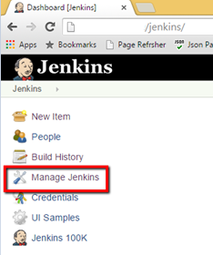{width="234"
height="280"}

-   Click on "Configure System".

  
  
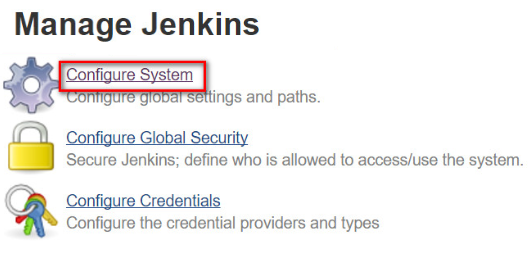{width="300"}  
  
  

-   Locate the section “Zephyr for JIRA – Test Management
    Configuration”.  Select applicable JIRA deployment and click “Add”.
    You can add more than one JIRA Server / JIRA Cloud instances by
    clicking on “Add” button.
    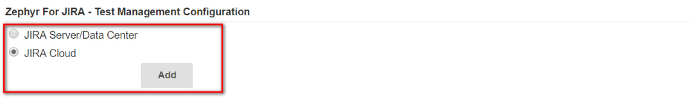
-   For JIRA Server / Data Center deployment, populate JIRA Server /
    Data Center URL and user credentials. Note that the User Name and
    Password must be that of a user with appropriate permissions to
    project(s). Click on “Test Configuration” to validate connection to
    JIRA. Click on “Save” button to save the configuration changes.

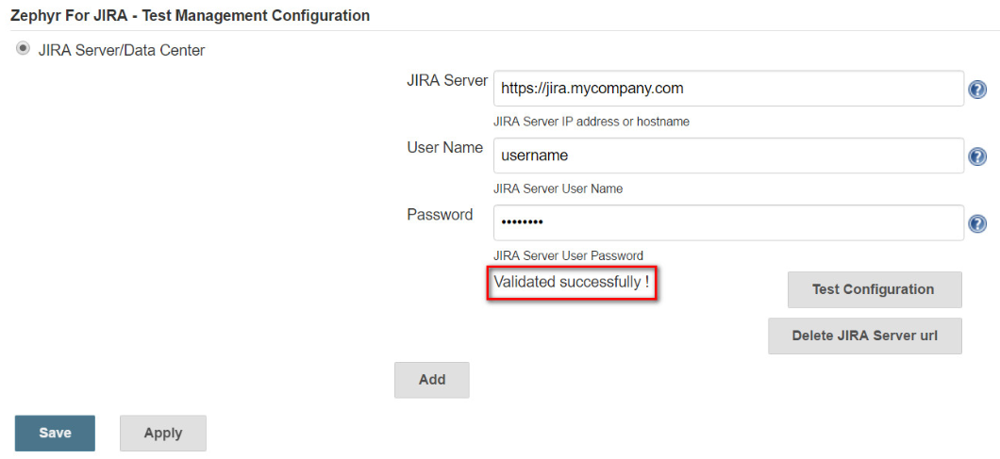

-   For JIRA Cloud deployment, populate JIRA Cloud URL, Zephyr Base URL,
    user credentials and Zephyr for JIRA Cloud [Access and Secret
    Key](https://support.getzephyr.com/hc/en-us/articles/115001068986).
    Note that the User Name and Password must be that of a user with
    appropriate permissions to project(s). Click on “Test Configuration”
    to validate connection to JIRA. Click on “Save” button to save the
    configuration changes.
    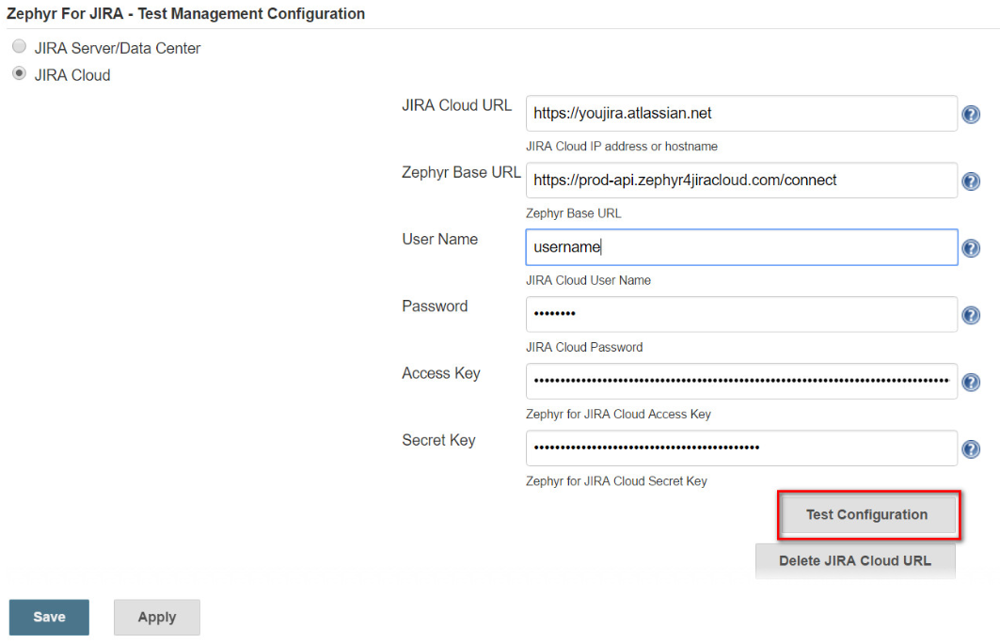

# **Configuring a standard Jenkins job**

A job in Jenkins defines a sequence of tasks for Jenkins to perform.
When a job is triggered, Jenkins looks for an Ant script or Maven build
file and runs it. It also provides options to define post-build tasks.
Follow the example below to configure a standard job and add a post
build action:  

1.  Create a new Jenkins job by clicking the "New Item" link found on
    the menu.

  
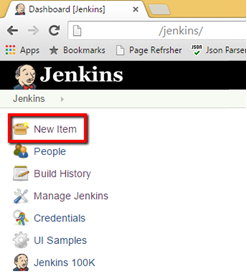{width="247"
height="275"}

2\. Give a name for your job, check the box "Freestyle project" and click
on "OK" button.

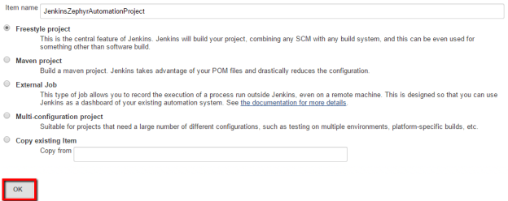{width="624"
height="248"}

3\. To configure the job you just created, click the \<job name\> on the
Jenkins home page.

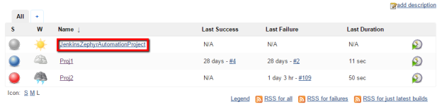{width="624"
height="155"}

4\. Click the "Configure" link.

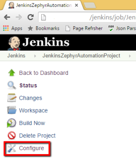{width="280"
height="327"}

5\. Choose "Subversion" option in the "Source Code Management" section.

{width="381"
height="140"}

6\. Enter the subversion URL where the target project resides and press
Tab.

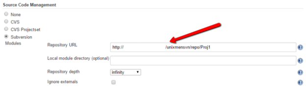{width="624"
height="192"}  
Note: User credentials needs to be setup to access SVN server. Click on
"enter credential" link to set it up if you see below error.  
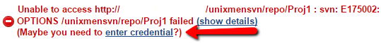{width="539"
height="62"}

7\. To add a build step, locate the "Build' section and select "Invoke
top-level maven targets" from the "Add build step" dropdown.

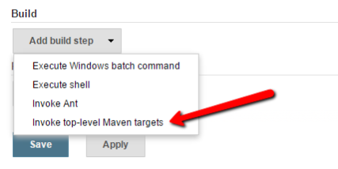{width="427"
height="214"}

8\. Select "clean package" as your Goals.

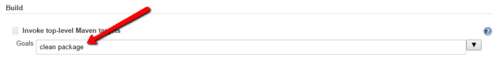{width="624"
height="73"}

**9. The plugin requires JUnit test result**. Locate the "Post-build
Actions" section and select "Publish JUnit test result report" from "Add
post-build Actions" dropdown.

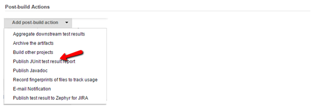{width="539"
height="186"}

10\. Enter the path to the test report. In the example below the location
is "Proj1\\target\\surefire-reports/\*.xml" where Proj1 is the target
project.

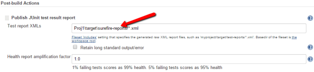{width="624"
height="145"}

# **Configuring Zephyr for JIRA Test Management plugin as a post build action**

  
In order to publish results in Zephyr for JIRA, define another
post-build action.

1.  Select "Publish test result to Zephyr for JIRA" from "Add post-build
    Actions" dropdown.

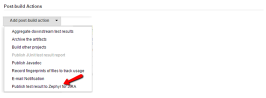{width="532"
height="196"}

2\. Configure Zephyr plugin job.

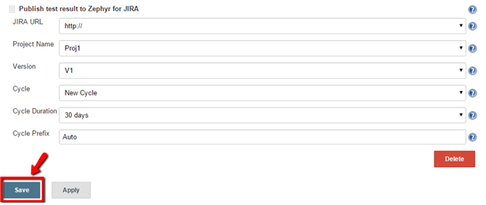{width="615"
height="260"}

1.  1.  1.  Select the JIRA URL from the dropdown. (Servers configured
            in the Jenkins global configuration are available here to
            select). This automatically pulls in projects, versions and
            cycles.
        2.  Select the Project Name from the dropdown. This re-populates
            the versions.
        3.  Select the Version from the dropdown. Selecting a version
            fetches all its cycles.
        4.  Select either an existing Cycle from the dropdown or create
            a new cycle.
        5.  For existing Cycle the default Cycle Duration will be that
            of existing cycle in Zephyr and Cycle Name Prefix will be of
            the format "Automation\_\<Date\>\<Time\>" stamp.
        6.  For new cycle you have option to select Cycle Duration from
            the dropdown and to edit default cycle prefix name
            "Automation". In the absence of a cycle prefix name
            "Automation" is used for new cycles.
        7.  Click "Save".

# **Triggering the job and publishing results in Zephyr**

  
To trigger a job manually, click "Build Now" link on the menu. This
builds the project and publishes the Junit result.

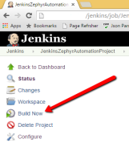{width="161"
height="178"}

Jenkins creates the test cases in the selected JIRA Project.

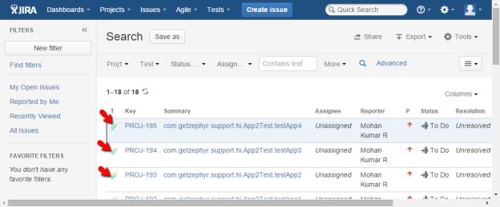{width="624"
height="259"}

Finally, Jenkins assigns these test cases to the selected cycle and
executes all the tests.

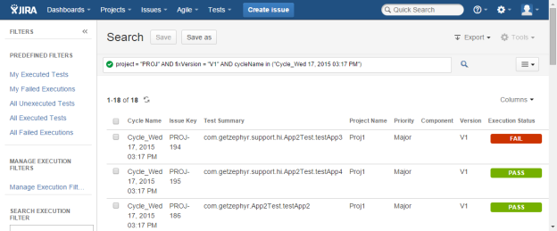{width="624"
height="259"}  
  
  
  
**License**

  
This plugin is open source. It follows the Apache License version 2.0
(\<<http://www.apache.org/licenses/>\>) It means:  
It allows you to:

-   freely download and use this software, in whole or in part, for
    personal, company internal, or commercial purposes;
-   Use this software in packages or distributions that you create.

It forbids you to:

-   redistribute any piece of our originated software without proper
    attribution;
-   use any marks owned by us in any way that might state or imply that
    we [www.getzephyr.com](http://www.getzephyr.com/) endorse your
    distribution;
-   Use any marks owned by us in any way that might state or imply that
    you created this software in question.

It requires you to:

-   include a copy of the license in any redistribution you may make
    that includes this software;
-   provide clear attribution to us,
    [www.getzephyr.com](http://www.getzephyr.com/) for any distributions
    that include this software

It does not require you to:

-   include the source of this software itself, or of any modifications
    you may have made to it, in any redistribution you may assemble that
    includes it;
-   Submit changes that you make to the software back to this software
    (though such feedback is encouraged).

See License FAQ \<<http://www.apache.org/foundation/licence-FAQ.html>\>
for more details.

# **Feedback**

-   Please provide your feedback at [Jenkins
    JIRA](https://issues.jenkins-ci.org/projects/JENKINS/issues) or at
    [Zephyr
    Community](https://support.getzephyr.com/hc/communities/public/topics/200179919-Developer-Zone-ZAPI)[ZAPI
    Server](https://support.getzephyr.com/hc/en-us/community/topics/200179919-Developer-Zone-ZAPI-Server)
    or [ZAPI
    Cloud](https://support.getzephyr.com/hc/en-us/community/topics/201112983-Developer-Zone-ZAPI-Cloud)
    forums
-   For code questions, send an email to <developer@getzephyr.com>
