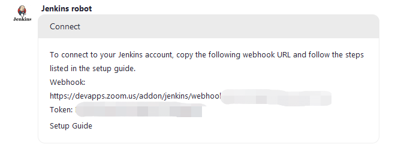
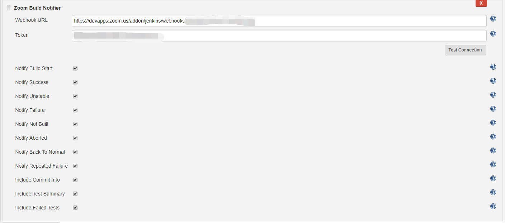

  

[Github→](https://github.com/jenkinsci/zoom-plugin)

  

This plugin is designed  for the Zoom Jenkins bot to send Jenkins build
notifications to Zoom Chat.

The first step is to install the Zoom Jenkins bot from [Zoom
Marketplace](https://marketplace.zoom.us/apps/Qm4SpLcMT1CNIV5lZ03VVA)[ ](https://marketplace.zoom.us/apps/Qm4SpLcMT1CNIV5lZ03VVA)if
you are a Zoom Chat user. Once the Bot is installed, you will see a
welcome message. Type the connect command in 1:1 chat with the bot and
you will see the following message with the webhook URL and the token.
Please copy them as you need that in the next step.

 

{height="250"}

  

Zoom plugin is defined in Post-build Actions of job's configuration.
Enter the webhook URL and the token you copied from the previous step
and select the notifications that you want to receive.

  

{height="400"}

  

-   "Notify Build Start" : Send notification to the webhook when build
    start.
-   "Notify Build Success": Send notification to the webhook if the
    current build has a "success" status.
-   "Notify Unstable": Send notification to the webhook if the current
    build has an "unstable" status.
-   "Notify Failure": Send notification to the webhook if the current
    build has a "failed" status.
-   "Notify Not Built": Send notification to the webhook if the current
    build has a "not build" status.
-   "Notify Aborted": Send notification to the webhook if the current
    build has an "aborted" status.
-   "Notify Back To Normal": Send notification to the webhook if the
    current build is successful and the previous build failed or was
    unstable.
-   "Notify Repeated Failture": Send notification to the webhook if both
    the current and the previous builds failed.
-   "Include Commit info": if checked, will include commit info into
    notification message.
-   "Include Test Summary": if checked, will include test summary into
    notification message.
-   "Include Failed Tests": if checked, will include failed tests into
    notification message.

  

That's all. You will start to receive Jenkins build notifications in
your Zoom Chat. 

  
